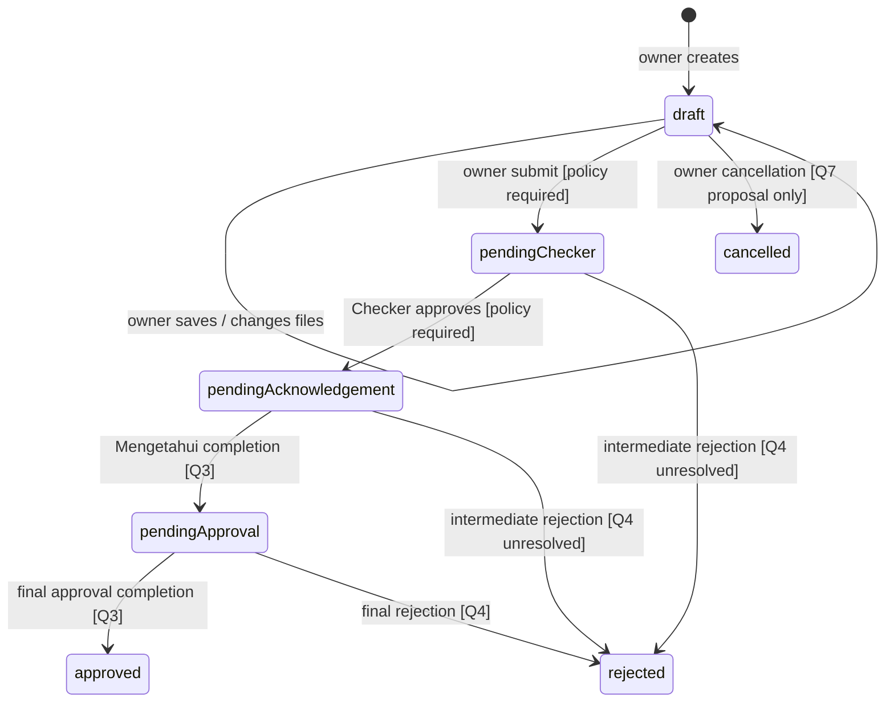

# Sales Program Submission API Design

Status: **design draft for review**, 2026-09-08. Stack confirmed: Flutter (Android, iOS, web, Windows, macOS, Linux), Django REST Framework, and MySQL. The repository now contains a development foundation; the business endpoints in this document are not implemented. See [architecture and implementation status](ARCHITECTURE.md) and [runtime foundation contract](foundation.openapi.yaml).

## 1. Evidence, scope and confidence

At the initial design review, the supplied workspace contained `ui-mockup/`, an empty `repo/`, and an initially empty `docs/`, with no application code or framework. Subsequently `repo/` became the Git repository and the user selected Flutter + DRF + MySQL. This document preserves the initial design evidence; current implementation status is in ARCHITECTURE.md. The original HTML designs remain in the parent workspace’s `ui-mockup/`.

Reviewed inputs:

| Input | Observed requirements |
| --- | --- |
| `../../ui-mockup/Authentication.dc.html` (form and Component script) | Masuk/Daftar, email/password, registration name and employee number, password visibility toggle. Buttons have no authentication implementation. |
| `../../ui-mockup/Pengajuan Program.dc.html` (all markup and Component script) | Own list/search, draft editor, locations, dates, attachments, fixed Checker, selectable Mengetahui/Menyetujui, submit confirmation, progress, printable detail. |
| `../../ui-mockup/Backoffice.dc.html` (all markup and Component script) | Current-turn inbox, program/person/type/location/date filters, detail, approve/reject confirmation, optional note, immutable decision presentation. |
| All six `../../ui-mockup/uploads/draw-*.png` images | Annotated Backoffice filter layout/scrolling variations; an older image includes Dashboard/Master Data/Laporan navigation but no respective flows. No additional business fields. |
| `../../ui-mockup/support.js`, `../../ui-mockup/image-slot.js`, `.thumbnail` | Mockup runtime, presentation asset support and thumbnail metadata; not application services. Image-slot uploading is a design tool feature, not a company-logo management requirement. |

The HTML and its scripts are complementary evidence, not authoritative business rules. Mockup data is inconsistent: a rejected row remains in the current-turn inbox; detail hard-codes `myRole: "Menyetujui"` even for a Checker; `confirmSubmit` only returns to the list; save-draft has no handler; filter controls do not actually filter the rows; number/date/checker values are fixed samples. These behaviors must not become backend logic.

**Contract labels:** “Specified” means sufficiently clear to describe in OpenAPI, using explicitly labeled technical recommendations. It does not mean implemented or production-approved. “Provisional” means a business-policy decision is outstanding; its request/response is an illustrative proposal only and its operation is excluded from OpenAPI `paths`. Unresolved behavior is never silently enabled. OpenAPI extensions list every exclusion. Some shared schemas support provisional examples; schema presence does not authorize an endpoint.

Questions Q1–Q11 and assumptions A1–A6 are listed at the end. Especially important before finalizing operations: registration trust/activation, Checker mapping, reviewer eligibility and multi-person quorum, intermediate rejection, type/cost provenance, required files, cancellation rights and Backoffice scope. Endpoint-specific dependencies appear below. Existing read data may be represented even where its future mutation rules remain undecided.

## 2. Domain and actors

PT Total Chemindo Loka employees request approval for Sales & Marketing programs (examples: Bundling and Diskon) at one or more locations (examples: BSD and Bekasi), with execution dates and supporting proposals/cost spreadsheets. This is a program approval application; customer CRM, orders, invoicing, payments and budget execution are not established requirements.

| Actor / proposed role code | Responsibility and scope |
| --- | --- |
| Unauthenticated employee | Login; registration intent is visible but provisioning is unresolved. |
| Pengaju / `submitter` | Own drafts and submissions, attachments, submit, own progress and printable forms. |
| Checker / `checker` | First review stage; reviewer is auto-filled, not selectable in the actual form. Mapping needs Q2. |
| Mengetahui / `acknowledger` | Middle stage; one or more selected people. Whether this is an acknowledgement or a veto-bearing approval needs Q3/Q4. |
| Menyetujui / `approver` | Final approval stage; one or more selected people. |
| Admin Backoffice / `backofficeAdmin` | Label appears in header only. Global read, user administration, reassignment and override privileges are **not granted** by this design. Q8 must define them. |
| Backend system | Resolves identity/policy, stores documents, scans uploads, evaluates transitions and records audits. No client-selectable system role. |

Roles are capabilities, not job titles or display names. A user can have multiple roles if trusted provisioning permits it; a role does not create a review assignment. An active role plus the relevant ownership/ready-task relationship is required. A backoffice administrator who also has an assigned reviewer role can act only under that reviewer permission. Self-review and cross-stage duplicates require Q3; no override is implied.

## 3. User flows

### Authentication

1. Masuk sends email/password; on success the service stores session credentials and loads `/users/me` (also included in login response).
2. Daftar collects full name, employee number, email and password. Activation, corporate-domain restriction, identity matching and verification are not designed. The provisional registration receipt grants no session.
3. Password visibility is local UI state. Refresh/logout are supporting session requirements, not additional screens.
4. Forgot password, email verification, invitation acceptance, SSO, MFA and account/profile administration have no supplied flows. Their endpoint inventory remains deferred pending Q1/Q10; no guessed reset/email delivery contract is included.

### Program Submission

1. Load only the caller's submissions. Search number/name; select a draft to resume editing or a submitted record to read detail.
2. Create a draft (can be empty), with a server-generated identifier/number. Populate applicant identity from the account. `submittedAt` stays null until actual submit; the form's prefilled date must not be mistaken for submission time.
3. Save name, multiple location IDs and execution start/end dates. Resolve Checker and reviewer options on the backend from saved context. Choose at least one Mengetahui and Menyetujui for eventual submit; mockup defaults allow up to two and three, with editor configuration up to four and five respectively.
4. Upload/remove supporting `.pdf`, `.xls`, `.xlsx` files (mockup: maximum 10 MB each). Draft saving can remain incomplete; submit has stronger validation. Mechanism, cost simulation and sales targets are in attachments, with no structured line-item editor.
5. Submit confirmation previews saved values. “Batal” dismisses this modal locally. Confirming will freeze content and route to Checker once Q2–Q6 are settled.
6. Detail displays status, all stage reviewers/decisions, attachments and a printable form. PDF generation is a proposed supporting endpoint; current mockup uses browser print. Four static signature columns must generalize to all selected people in data.

### Backoffice

1. Apply filters to current actionable submissions. Backoffice prose explicitly says the next reviewer sees an item only after the previous stage is approved.
2. Filter by program number, period, Checker, Mengetahui, Menyetujui, type, location and submitter. Multi-select person filters use IDs, not names. Empty results and clearing filters require no mutation endpoint.
3. Open an assigned item, inspect complete form/attachments and identify the exact ready task.
4. Approve or Not Approved opens confirmation with an optional note. Cancel confirmation is local. On confirm, backend checks task assignment/state/version and commits the decision atomically.
5. Decision display becomes immutable. History visibility is unresolved because sample rejected rows contradict the current-turn wording. “Pending” exists in script helpers but is not an exposed action in the final markup; there is no reset-to-pending endpoint.
6. Dashboard, master-data editing and reports have no completed designs. Only supporting read resources are specified; dashboard-summary is a clearly labeled proposal.

## 4. Initial data model recommendation

Use a single modular Django REST Framework backend and MySQL with transactions, plus private blob storage when uploads are implemented. Flutter targets mobile, web and desktop. The framework and database are now user-selected; the detailed business model below remains a recommendation. No microservices, message broker, generalized workflow engine or event-sourced database is required. A small worker/poller may scan quarantined files; its product-facing contract is attachment scan status.

| Entity | Initial fields and constraints | Relationships / notes |
| --- | --- | --- |
| User | `id`, normalized unique `email`, unique `employeeNumber`, `fullName`, nullable `jobTitle`, `status`, `timeZone`, timestamps; password hash is internal only | Roles via UserRole; location scope via UserLocation. Public User excludes password/session internals. Active/disabled covers existing accounts; registration lifecycle awaits Q1. |
| UserRole / UserLocation | `(userId, role)` / `(userId, locationId)` unique | Trusted assignment only; do not infer roles from job title. Location scope authority awaits Q2. |
| Session | `id`, `userId`, refresh-token-family ID, hashed refresh token records, hashed opaque access credentials, access/refresh expiry, revocation timestamps, rotation parent, created/last-used timestamps | Many per user; no plaintext credential persistence. Immediate revocation/disable checks. |
| Location | `id`, unique `code`, `name`, `isActive`, timestamps | Many-to-many submissions; sample BSD/Bekasi are records. Whether branch/outlet is a separate hierarchy awaits Q2. |
| ProgramType | `id`, unique `code`, `name`, `isActive` | Nullable reference from submission; Bundling/Diskon are records, not a fixed extensibility limit. Writer/requiredness awaits Q5. |
| ProgramSubmission | `id`, unique `programNumber`, `ownerId`, nullable draft `programName`, nullable `programTypeId`, nullable `periodStart`/`periodEnd`, nullable `estimatedCostAmount`, currency IDR when cost known, `status`, nullable `currentStage`, `version`, `createdAt`, `updatedAt`, nullable `submittedAt`, nullable `closedAt`, nullable `cancellationReason` | Owner 1:N submissions. Decimal(16,2) proposed for money. Submitted records retain identity/content/policy snapshots; never infer type/cost from title or Excel. `closedAt`/cancellationReason are internal recommendations pending lifecycle policy. |
| SubmissionLocation | `(submissionId, locationId)` unique; snapshot code/name at submit | N:M; list response returns locations array, not comma-separated text. |
| SubmissionReviewer | `submissionId`, `stage`, `reviewerId`, `position`, source/policy version, identity snapshot at submit | Draft reviewer plan; exactly one resolved Checker at submit. Preserve selection order without assuming it defines execution order. Cardinality from server policy. |
| ReviewTask | `id`, `submissionId`, `stage`, `reviewerId`, `position`, `status`, eligibility timestamp, decision reference | Created when submitting; waiting/ready/approved/rejected/voided. Exactly one effective decision per task, enforced with unique constraint. Q3 determines which tasks become ready. |
| ReviewDecision | `id`, unique `taskId`, `actorId`, `decision`, nullable `note`, `decidedAt`, policy version | Append-only. UI task response projects decision/note/time. Actor must equal current authorized assignee unless future delegation policy explicitly allows otherwise. |
| Attachment | `id`, `submissionId`, uploader ID, safe original `fileName`, detected `contentType`, `sizeBytes`, internal random `storageKey`, SHA-256, `scanStatus`, uploaded/scanned/removed timestamps | One submission owns each attachment. Quarantine until clean. Do not return keys/checksum internals in baseline response. |
| WorkflowPolicy / CheckerMapping | Versioned rule data, effective scope, Checker resolution, reviewer eligibility, configured min/max | Recommendation for server configuration, not a general editable workflow resource. Execution/quorum/rejection policy remains unresolved; configuration must not guess it. Snapshot applied version at submit. |
| AuditLog | `id`, `occurredAt`, actor/user/session or system identity, event type, resource type/ID, request ID, outcome, sanitized changed fields, version before/after | Append-only; log draft changes, submit, decisions, cancellation, uploads/removals, downloads, auth/role/policy changes. Do not expose unrestricted audit API without Q8. |
| IdempotencyRecord | actor/credential scope, method, canonical path, key, request hash, response status/body/headers, timestamps/expiry | Unique key scope and transaction boundary prevent duplicate drafts/files/decisions. Retain 24 hours (A3). |

Recommended indexes: normalized user email/employee number; unique program number; `(ownerId, createdAt, id)`; `(reviewerId, status, submissionId)` on tasks; `(status, createdAt, id)` on submissions; both directions of location/reviewer joins; attachment parent ID; `(resourceType, resourceId, occurredAt)` on audits. Apply query scope before counting/pagination. Benchmark substring search before adding a search service.

Enums (JSON values remain stable English codes; Flutter translates display labels):

| Enum | Values |
| --- | --- |
| Role | `submitter`, `checker`, `acknowledger`, `approver`, `backofficeAdmin` |
| SubmissionStatus | `draft`, `pendingChecker`, `pendingAcknowledgement`, `pendingApproval`, `approved`, `rejected`, `cancelled` (candidate only) |
| Stage | `checker`, `acknowledgement`, `approval` |
| ReviewTaskStatus | `waiting`, `ready`, `approved`, `rejected`, `voided` (candidate termination/deactivation projection) |
| ReviewDecision | `approve`, `reject`; no mutable `pending` decision |
| UserStatus | `active`, `disabled`; registration states await Q1 |
| AttachmentScanStatus | `pending`, `clean`, `rejected` |
| Currency | `IDR` for baseline examples; multi-currency awaits Q5 |

UI mapping: Draft → `draft`; Menunggu checker → `pendingChecker`; intermediate Mengetahui stage → proposed `pendingAcknowledgement` (no explicit badge example); Menunggu persetujuan → `pendingApproval`; Disetujui → `approved`; Ditolak → `rejected`. `cancelled` has no supplied UI.

## 5. Authorization and lifecycle

| Endpoint family | Effective authorization |
| --- | --- |
| Login / provisional register | Public, throttled; never trusts client roles or employee ID as proof of identity. |
| Refresh / logout | Possession of valid refresh credential for rotation; logout hides token existence. No bearer access requirement. |
| `/users/me`, master lists | Active authenticated account; directory/location data constrained to permitted scope. |
| `/program-submissions/**` | `submitter` plus owner match, including files/PDF; mutations also require draft/allowed transition. |
| `/backoffice/program-submissions/**`, person filter options | Matching reviewer role plus at least one current ready task assigned to caller; actions additionally target that exact task. |
| Provisional dashboard | Proposed same current-task scope; no organization-wide counts. |
| Admin/global read or write | Unspecified, no implicit superuser permission. |

The server returns 403 for a missing endpoint-level role and 404 for an object outside authorized scope. Filter/search/count/PDF/file routes enforce the same scope. A stale task action can return 409 to its recorded assignee without granting post-decision read access; unrelated users still receive 404. Client-supplied IDs and `allowedActions` never bypass authorization.



| From | Action / authorized actor | To / invariant | Confidence |
| --- | --- | --- | --- |
| none | Create / submitter | draft; owner and number assigned by server | Specified |
| draft | Save/upload/remove / owner | draft; version increases | Specified |
| draft | Submit / owner | pendingChecker; freeze fields/files/plan; Checker task ready | Direction observed; Q2–Q6 block final contract |
| pendingChecker | Approve / assigned ready Checker | pendingAcknowledgement if stage complete | Ordered stages observed; Mengetahui semantics await Q3 |
| pendingAcknowledgement | Approve or acknowledge / assigned ready Mengetahui | Same state until completion, then pendingApproval | Action naming, concurrency/quorum await Q3 |
| pendingApproval | Approve / assigned ready approver | Same state until completion, then approved | Final approval observed; multi-person completion awaits Q3 |
| any pending stage | Reject / assigned ready reviewer if policy permits | rejected only if confirmed terminal-rejection rule applies | Final rejection observed; intermediate authority/termination await Q4 |
| draft | Cancel / proposed owner | cancelled | User requested example, not mockup behavior; Q7 |
| pending / approved / rejected | Cancel, revise, resubmit, reopen, override | Undecided; no transition specified | Q4/Q7/Q8 |

No transition code should be implemented from dotted assumptions. The chart is a review aid, not an authorization policy. No generic status PATCH exists. Tasks only become ready when the backend's confirmed sequencing/quorum rule permits it; position merely preserves selection order. Each mutation compares version, checks policy/authorization, changes state, writes decision/audit/idempotency result and commits atomically. Failure rolls back all effects. Actions return the full updated detail to avoid frontend transition calculations. `allowedActions` and `submissionIssues` reflect the caller and current rules; absent/unconfigured policy yields no submit/decision capability. After an allowed decision the response may include the committed snapshot even when the actor no longer has inbox access.

## 6. API conventions

All paths below are relative to **`/api/v1`**. OpenAPI uses `servers: [{url: /api/v1}]` and paths without a duplicate prefix. HTTPS deployment origin is configured by environment. Version breaking changes under `/api/v2`; additive optional fields remain v1. Response clients should ignore unknown fields and handle unknown future enum values safely. Requests reject unknown fields (mass-assignment protection).

JSON field names are `camelCase`; URLs use plural kebab-case resources. Opaque IDs are immutable strings (example `sub_0144`); do not use human program number as a path ID. IDs/names in examples are illustrative; the inconsistent mockup records are not seed truth. Money uses exact decimal strings such as `{"currency":"IDR","amount":"42000000.00"}`; never transmit `Rp 42 jt` or binary floating point amounts. Draft name/dates may be null; missing cost/type is null, never zero or inferred. Null and omission are distinct for PATCH; arrays replace in full, not merge by index.

### Responses, errors and status codes

Single success: `{ "data": <typed object>, "meta": { "requestId": "req_01salesdesign" } }`. Collections: `data` is an array and `meta` includes page metadata. JSON errors: `{ "error": { "code": "VALIDATION_FAILED", "message": "Validation failed.", "details": [{ "field": "periodEnd", "code": "END_BEFORE_START", "message": "End date must be on or after start date." }] }, "meta": { "requestId": "req_01salesdesign" } }`. Field paths use dotted paths/zero-based indexes; null means a whole-request issue. Flutter branches on error code, not human message. Never return a 200 with an error payload.

| HTTP | Meaning |
| --- | --- |
| 200 | Read, update, rotation/logout, removal, candidate domain action success |
| 201 | Persisted new draft, Location and ETag returned |
| 202 | Attachment persisted but quarantined/pending scan; provisional registration receipt |
| 400 | Malformed JSON, unknown parameters/fields, invalid query encoding, missing idempotency header |
| 401 | Missing/invalid access credential, generic invalid login, invalid/reused refresh credential |
| 403 / 404 | Endpoint role denied / object absent or out of scope |
| 409 | Locked state, already-decided task, unresolved required policy, attachment not clean, idempotency conflict |
| 412 / 428 | Stale If-Match / missing If-Match |
| 413 / 415 | Payload too large / unsupported media type |
| 422 | Valid syntax but invalid fields, references, date range or required submission data |
| 429 | Throttled; Retry-After seconds |
| 500 / 503 | Sanitized unexpected error / transient dependency failure (Retry-After on 503) |

All JSON successes/errors carry `X-Request-Id` matching `meta.requestId`. Auth failures return an appropriate `WWW-Authenticate` challenge. Auth/personal/document responses use `Cache-Control: no-store`. Binary content/PDF endpoints intentionally return raw bytes with their actual media type, `Content-Disposition: attachment`, and `X-Content-Type-Options: nosniff`; their errors remain the same JSON envelope. Binary success has no JSON example because wrapping it would contradict the download contract. No 204 or 304 is part of this baseline.

### Collection queries

`page=1`, `pageSize=20` by default; `pageSize` 1..100. `totalItems` counts the complete authorized filtered set; `totalPages = ceil(totalItems/pageSize)`, zero for empty results; `hasNextPage = page < totalPages`. Out-of-range pages return empty data, not 404. Offset pagination is deliberately simple for Flutter; a future cursor mode should be introduced explicitly if volume requires it. Concurrent changes may shift pages; stable ordering prevents tie ambiguity, not snapshot isolation across requests.

Repeated query keys encode arrays: `locationId=loc_bsd&locationId=loc_bekasi`. OR within one array filter, AND across different filters. Empty selection omits the key; no empty strings, comma-separated or JSON-encoded arrays. Unknown parameters and malformed syntax return 400; invalid scalar/enum/range values return 422. Unauthorized/unknown filter IDs produce no matches, not an information leak. q is a trimmed case-insensitive literal substring, maximum 100 characters, not a regular expression. Master lists sort code then id; people options sort fullName then id. Submission sorts are allowlisted: `-createdAt` default, `createdAt`, `-updatedAt`, `updatedAt`, `programNumber`; id ascending is the tie-breaker. Totals deduplicate submissions with several matching locations/tasks.

Period filtering is proposed explicitly as inclusive **execution start date** bounds `periodStartFrom` and `periodStartTo` (A2), not overlap or submission timestamp. One-sided bounds are supported; if both given, from <= to. No implicitly named ambiguous `dateFrom` is exposed. Confirm whether the UI intended an overlapping execution period or submission dates before client integration.

### Dates, validation, concurrency and idempotency

Execution dates use ISO `YYYY-MM-DD`, inclusive endpoints with start <= end; they are date-only values, never midnight UTC conversions. Instants use RFC 3339 UTC with `Z` (example `2026-08-21T03:00:00Z`). Display in the account's IANA `timeZone`; `Asia/Jakarta` is the proposed default (A2), not an assumption that every location shares it. Backend timestamps and program-number year use explicit policy. Backdated/future-date cutoffs are unresolved (Q5); no prohibition is invented.

Recommended transport bounds: name 1..200 non-whitespace characters when set; full name 1..150; employee number 1..50; email <=254; decision note/cancellation reason <=2000. Draft supports missing data; on submit the form's required name, >=1 location, both dates, >=1 Mengetahui and >=1 Menyetujui are revalidated. IDs must exist, be active where selected and satisfy confirmed eligibility. A transport cap of 100 locations is A6, not a business maximum. Reviewer arrays cap at mockup editor bounds 4/5; actual policy limits may be lower. Number generation uniqueness/allocation is backend-only; display pattern is a recommendation awaiting Q5.

Detail and submission mutation successes return strong `ETag: "<version>"`. All draft/file/domain mutations after create require the last known parent submission `If-Match`. Attachment scan changes also bump parent version. Missing => 428, stale => 412; refetch before deciding whether to retry. Create/read/login/refresh/logout have no If-Match. PATCH retries may return 412 after a lost successful response; read current state to reconcile rather than blindly overwrite.

Require `Idempotency-Key` on draft creation, attachment upload/removal and provisional registration/submit/approve/reject/cancel. Random 16..128 characters, persisted by Flutter for one logical intent. Scope by authenticated actor (registration: normalized identity digest), method and canonical path; hash normalized body and relevant headers. For multipart hash actual bytes plus filename/type, excluding random multipart boundaries. Store status/body/Location/ETag atomically with mutation for 24 hours. After authenticating and checking role/object or recorded actor eligibility, replay an identical completed request **before** If-Match/state checks so a successful lost response can be recovered. Same key with different payload/If-Match => 409 IDEMPOTENCY_KEY_REUSED; in-progress duplicate => 409 REQUEST_IN_PROGRESS. No second decision/upload on replay. Requests failing before side effects need not reserve a key. Expired keys cannot guarantee deduplication; reconcile by resource state. Keep original response snapshot/version on replay; it may no longer be current.

GET is safe and DELETE removal has explicit replay protection. PATCH uses optimistic concurrency; refresh deliberately has no automatic retry/replay path because rotation is single-use. Retry only safe operations or requests with the original idempotency key, use bounded jittered backoff for transient failures and respect Retry-After. A timeout is not proof of failure.

## 7. Endpoint inventory and full contracts

Every operation below inherits section 6 and the security requirements in section 8. No unlisted path/query/body fields are accepted. All authenticated requests require `Authorization: Bearer <accessToken>` except refresh/logout, whose body credential is explicitly described. Each error list also includes the common transient and transport errors applicable to that operation.

| Method | Path (prefix `/api/v1`) | Purpose | Status |
| --- | --- | --- | --- |
| POST | `/auth/login` | Authenticate an existing active account. | Specified |
| POST | `/auth/refresh` | Rotate the refresh token and issue a new access token. | Specified |
| POST | `/auth/logout` | Revoke the current refresh-token family and its access sessions. | Specified |
| POST | `/auth/register` | Request an employee account. | Provisional: Q1 |
| GET | `/users/me` | Load the signed-in profile for the header and auto-filled applicant section. | Specified |
| GET | `/master-data/locations` | List locations the caller may select. | Specified |
| GET | `/master-data/program-types` | List program types used by read-only filters. | Specified |
| GET | `/program-submissions` | List and search only submissions owned by the caller. | Specified |
| POST | `/program-submissions` | Create a persisted draft, including an empty draft. | Specified |
| GET | `/program-submissions/{submissionId}` | Read an owned draft or submission, progress and attachment metadata. | Specified |
| PATCH | `/program-submissions/{submissionId}` | Partially update an owned draft. | Specified |
| GET | `/program-submissions/{submissionId}/policy` | Load server-resolved checker, reviewer limits and upload constraints for this draft. | Specified |
| GET | `/program-submissions/{submissionId}/reviewer-options` | List eligible reviewers for the selected draft and stage. | Specified |
| POST | `/program-submissions/{submissionId}/attachments` | Upload one PDF/Excel attachment to an owned draft. | Specified |
| GET | `/program-submissions/{submissionId}/attachments/{attachmentId}` | Read attachment metadata and scan status. | Specified |
| DELETE | `/program-submissions/{submissionId}/attachments/{attachmentId}` | Remove an attachment from an owned draft. | Specified |
| GET | `/program-submissions/{submissionId}/attachments/{attachmentId}/content` | Download an authorized, clean attachment. | Specified |
| GET | `/program-submissions/{submissionId}/pdf` | Render a printable submission form from a consistent saved snapshot. | Specified |
| GET | `/backoffice/program-submissions/{submissionId}/attachments/{attachmentId}/content` | Download an authorized, clean attachment. | Specified |
| GET | `/backoffice/program-submissions/{submissionId}/pdf` | Render a printable submission form from a consistent saved snapshot. | Specified |
| POST | `/program-submissions/{submissionId}/submit` | Freeze draft content and start the review chain. | Provisional: Q2, Q3, Q4, Q5, Q6 |
| POST | `/program-submissions/{submissionId}/cancel` | Candidate withdrawal action; the mockup has no cancellation flow. | Provisional: Q7 |
| GET | `/backoffice/program-submissions` | List submissions with a current ready review task assigned to the caller. | Specified |
| GET | `/backoffice/program-submissions/{submissionId}` | Read submission details for a current task, including progress and decision targets. | Specified |
| GET | `/backoffice/filter-options/people` | Populate submitter and reviewer person filters without an unrestricted directory. | Specified |
| POST | `/backoffice/program-submissions/{submissionId}/review-tasks/{taskId}/approve` | Record approval for exactly one assigned review task. | Provisional: Q3, Q4 |
| POST | `/backoffice/program-submissions/{submissionId}/review-tasks/{taskId}/reject` | Record rejection for exactly one assigned review task. | Provisional: Q3, Q4 |
| GET | `/backoffice/dashboard-summary` | Candidate summary of the caller current review workload. | Provisional: Q9 |

### Authentication

#### `POST /api/v1/auth/login`

Authenticate an existing active account.

**Contract:** Specified in OpenAPI.

**Allowed roles:** Public.

**Validation and business rules:** Email comparison is case-insensitive after trimming; never trim passwords. Invalid email/password/disabled account use the same 401 response. Credentials are never logged. Lifetime values are technical recommendations (A3).

**Path/query parameters and operation-specific headers:** none.

**Required JSON request body:** `LoginRequest`.

| Field | Required | Type / constraints |
| --- | --- | --- |
| `email` | yes | string (email); maxLength=254 |
| `password` | yes | string; minLength=1; maxLength=128 |

Request example:

```json
{
  "email": "rizky@example.com",
  "password": "example-password-for-documentation"
}
```

**Success: 200** — `SessionResponse`.

```json
{
  "data": {
    "accessToken": "example-access-token-not-a-real-credential",
    "tokenType": "Bearer",
    "expiresIn": 900,
    "refreshToken": "example-refresh-token-not-a-real-credential",
    "refreshExpiresAt": "2026-09-20T03:00:00Z",
    "sessionId": "ses_rizky",
    "user": {
      "id": "usr_rizky",
      "fullName": "Rizky Pratama",
      "jobTitle": "Sales Executive",
      "employeeNumber": "B001",
      "email": "rizky@example.com",
      "status": "active",
      "roles": [
        "submitter"
      ],
      "timeZone": "Asia/Jakarta",
      "locationIds": [
        "loc_bsd"
      ]
    }
  },
  "meta": {
    "requestId": "req_01salesdesign"
  }
}
```

**Possible errors:** `400 BAD_REQUEST`; `401 UNAUTHENTICATED`; `415 UNSUPPORTED_MEDIA_TYPE`; `422 VALIDATION_FAILED`; `429 RATE_LIMITED`; `500 INTERNAL_ERROR`; `503 SERVICE_UNAVAILABLE`. All use `Error` (section 6); endpoint-specific conflict codes appear in the rules.

#### `POST /api/v1/auth/refresh`

Rotate the refresh token and issue a new access token.

**Contract:** Specified in OpenAPI.

**Allowed roles:** Refresh-token holder.

**Validation and business rules:** Validate the hashed token and session, rotate once, revoke the family on reuse. This request uses the refresh credential, not an access bearer token. Serialize refresh requests in the client; do not automatically retry on a lost response. Role changes and disabled accounts take effect immediately.

**Path/query parameters and operation-specific headers:** none.

**Required JSON request body:** `RefreshRequest`.

| Field | Required | Type / constraints |
| --- | --- | --- |
| `refreshToken` | yes | string; minLength=32; maxLength=2048 |

Request example:

```json
{
  "refreshToken": "example-refresh-token-not-a-real-credential"
}
```

**Success: 200** — `SessionResponse`.

```json
{
  "data": {
    "accessToken": "example-new-access-token-not-a-real-credential",
    "tokenType": "Bearer",
    "expiresIn": 900,
    "refreshToken": "example-new-refresh-token-not-a-real-credential",
    "refreshExpiresAt": "2026-09-20T03:00:00Z",
    "sessionId": "ses_rizky",
    "user": {
      "id": "usr_rizky",
      "fullName": "Rizky Pratama",
      "jobTitle": "Sales Executive",
      "employeeNumber": "B001",
      "email": "rizky@example.com",
      "status": "active",
      "roles": [
        "submitter"
      ],
      "timeZone": "Asia/Jakarta",
      "locationIds": [
        "loc_bsd"
      ]
    }
  },
  "meta": {
    "requestId": "req_01salesdesign"
  }
}
```

**Possible errors:** `400 BAD_REQUEST`; `401 UNAUTHENTICATED`; `415 UNSUPPORTED_MEDIA_TYPE`; `422 VALIDATION_FAILED`; `429 RATE_LIMITED`; `500 INTERNAL_ERROR`; `503 SERVICE_UNAVAILABLE`. All use `Error` (section 6); endpoint-specific conflict codes appear in the rules.

#### `POST /api/v1/auth/logout`

Revoke the current refresh-token family and its access sessions.

**Contract:** Specified in OpenAPI.

**Allowed roles:** Refresh-token holder.

**Validation and business rules:** No live access token required. Accept current or previously rotated token from the family for revocation. Unknown, expired or already revoked tokens return the same success; do not expose whether a token existed. Clear client credentials after attempting logout. Other device sessions remain active.

**Path/query parameters and operation-specific headers:** none.

**Required JSON request body:** `RefreshRequest`.

| Field | Required | Type / constraints |
| --- | --- | --- |
| `refreshToken` | yes | string; minLength=32; maxLength=2048 |

Request example:

```json
{
  "refreshToken": "example-refresh-token-not-a-real-credential"
}
```

**Success: 200** — `LogoutResponse`.

```json
{
  "data": {
    "revoked": true
  },
  "meta": {
    "requestId": "req_01salesdesign"
  }
}
```

**Possible errors:** `400 BAD_REQUEST`; `415 UNSUPPORTED_MEDIA_TYPE`; `422 VALIDATION_FAILED`; `429 RATE_LIMITED`; `500 INTERNAL_ERROR`; `503 SERVICE_UNAVAILABLE`. All use `Error` (section 6); endpoint-specific conflict codes appear in the rules.

#### `POST /api/v1/auth/register`

Request an employee account.

**Contract:** Provisional — Q1; illustrative only, excluded from OpenAPI paths.

**Allowed roles:** Public.

**Validation and business rules:** PROVISIONAL Q1. Form fields are observed; account verification, identity source, provisioning and activation are not. Proposed generic 202 receipt must not grant a session or roles. Duplicate identity response must not enumerate accounts. Password minimum 15 and maximum 128 characters is a proposed no-MFA baseline.

**Path, query and operation headers** (Bearer header additionally applies where required):

| Name | In | Required | Type / constraints | Meaning |
| --- | --- | --- | --- | --- |
| `Idempotency-Key` | header | yes | string; minLength=16; maxLength=128 | Random key for one logical operation; reuse only for an identical retry. Retained for 24 hours. |

**Required JSON request body:** `RegistrationRequest`.

| Field | Required | Type / constraints |
| --- | --- | --- |
| `fullName` | yes | string; minLength=1; maxLength=150 |
| `employeeNumber` | yes | string; minLength=1; maxLength=50 |
| `email` | yes | string (email); maxLength=254 |
| `password` | yes | string; minLength=15; maxLength=128 |

Request example:

```json
{
  "fullName": "Rizky Pratama",
  "employeeNumber": "B001",
  "email": "rizky@example.com",
  "password": "example-password-for-documentation"
}
```

**Success: 202** — `RegistrationResponse`.

```json
{
  "data": {
    "message": "Registration request received."
  },
  "meta": {
    "requestId": "req_01salesdesign"
  }
}
```

**Possible errors:** `400 BAD_REQUEST`; `409 CONFLICT`; `415 UNSUPPORTED_MEDIA_TYPE`; `422 VALIDATION_FAILED`; `429 RATE_LIMITED`; `500 INTERNAL_ERROR`; `503 SERVICE_UNAVAILABLE`. All use `Error` (section 6); endpoint-specific conflict codes appear in the rules.

### User/Profile

#### `GET /api/v1/users/me`

Load the signed-in profile for the header and auto-filled applicant section.

**Contract:** Specified in OpenAPI.

**Allowed roles:** Any active authenticated role.

**Validation and business rules:** Only the caller profile. Job title, employee number, roles and location scope are managed by trusted provisioning, never by the submission request. No self-service profile editing is visible in the designs.

**Path/query parameters and operation-specific headers:** none.

**Request body:** none.

**Success: 200** — `UserResponse`.

```json
{
  "data": {
    "id": "usr_rizky",
    "fullName": "Rizky Pratama",
    "jobTitle": "Sales Executive",
    "employeeNumber": "B001",
    "email": "rizky@example.com",
    "status": "active",
    "roles": [
      "submitter"
    ],
    "timeZone": "Asia/Jakarta",
    "locationIds": [
      "loc_bsd"
    ]
  },
  "meta": {
    "requestId": "req_01salesdesign"
  }
}
```

**Possible errors:** `400 BAD_REQUEST`; `401 UNAUTHENTICATED`; `403 FORBIDDEN`; `429 RATE_LIMITED`; `500 INTERNAL_ERROR`; `503 SERVICE_UNAVAILABLE`. All use `Error` (section 6); endpoint-specific conflict codes appear in the rules.

### Program Submission

#### `GET /api/v1/program-submissions`

List and search only submissions owned by the caller.

**Contract:** Specified in OpenAPI.

**Allowed roles:** submitter (owner).

**Validation and business rules:** Ownership is server-derived and always applied before filters/counts. No ownerId override. Read projections preserve null programType/estimatedCost until their source is defined. Unknown or unauthorized filter IDs produce an empty list without disclosing them.

**Path, query and operation headers** (Bearer header additionally applies where required):

| Name | In | Required | Type / constraints | Meaning |
| --- | --- | --- | --- | --- |
| `page` | query | no | integer; minimum=1; default=1 | 1-based page. |
| `pageSize` | query | no | integer; minimum=1; maximum=100; default=20 | Items per page. |
| `q` | query | no | string; maxLength=100 | Trimmed, case-insensitive literal substring of program number or program name; no wildcard syntax. |
| `programNumber` | query | no | string; maxLength=64 | Exact program number; combines with q using AND. |
| `status` | query | no | array<SubmissionStatus> (unique); max 7 | Repeat key for multiple statuses; OR within this filter. |
| `locationId` | query | no | array<Id> (unique); max 100 | Repeat key; submission must match at least one selected location. |
| `programTypeId` | query | no | Id | Exact type ID; submissions with unknown type do not match. |
| `periodStartFrom` | query | no | string (date) | Inclusive lower bound on execution periodStart; not submittedAt. |
| `periodStartTo` | query | no | string (date) | Inclusive upper bound on execution periodStart; lower bound must not exceed upper bound. |
| `sort` | query | no | string: `-createdAt`, `createdAt`, `-updatedAt`, `updatedAt`, `programNumber`; default=-createdAt | Default -createdAt; append id ascending internally as a stable tie-breaker. |

**Request body:** none.

**Success: 200** — `SubmissionListResponse`.

```json
{
  "data": [
    {
      "id": "sub_0144",
      "programNumber": "PRG-2026-0144",
      "programName": "Bundling Idul Adha Outlet BSD",
      "programType": null,
      "locations": [
        {
          "id": "loc_bsd",
          "code": "BSD",
          "name": "BSD",
          "isActive": true
        }
      ],
      "periodStart": "2026-09-06",
      "periodEnd": "2026-09-20",
      "estimatedCost": null,
      "owner": {
        "id": "usr_rizky",
        "fullName": "Rizky Pratama",
        "jobTitle": "Sales Executive"
      },
      "status": "draft",
      "currentStage": null,
      "createdAt": "2026-08-21T03:00:00Z",
      "updatedAt": "2026-08-21T03:00:00Z",
      "submittedAt": null,
      "version": 1,
      "myActiveTaskIds": []
    }
  ],
  "meta": {
    "requestId": "req_01salesdesign",
    "page": 1,
    "pageSize": 20,
    "totalItems": 1,
    "totalPages": 1,
    "hasNextPage": false
  }
}
```

**Possible errors:** `400 BAD_REQUEST`; `401 UNAUTHENTICATED`; `403 FORBIDDEN`; `422 VALIDATION_FAILED`; `429 RATE_LIMITED`; `500 INTERNAL_ERROR`; `503 SERVICE_UNAVAILABLE`. All use `Error` (section 6); endpoint-specific conflict codes appear in the rules.

#### `POST /api/v1/program-submissions`

Create a persisted draft, including an empty draft.

**Contract:** Specified in OpenAPI.

**Allowed roles:** submitter.

**Validation and business rules:** All body fields optional; {} creates an empty draft with null scalars/empty arrays. Owner, status, number, checker, cost, type and timestamps are server-owned. Allocate immutable opaque ID and unique human number in one transaction. Validate provided references against confirmed eligibility; never use the mockup PEOPLE array as authorization. Missing routing may leave checker null and submissionIssues populated. See A1 and Q2/Q5.

**Path, query and operation headers** (Bearer header additionally applies where required):

| Name | In | Required | Type / constraints | Meaning |
| --- | --- | --- | --- | --- |
| `Idempotency-Key` | header | yes | string; minLength=16; maxLength=128 | Random key for one logical operation; reuse only for an identical retry. Retained for 24 hours. |

**Required JSON request body:** `DraftCreate`.

| Field | Required | Type / constraints |
| --- | --- | --- |
| `programName` | no | string; minLength=1; maxLength=200 or null |
| `locationIds` | no | array<Id> (unique); max 100 |
| `periodStart` | no | string (date) or null |
| `periodEnd` | no | string (date) or null |
| `acknowledgerIds` | no | array<Id> (unique); max 4 |
| `approverIds` | no | array<Id> (unique); max 5 |

Request example:

```json
{
  "programName": "Bundling Idul Adha Outlet BSD",
  "locationIds": [
    "loc_bsd"
  ],
  "periodStart": "2026-09-06",
  "periodEnd": "2026-09-20",
  "acknowledgerIds": [
    "usr_dewi"
  ],
  "approverIds": [
    "usr_ratna"
  ]
}
```

**Success: 201** — `SubmissionResponse`. Parent submission `ETag: "1"`. `Location` points to the new draft or attachment metadata URI.

```json
{
  "data": {
    "id": "sub_0144",
    "programNumber": "PRG-2026-0144",
    "programName": "Bundling Idul Adha Outlet BSD",
    "programType": null,
    "locations": [
      {
        "id": "loc_bsd",
        "code": "BSD",
        "name": "BSD",
        "isActive": true
      }
    ],
    "periodStart": "2026-09-06",
    "periodEnd": "2026-09-20",
    "estimatedCost": null,
    "owner": {
      "id": "usr_rizky",
      "fullName": "Rizky Pratama",
      "jobTitle": "Sales Executive"
    },
    "status": "draft",
    "currentStage": null,
    "createdAt": "2026-08-21T03:00:00Z",
    "updatedAt": "2026-08-21T03:00:00Z",
    "submittedAt": null,
    "version": 1,
    "myActiveTaskIds": [],
    "reviewPlan": {
      "checker": {
        "id": "usr_andi",
        "fullName": "Andi Setiawan",
        "jobTitle": "Supervisor Sales"
      },
      "acknowledgers": [
        {
          "id": "usr_dewi",
          "fullName": "Dewi Larasati",
          "jobTitle": "Branch Manager BSD"
        }
      ],
      "approvers": [
        {
          "id": "usr_ratna",
          "fullName": "Ratna Kusuma",
          "jobTitle": "GM Sales & Marketing"
        }
      ]
    },
    "reviewTasks": [],
    "attachments": [],
    "allowedActions": [
      "update",
      "uploadAttachment",
      "downloadPdf"
    ],
    "submissionIssues": [
      {
        "field": null,
        "code": "WORKFLOW_POLICY_UNRESOLVED",
        "message": "Review policy must be confirmed before submission."
      }
    ]
  },
  "meta": {
    "requestId": "req_01salesdesign"
  }
}
```

**Possible errors:** `400 BAD_REQUEST`; `401 UNAUTHENTICATED`; `403 FORBIDDEN`; `409 CONFLICT`; `415 UNSUPPORTED_MEDIA_TYPE`; `422 VALIDATION_FAILED`; `429 RATE_LIMITED`; `500 INTERNAL_ERROR`; `503 SERVICE_UNAVAILABLE`. All use `Error` (section 6); endpoint-specific conflict codes appear in the rules.

#### `GET /api/v1/program-submissions/{submissionId}`

Read an owned draft or submission, progress and attachment metadata.

**Contract:** Specified in OpenAPI.

**Allowed roles:** submitter (owner).

**Validation and business rules:** Return 404 for non-owned IDs. Review tasks include all stages for the progress/signature display; task eligibility is computed on the backend. Response ETag is the quoted parent version. Notes are owner-visible in this proposed contract (Q11).

**Path, query and operation headers** (Bearer header additionally applies where required):

| Name | In | Required | Type / constraints | Meaning |
| --- | --- | --- | --- | --- |
| `submissionId` | path | yes | Id | Immutable submissionId. |

**Request body:** none.

**Success: 200** — `SubmissionResponse`. Parent submission `ETag: "5"`.

```json
{
  "data": {
    "id": "sub_0144",
    "programNumber": "PRG-2026-0144",
    "programName": "Bundling September Outlet BSD",
    "programType": null,
    "locations": [
      {
        "id": "loc_bsd",
        "code": "BSD",
        "name": "BSD",
        "isActive": true
      }
    ],
    "periodStart": "2026-09-06",
    "periodEnd": "2026-09-20",
    "estimatedCost": null,
    "owner": {
      "id": "usr_rizky",
      "fullName": "Rizky Pratama",
      "jobTitle": "Sales Executive"
    },
    "status": "pendingChecker",
    "currentStage": "checker",
    "createdAt": "2026-08-21T03:00:00Z",
    "updatedAt": "2026-08-21T03:10:00Z",
    "submittedAt": "2026-08-21T03:10:00Z",
    "version": 5,
    "myActiveTaskIds": [],
    "reviewPlan": {
      "checker": {
        "id": "usr_andi",
        "fullName": "Andi Setiawan",
        "jobTitle": "Supervisor Sales"
      },
      "acknowledgers": [
        {
          "id": "usr_dewi",
          "fullName": "Dewi Larasati",
          "jobTitle": "Branch Manager BSD"
        }
      ],
      "approvers": [
        {
          "id": "usr_ratna",
          "fullName": "Ratna Kusuma",
          "jobTitle": "GM Sales & Marketing"
        }
      ]
    },
    "reviewTasks": [
      {
        "id": "tsk_checker",
        "stage": "checker",
        "reviewer": {
          "id": "usr_andi",
          "fullName": "Andi Setiawan",
          "jobTitle": "Supervisor Sales"
        },
        "position": 1,
        "status": "ready",
        "decidedAt": null,
        "note": null
      },
      {
        "id": "tsk_know",
        "stage": "acknowledgement",
        "reviewer": {
          "id": "usr_dewi",
          "fullName": "Dewi Larasati",
          "jobTitle": "Branch Manager BSD"
        },
        "position": 1,
        "status": "waiting",
        "decidedAt": null,
        "note": null
      },
      {
        "id": "tsk_approve",
        "stage": "approval",
        "reviewer": {
          "id": "usr_ratna",
          "fullName": "Ratna Kusuma",
          "jobTitle": "GM Sales & Marketing"
        },
        "position": 1,
        "status": "waiting",
        "decidedAt": null,
        "note": null
      }
    ],
    "attachments": [
      {
        "id": "att_proposal",
        "submissionId": "sub_0144",
        "fileName": "Proposal Program.pdf",
        "contentType": "application/pdf",
        "sizeBytes": 1800000,
        "scanStatus": "clean",
        "uploadedAt": "2026-08-21T03:06:00Z"
      }
    ],
    "allowedActions": [
      "downloadPdf"
    ],
    "submissionIssues": []
  },
  "meta": {
    "requestId": "req_01salesdesign"
  }
}
```

**Possible errors:** `400 BAD_REQUEST`; `401 UNAUTHENTICATED`; `403 FORBIDDEN`; `404 NOT_FOUND`; `429 RATE_LIMITED`; `500 INTERNAL_ERROR`; `503 SERVICE_UNAVAILABLE`. All use `Error` (section 6); endpoint-specific conflict codes appear in the rules.

#### `PATCH /api/v1/program-submissions/{submissionId}`

Partially update an owned draft.

**Contract:** Specified in OpenAPI.

**Allowed roles:** submitter (owner).

**Validation and business rules:** Draft only; 409 SUBMISSION_LOCKED otherwise. Omitted fields unchanged; null clears scalar fields; arrays replace the entire selection and [] clears it. A non-null name must contain non-whitespace text. Provided dates must be real dates and start <= end when both present. Body cannot set status, checker, number, owner, type, cost or tasks. Validate IDs and configured reviewer limits. Atomic If-Match; increment version.

**Path, query and operation headers** (Bearer header additionally applies where required):

| Name | In | Required | Type / constraints | Meaning |
| --- | --- | --- | --- | --- |
| `submissionId` | path | yes | Id | Immutable submissionId. |
| `If-Match` | header | yes | string | Quoted submission version from a prior detail/mutation ETag; attachment writes use the parent submission version. |

**Required JSON request body:** `DraftUpdate`.

| Field | Required | Type / constraints |
| --- | --- | --- |
| `programName` | no | string; minLength=1; maxLength=200 or null |
| `locationIds` | no | array<Id> (unique); max 100 |
| `periodStart` | no | string (date) or null |
| `periodEnd` | no | string (date) or null |
| `acknowledgerIds` | no | array<Id> (unique); max 4 |
| `approverIds` | no | array<Id> (unique); max 5 |

Request example:

```json
{
  "programName": "Bundling September Outlet BSD"
}
```

**Success: 200** — `SubmissionResponse`. Parent submission `ETag: "2"`.

```json
{
  "data": {
    "id": "sub_0144",
    "programNumber": "PRG-2026-0144",
    "programName": "Bundling September Outlet BSD",
    "programType": null,
    "locations": [
      {
        "id": "loc_bsd",
        "code": "BSD",
        "name": "BSD",
        "isActive": true
      }
    ],
    "periodStart": "2026-09-06",
    "periodEnd": "2026-09-20",
    "estimatedCost": null,
    "owner": {
      "id": "usr_rizky",
      "fullName": "Rizky Pratama",
      "jobTitle": "Sales Executive"
    },
    "status": "draft",
    "currentStage": null,
    "createdAt": "2026-08-21T03:00:00Z",
    "updatedAt": "2026-08-21T03:05:00Z",
    "submittedAt": null,
    "version": 2,
    "myActiveTaskIds": [],
    "reviewPlan": {
      "checker": {
        "id": "usr_andi",
        "fullName": "Andi Setiawan",
        "jobTitle": "Supervisor Sales"
      },
      "acknowledgers": [
        {
          "id": "usr_dewi",
          "fullName": "Dewi Larasati",
          "jobTitle": "Branch Manager BSD"
        }
      ],
      "approvers": [
        {
          "id": "usr_ratna",
          "fullName": "Ratna Kusuma",
          "jobTitle": "GM Sales & Marketing"
        }
      ]
    },
    "reviewTasks": [],
    "attachments": [],
    "allowedActions": [
      "update",
      "uploadAttachment",
      "downloadPdf"
    ],
    "submissionIssues": [
      {
        "field": null,
        "code": "WORKFLOW_POLICY_UNRESOLVED",
        "message": "Review policy must be confirmed before submission."
      }
    ]
  },
  "meta": {
    "requestId": "req_01salesdesign"
  }
}
```

**Possible errors:** `400 BAD_REQUEST`; `401 UNAUTHENTICATED`; `403 FORBIDDEN`; `404 NOT_FOUND`; `409 CONFLICT`; `412 VERSION_CONFLICT`; `415 UNSUPPORTED_MEDIA_TYPE`; `422 VALIDATION_FAILED`; `428 PRECONDITION_REQUIRED`; `429 RATE_LIMITED`; `500 INTERNAL_ERROR`; `503 SERVICE_UNAVAILABLE`. All use `Error` (section 6); endpoint-specific conflict codes appear in the rules.

#### `GET /api/v1/program-submissions/{submissionId}/policy`

Load server-resolved checker, reviewer limits and upload constraints for this draft.

**Contract:** Specified in OpenAPI.

**Allowed roles:** submitter (owner).

**Validation and business rules:** Read only; derives context from the persisted draft locations and caller, so save locations before querying. Checker may be null when mapping is unresolved. routingConfigured describes whether checker routing is configured, not whether all business-policy questions are settled. It does not imply submit is allowed. Limits 2/3 reflect mockup defaults; configurable bounds 1..4/1..5. No management endpoint is specified.

**Path, query and operation headers** (Bearer header additionally applies where required):

| Name | In | Required | Type / constraints | Meaning |
| --- | --- | --- | --- | --- |
| `submissionId` | path | yes | Id | Immutable submissionId. |

**Request body:** none.

**Success: 200** — `PolicyResponse`.

```json
{
  "data": {
    "policyVersion": "policy_example_1",
    "checker": {
      "id": "usr_andi",
      "fullName": "Andi Setiawan",
      "jobTitle": "Supervisor Sales"
    },
    "minAcknowledgers": 1,
    "maxAcknowledgers": 2,
    "minApprovers": 1,
    "maxApprovers": 3,
    "allowedAttachmentExtensions": [
      ".pdf",
      ".xls",
      ".xlsx"
    ],
    "maxAttachmentBytes": 10000000,
    "routingConfigured": true
  },
  "meta": {
    "requestId": "req_01salesdesign"
  }
}
```

**Possible errors:** `400 BAD_REQUEST`; `401 UNAUTHENTICATED`; `403 FORBIDDEN`; `404 NOT_FOUND`; `409 CONFLICT`; `429 RATE_LIMITED`; `500 INTERNAL_ERROR`; `503 SERVICE_UNAVAILABLE`. All use `Error` (section 6); endpoint-specific conflict codes appear in the rules.

#### `GET /api/v1/program-submissions/{submissionId}/reviewer-options`

List eligible reviewers for the selected draft and stage.

**Contract:** Specified in OpenAPI.

**Allowed roles:** submitter (owner).

**Validation and business rules:** Only acknowledgement/approval are selectable; checker is server-assigned. Use authorized directory data, not arbitrary users. If the eligibility policy is unconfigured, return 409 REVIEWER_POLICY_UNRESOLVED; never expose an unrestricted directory. Active eligibility is rechecked on draft writes and submit. Ordering is fullName then id.

**Path, query and operation headers** (Bearer header additionally applies where required):

| Name | In | Required | Type / constraints | Meaning |
| --- | --- | --- | --- | --- |
| `submissionId` | path | yes | Id | Immutable submissionId. |
| `page` | query | no | integer; minimum=1; default=1 | 1-based page. |
| `pageSize` | query | no | integer; minimum=1; maximum=100; default=20 | Items per page. |
| `stage` | query | yes | string: `acknowledgement`, `approval` | Requested selectable stage. |
| `q` | query | no | string; maxLength=100 | Case-insensitive substring of fullName/jobTitle. |

**Request body:** none.

**Success: 200** — `ReviewerListResponse`.

```json
{
  "data": [
    {
      "person": {
        "id": "usr_dewi",
        "fullName": "Dewi Larasati",
        "jobTitle": "Branch Manager BSD"
      },
      "eligibleStages": [
        "acknowledgement"
      ]
    }
  ],
  "meta": {
    "requestId": "req_01salesdesign",
    "page": 1,
    "pageSize": 20,
    "totalItems": 1,
    "totalPages": 1,
    "hasNextPage": false
  }
}
```

**Possible errors:** `400 BAD_REQUEST`; `401 UNAUTHENTICATED`; `403 FORBIDDEN`; `404 NOT_FOUND`; `409 CONFLICT`; `422 VALIDATION_FAILED`; `429 RATE_LIMITED`; `500 INTERNAL_ERROR`; `503 SERVICE_UNAVAILABLE`. All use `Error` (section 6); endpoint-specific conflict codes appear in the rules.

#### `POST /api/v1/program-submissions/{submissionId}/attachments`

Upload one PDF/Excel attachment to an owned draft.

**Contract:** Specified in OpenAPI.

**Allowed roles:** submitter (owner).

**Validation and business rules:** multipart/form-data with exactly one file part; no client storage URL. Enforce <= 10,000,000 bytes (A4), extension, detected format and authorization before accepting. Save quarantined attachment as pending, increment parent version and return 202. Scanner later marks clean/rejected and increments parent version again; read metadata to poll. No download or submit while pending/rejected files remain. Draft-only; atomically recheck version/status after streaming.

**Path, query and operation headers** (Bearer header additionally applies where required):

| Name | In | Required | Type / constraints | Meaning |
| --- | --- | --- | --- | --- |
| `submissionId` | path | yes | Id | Immutable submissionId. |
| `If-Match` | header | yes | string | Quoted submission version from a prior detail/mutation ETag; attachment writes use the parent submission version. |
| `Idempotency-Key` | header | yes | string; minLength=16; maxLength=128 | Random key for one logical operation; reuse only for an identical retry. Retained for 24 hours. |

**Required request body:** `multipart/form-data`; exactly one required binary `file` part, e.g. `Proposal Program.pdf` with `application/pdf` bytes. No JSON/base64 wrapper.

**Success: 202** — `UploadResponse`. Parent submission `ETag: "3"`. `Location` points to the new draft or attachment metadata URI.

```json
{
  "data": {
    "attachment": {
      "id": "att_proposal",
      "submissionId": "sub_0144",
      "fileName": "Proposal Program.pdf",
      "contentType": "application/pdf",
      "sizeBytes": 1800000,
      "scanStatus": "pending",
      "uploadedAt": "2026-08-21T03:06:00Z"
    },
    "submissionVersion": 3
  },
  "meta": {
    "requestId": "req_01salesdesign"
  }
}
```

**Possible errors:** `400 BAD_REQUEST`; `401 UNAUTHENTICATED`; `403 FORBIDDEN`; `404 NOT_FOUND`; `409 CONFLICT`; `412 VERSION_CONFLICT`; `413 PAYLOAD_TOO_LARGE`; `415 UNSUPPORTED_MEDIA_TYPE`; `422 VALIDATION_FAILED`; `428 PRECONDITION_REQUIRED`; `429 RATE_LIMITED`; `500 INTERNAL_ERROR`; `503 SERVICE_UNAVAILABLE`. All use `Error` (section 6); endpoint-specific conflict codes appear in the rules.

#### `GET /api/v1/program-submissions/{submissionId}/attachments/{attachmentId}`

Read attachment metadata and scan status.

**Contract:** Specified in OpenAPI.

**Allowed roles:** submitter (owner).

**Validation and business rules:** Authorize parent and verify attachment belongs to it; removed attachments return 404. Does not expose object storage keys or scan internals. This metadata GET has no ETag; fetch parent detail for its current version.

**Path, query and operation headers** (Bearer header additionally applies where required):

| Name | In | Required | Type / constraints | Meaning |
| --- | --- | --- | --- | --- |
| `submissionId` | path | yes | Id | Immutable submissionId. |
| `attachmentId` | path | yes | Id | Immutable attachmentId. |

**Request body:** none.

**Success: 200** — `AttachmentResponse`.

```json
{
  "data": {
    "id": "att_proposal",
    "submissionId": "sub_0144",
    "fileName": "Proposal Program.pdf",
    "contentType": "application/pdf",
    "sizeBytes": 1800000,
    "scanStatus": "clean",
    "uploadedAt": "2026-08-21T03:06:00Z"
  },
  "meta": {
    "requestId": "req_01salesdesign"
  }
}
```

**Possible errors:** `400 BAD_REQUEST`; `401 UNAUTHENTICATED`; `403 FORBIDDEN`; `404 NOT_FOUND`; `429 RATE_LIMITED`; `500 INTERNAL_ERROR`; `503 SERVICE_UNAVAILABLE`. All use `Error` (section 6); endpoint-specific conflict codes appear in the rules.

#### `DELETE /api/v1/program-submissions/{submissionId}/attachments/{attachmentId}`

Remove an attachment from an owned draft.

**Contract:** Specified in OpenAPI.

**Allowed roles:** submitter (owner).

**Validation and business rules:** Draft only; remove the association and increment parent version atomically. Blob cleanup follows retention policy. Exact retries with same idempotency key return original result; a removed ID with a different key returns 404. Never remove historical submitted documents through this operation.

**Path, query and operation headers** (Bearer header additionally applies where required):

| Name | In | Required | Type / constraints | Meaning |
| --- | --- | --- | --- | --- |
| `submissionId` | path | yes | Id | Immutable submissionId. |
| `attachmentId` | path | yes | Id | Immutable attachmentId. |
| `If-Match` | header | yes | string | Quoted submission version from a prior detail/mutation ETag; attachment writes use the parent submission version. |
| `Idempotency-Key` | header | yes | string; minLength=16; maxLength=128 | Random key for one logical operation; reuse only for an identical retry. Retained for 24 hours. |

**Request body:** none.

**Success: 200** — `RemovalResponse`. Parent submission `ETag: "4"`.

```json
{
  "data": {
    "attachmentId": "att_proposal",
    "removed": true,
    "submissionVersion": 4
  },
  "meta": {
    "requestId": "req_01salesdesign"
  }
}
```

**Possible errors:** `400 BAD_REQUEST`; `401 UNAUTHENTICATED`; `403 FORBIDDEN`; `404 NOT_FOUND`; `409 CONFLICT`; `412 VERSION_CONFLICT`; `428 PRECONDITION_REQUIRED`; `429 RATE_LIMITED`; `500 INTERNAL_ERROR`; `503 SERVICE_UNAVAILABLE`. All use `Error` (section 6); endpoint-specific conflict codes appear in the rules.

#### `GET /api/v1/program-submissions/{submissionId}/attachments/{attachmentId}/content`

Download an authorized, clean attachment.

**Contract:** Specified in OpenAPI.

**Allowed roles:** submitter (owner).

**Validation and business rules:** Authorize parent on every request and ensure attachment membership. Only clean files; pending/rejected => 409 ATTACHMENT_NOT_READY. Stream from private storage with sanitized Content-Disposition: attachment and nosniff. No public or permanent URL.

**Path, query and operation headers** (Bearer header additionally applies where required):

| Name | In | Required | Type / constraints | Meaning |
| --- | --- | --- | --- | --- |
| `submissionId` | path | yes | Id | Immutable submissionId. |
| `attachmentId` | path | yes | Id | Immutable attachmentId. |

**Request body:** none.

**Success: 200** — raw document bytes; JSON success intentionally does not apply.

```http
HTTP/1.1 200 OK
Content-Type: application/pdf
Content-Disposition: attachment; filename="Proposal Program.pdf"
X-Content-Type-Options: nosniff
Cache-Control: no-store
X-Request-Id: req_01salesdesign

%PDF-1.7 ... document bytes ...
```

**Possible errors:** `400 BAD_REQUEST`; `401 UNAUTHENTICATED`; `403 FORBIDDEN`; `404 NOT_FOUND`; `409 CONFLICT`; `429 RATE_LIMITED`; `500 INTERNAL_ERROR`; `503 SERVICE_UNAVAILABLE`. All use `Error` (section 6); endpoint-specific conflict codes appear in the rules.

#### `GET /api/v1/program-submissions/{submissionId}/pdf`

Render a printable submission form from a consistent saved snapshot.

**Contract:** Specified in OpenAPI.

**Allowed roles:** submitter (owner).

**Validation and business rules:** PDF is an output recommendation (A5); mockup uses window.print(). Render saved fields, all selected reviewers and recorded decisions, marking draft/pending clearly. A visual approval stamp is not a cryptographic signature. Do not embed attachment bytes. Authorize before rendering; missing template configuration => 503.

**Path, query and operation headers** (Bearer header additionally applies where required):

| Name | In | Required | Type / constraints | Meaning |
| --- | --- | --- | --- | --- |
| `submissionId` | path | yes | Id | Immutable submissionId. |

**Request body:** none.

**Success: 200** — raw document bytes; JSON success intentionally does not apply.

```http
HTTP/1.1 200 OK
Content-Type: application/pdf
Content-Disposition: attachment; filename="submission.pdf"
X-Content-Type-Options: nosniff
Cache-Control: no-store
X-Request-Id: req_01salesdesign

%PDF-1.7 ... document bytes ...
```

**Possible errors:** `400 BAD_REQUEST`; `401 UNAUTHENTICATED`; `403 FORBIDDEN`; `404 NOT_FOUND`; `429 RATE_LIMITED`; `500 INTERNAL_ERROR`; `503 SERVICE_UNAVAILABLE`. All use `Error` (section 6); endpoint-specific conflict codes appear in the rules.

#### `POST /api/v1/program-submissions/{submissionId}/submit`

Freeze draft content and start the review chain.

**Contract:** Provisional — Q2, Q3, Q4, Q5, Q6; illustrative only, excluded from OpenAPI paths.

**Allowed roles:** submitter (owner).

**Validation and business rules:** PROVISIONAL Q2–Q6. Validate required name, >=1 location, complete ordered dates, >=1 acknowledger and >=1 approver within policy, resolved checker, eligible reviewers and clean retained files. Attachment minimum and type/cost requirements remain unresolved. Snapshot policy/people/content and create tasks atomically; status becomes pendingChecker. Current example assumes one person per stage and a confirmed policy; no multi-person quorum is implied. Block 409 WORKFLOW_POLICY_UNRESOLVED until applicable rules are configured.

**Path, query and operation headers** (Bearer header additionally applies where required):

| Name | In | Required | Type / constraints | Meaning |
| --- | --- | --- | --- | --- |
| `submissionId` | path | yes | Id | Immutable submissionId. |
| `If-Match` | header | yes | string | Quoted submission version from a prior detail/mutation ETag; attachment writes use the parent submission version. |
| `Idempotency-Key` | header | yes | string; minLength=16; maxLength=128 | Random key for one logical operation; reuse only for an identical retry. Retained for 24 hours. |

**Required JSON request body:** `EmptyRequest`.

| Field | Required | Type / constraints |
| --- | --- | --- |
| — | — | Empty object only |

Request example:

```json
{}
```

**Success: 200** — `SubmissionResponse`. Parent submission `ETag: "5"`.

```json
{
  "data": {
    "id": "sub_0144",
    "programNumber": "PRG-2026-0144",
    "programName": "Bundling September Outlet BSD",
    "programType": null,
    "locations": [
      {
        "id": "loc_bsd",
        "code": "BSD",
        "name": "BSD",
        "isActive": true
      }
    ],
    "periodStart": "2026-09-06",
    "periodEnd": "2026-09-20",
    "estimatedCost": null,
    "owner": {
      "id": "usr_rizky",
      "fullName": "Rizky Pratama",
      "jobTitle": "Sales Executive"
    },
    "status": "pendingChecker",
    "currentStage": "checker",
    "createdAt": "2026-08-21T03:00:00Z",
    "updatedAt": "2026-08-21T03:10:00Z",
    "submittedAt": "2026-08-21T03:10:00Z",
    "version": 5,
    "myActiveTaskIds": [],
    "reviewPlan": {
      "checker": {
        "id": "usr_andi",
        "fullName": "Andi Setiawan",
        "jobTitle": "Supervisor Sales"
      },
      "acknowledgers": [
        {
          "id": "usr_dewi",
          "fullName": "Dewi Larasati",
          "jobTitle": "Branch Manager BSD"
        }
      ],
      "approvers": [
        {
          "id": "usr_ratna",
          "fullName": "Ratna Kusuma",
          "jobTitle": "GM Sales & Marketing"
        }
      ]
    },
    "reviewTasks": [
      {
        "id": "tsk_checker",
        "stage": "checker",
        "reviewer": {
          "id": "usr_andi",
          "fullName": "Andi Setiawan",
          "jobTitle": "Supervisor Sales"
        },
        "position": 1,
        "status": "ready",
        "decidedAt": null,
        "note": null
      },
      {
        "id": "tsk_know",
        "stage": "acknowledgement",
        "reviewer": {
          "id": "usr_dewi",
          "fullName": "Dewi Larasati",
          "jobTitle": "Branch Manager BSD"
        },
        "position": 1,
        "status": "waiting",
        "decidedAt": null,
        "note": null
      },
      {
        "id": "tsk_approve",
        "stage": "approval",
        "reviewer": {
          "id": "usr_ratna",
          "fullName": "Ratna Kusuma",
          "jobTitle": "GM Sales & Marketing"
        },
        "position": 1,
        "status": "waiting",
        "decidedAt": null,
        "note": null
      }
    ],
    "attachments": [
      {
        "id": "att_proposal",
        "submissionId": "sub_0144",
        "fileName": "Proposal Program.pdf",
        "contentType": "application/pdf",
        "sizeBytes": 1800000,
        "scanStatus": "clean",
        "uploadedAt": "2026-08-21T03:06:00Z"
      }
    ],
    "allowedActions": [
      "downloadPdf"
    ],
    "submissionIssues": []
  },
  "meta": {
    "requestId": "req_01salesdesign"
  }
}
```

**Possible errors:** `400 BAD_REQUEST`; `401 UNAUTHENTICATED`; `403 FORBIDDEN`; `404 NOT_FOUND`; `409 CONFLICT`; `412 VERSION_CONFLICT`; `415 UNSUPPORTED_MEDIA_TYPE`; `422 VALIDATION_FAILED`; `428 PRECONDITION_REQUIRED`; `429 RATE_LIMITED`; `500 INTERNAL_ERROR`; `503 SERVICE_UNAVAILABLE`. All use `Error` (section 6); endpoint-specific conflict codes appear in the rules.

#### `POST /api/v1/program-submissions/{submissionId}/cancel`

Candidate withdrawal action; the mockup has no cancellation flow.

**Contract:** Provisional — Q7; illustrative only, excluded from OpenAPI paths.

**Allowed roles:** Proposed: submitter (owner); not yet authorized by business policy.

**Validation and business rules:** PROVISIONAL Q7. Example illustrates only draft -> cancelled with a reason; it is not an approved rule. Do not treat the modal Batal button as this endpoint: Batal dismisses the modal without a request. Post-submit cancellation, approver/admin power, retention and pending-task invalidation require a decision. If enabled, apply status/version validation and audit atomically; no hard deletion.

**Path, query and operation headers** (Bearer header additionally applies where required):

| Name | In | Required | Type / constraints | Meaning |
| --- | --- | --- | --- | --- |
| `submissionId` | path | yes | Id | Immutable submissionId. |
| `If-Match` | header | yes | string | Quoted submission version from a prior detail/mutation ETag; attachment writes use the parent submission version. |
| `Idempotency-Key` | header | yes | string; minLength=16; maxLength=128 | Random key for one logical operation; reuse only for an identical retry. Retained for 24 hours. |

**Required JSON request body:** `CancelRequest`.

| Field | Required | Type / constraints |
| --- | --- | --- |
| `reason` | yes | string; minLength=1; maxLength=2000 |

Request example:

```json
{
  "reason": "Program tidak jadi dilaksanakan."
}
```

**Success: 200** — `SubmissionResponse`. Parent submission `ETag: "2"`.

```json
{
  "data": {
    "id": "sub_0144",
    "programNumber": "PRG-2026-0144",
    "programName": "Bundling Idul Adha Outlet BSD",
    "programType": null,
    "locations": [
      {
        "id": "loc_bsd",
        "code": "BSD",
        "name": "BSD",
        "isActive": true
      }
    ],
    "periodStart": "2026-09-06",
    "periodEnd": "2026-09-20",
    "estimatedCost": null,
    "owner": {
      "id": "usr_rizky",
      "fullName": "Rizky Pratama",
      "jobTitle": "Sales Executive"
    },
    "status": "cancelled",
    "currentStage": null,
    "createdAt": "2026-08-21T03:00:00Z",
    "updatedAt": "2026-08-21T03:05:00Z",
    "submittedAt": null,
    "version": 2,
    "myActiveTaskIds": [],
    "reviewPlan": {
      "checker": {
        "id": "usr_andi",
        "fullName": "Andi Setiawan",
        "jobTitle": "Supervisor Sales"
      },
      "acknowledgers": [
        {
          "id": "usr_dewi",
          "fullName": "Dewi Larasati",
          "jobTitle": "Branch Manager BSD"
        }
      ],
      "approvers": [
        {
          "id": "usr_ratna",
          "fullName": "Ratna Kusuma",
          "jobTitle": "GM Sales & Marketing"
        }
      ]
    },
    "reviewTasks": [],
    "attachments": [],
    "allowedActions": [
      "downloadPdf"
    ],
    "submissionIssues": []
  },
  "meta": {
    "requestId": "req_01salesdesign"
  }
}
```

**Possible errors:** `400 BAD_REQUEST`; `401 UNAUTHENTICATED`; `403 FORBIDDEN`; `404 NOT_FOUND`; `409 CONFLICT`; `412 VERSION_CONFLICT`; `415 UNSUPPORTED_MEDIA_TYPE`; `422 VALIDATION_FAILED`; `428 PRECONDITION_REQUIRED`; `429 RATE_LIMITED`; `500 INTERNAL_ERROR`; `503 SERVICE_UNAVAILABLE`. All use `Error` (section 6); endpoint-specific conflict codes appear in the rules.

### Backoffice

#### `GET /api/v1/backoffice/program-submissions/{submissionId}/attachments/{attachmentId}/content`

Download an authorized, clean attachment.

**Contract:** Specified in OpenAPI.

**Allowed roles:** checker / acknowledger / approver (current ready task assignee).

**Validation and business rules:** Authorize parent on every request and ensure attachment membership. Only clean files; pending/rejected => 409 ATTACHMENT_NOT_READY. Stream from private storage with sanitized Content-Disposition: attachment and nosniff. No public or permanent URL.

**Path, query and operation headers** (Bearer header additionally applies where required):

| Name | In | Required | Type / constraints | Meaning |
| --- | --- | --- | --- | --- |
| `submissionId` | path | yes | Id | Immutable submissionId. |
| `attachmentId` | path | yes | Id | Immutable attachmentId. |

**Request body:** none.

**Success: 200** — raw document bytes; JSON success intentionally does not apply.

```http
HTTP/1.1 200 OK
Content-Type: application/pdf
Content-Disposition: attachment; filename="Proposal Program.pdf"
X-Content-Type-Options: nosniff
Cache-Control: no-store
X-Request-Id: req_01salesdesign

%PDF-1.7 ... document bytes ...
```

**Possible errors:** `400 BAD_REQUEST`; `401 UNAUTHENTICATED`; `403 FORBIDDEN`; `404 NOT_FOUND`; `409 CONFLICT`; `429 RATE_LIMITED`; `500 INTERNAL_ERROR`; `503 SERVICE_UNAVAILABLE`. All use `Error` (section 6); endpoint-specific conflict codes appear in the rules.

#### `GET /api/v1/backoffice/program-submissions/{submissionId}/pdf`

Render a printable submission form from a consistent saved snapshot.

**Contract:** Specified in OpenAPI.

**Allowed roles:** checker / acknowledger / approver (current ready task assignee).

**Validation and business rules:** PDF is an output recommendation (A5); mockup uses window.print(). Render saved fields, all selected reviewers and recorded decisions, marking draft/pending clearly. A visual approval stamp is not a cryptographic signature. Do not embed attachment bytes. Authorize before rendering; missing template configuration => 503.

**Path, query and operation headers** (Bearer header additionally applies where required):

| Name | In | Required | Type / constraints | Meaning |
| --- | --- | --- | --- | --- |
| `submissionId` | path | yes | Id | Immutable submissionId. |

**Request body:** none.

**Success: 200** — raw document bytes; JSON success intentionally does not apply.

```http
HTTP/1.1 200 OK
Content-Type: application/pdf
Content-Disposition: attachment; filename="submission.pdf"
X-Content-Type-Options: nosniff
Cache-Control: no-store
X-Request-Id: req_01salesdesign

%PDF-1.7 ... document bytes ...
```

**Possible errors:** `400 BAD_REQUEST`; `401 UNAUTHENTICATED`; `403 FORBIDDEN`; `404 NOT_FOUND`; `429 RATE_LIMITED`; `500 INTERNAL_ERROR`; `503 SERVICE_UNAVAILABLE`. All use `Error` (section 6); endpoint-specific conflict codes appear in the rules.

#### `GET /api/v1/backoffice/program-submissions`

List submissions with a current ready review task assigned to the caller.

**Contract:** Specified in OpenAPI.

**Allowed roles:** checker / acknowledger / approver.

**Validation and business rules:** Use EXISTS over ready tasks to avoid duplicate submissions. Role alone is insufficient. Previous/future assignments and completed submissions do not enter this inbox. backofficeAdmin alone confers no access; Q8 must settle broader visibility. Period filter explicitly targets execution start date as a proposed convention (A2).

**Path, query and operation headers** (Bearer header additionally applies where required):

| Name | In | Required | Type / constraints | Meaning |
| --- | --- | --- | --- | --- |
| `page` | query | no | integer; minimum=1; default=1 | 1-based page. |
| `pageSize` | query | no | integer; minimum=1; maximum=100; default=20 | Items per page. |
| `q` | query | no | string; maxLength=100 | Trimmed, case-insensitive literal substring of program number or program name; no wildcard syntax. |
| `programNumber` | query | no | string; maxLength=64 | Exact program number; combines with q using AND. |
| `status` | query | no | array<SubmissionStatus> (unique); max 7 | Repeat key for multiple statuses; OR within this filter. |
| `locationId` | query | no | array<Id> (unique); max 100 | Repeat key; submission must match at least one selected location. |
| `programTypeId` | query | no | Id | Exact type ID; submissions with unknown type do not match. |
| `periodStartFrom` | query | no | string (date) | Inclusive lower bound on execution periodStart; not submittedAt. |
| `periodStartTo` | query | no | string (date) | Inclusive upper bound on execution periodStart; lower bound must not exceed upper bound. |
| `ownerId` | query | no | Id | Exact submitter ID. |
| `checkerId` | query | no | array<Id> (unique); max 100 | Repeat key; match any selected reviewer in this stage of the saved plan. Never widens the caller scope. |
| `acknowledgerId` | query | no | array<Id> (unique); max 100 | Repeat key; match any selected reviewer in this stage of the saved plan. Never widens the caller scope. |
| `approverId` | query | no | array<Id> (unique); max 100 | Repeat key; match any selected reviewer in this stage of the saved plan. Never widens the caller scope. |
| `sort` | query | no | string: `-createdAt`, `createdAt`, `-updatedAt`, `updatedAt`, `programNumber`; default=-createdAt | Default -createdAt; append id ascending internally as a stable tie-breaker. |

**Request body:** none.

**Success: 200** — `SubmissionListResponse`.

```json
{
  "data": [
    {
      "id": "sub_0144",
      "programNumber": "PRG-2026-0144",
      "programName": "Bundling September Outlet BSD",
      "programType": null,
      "locations": [
        {
          "id": "loc_bsd",
          "code": "BSD",
          "name": "BSD",
          "isActive": true
        }
      ],
      "periodStart": "2026-09-06",
      "periodEnd": "2026-09-20",
      "estimatedCost": null,
      "owner": {
        "id": "usr_rizky",
        "fullName": "Rizky Pratama",
        "jobTitle": "Sales Executive"
      },
      "status": "pendingChecker",
      "currentStage": "checker",
      "createdAt": "2026-08-21T03:00:00Z",
      "updatedAt": "2026-08-21T03:10:00Z",
      "submittedAt": "2026-08-21T03:10:00Z",
      "version": 5,
      "myActiveTaskIds": [
        "tsk_checker"
      ]
    }
  ],
  "meta": {
    "requestId": "req_01salesdesign",
    "page": 1,
    "pageSize": 20,
    "totalItems": 1,
    "totalPages": 1,
    "hasNextPage": false
  }
}
```

**Possible errors:** `400 BAD_REQUEST`; `401 UNAUTHENTICATED`; `403 FORBIDDEN`; `422 VALIDATION_FAILED`; `429 RATE_LIMITED`; `500 INTERNAL_ERROR`; `503 SERVICE_UNAVAILABLE`. All use `Error` (section 6); endpoint-specific conflict codes appear in the rules.

#### `GET /api/v1/backoffice/program-submissions/{submissionId}`

Read submission details for a current task, including progress and decision targets.

**Contract:** Specified in OpenAPI.

**Allowed roles:** checker / acknowledger / approver (current ready task assignee).

**Validation and business rules:** Enforce ready-task assignment, not global admin status; 404 outside scope. myActiveTaskIds and ready tasks identify taskId for the candidate decision endpoints. After acting, refresh the inbox; do not assume continued access to the detail (Q8). This read contract can expose existing state while transition operations remain provisional.

**Path, query and operation headers** (Bearer header additionally applies where required):

| Name | In | Required | Type / constraints | Meaning |
| --- | --- | --- | --- | --- |
| `submissionId` | path | yes | Id | Immutable submissionId. |

**Request body:** none.

**Success: 200** — `SubmissionResponse`. Parent submission `ETag: "5"`.

```json
{
  "data": {
    "id": "sub_0144",
    "programNumber": "PRG-2026-0144",
    "programName": "Bundling September Outlet BSD",
    "programType": null,
    "locations": [
      {
        "id": "loc_bsd",
        "code": "BSD",
        "name": "BSD",
        "isActive": true
      }
    ],
    "periodStart": "2026-09-06",
    "periodEnd": "2026-09-20",
    "estimatedCost": null,
    "owner": {
      "id": "usr_rizky",
      "fullName": "Rizky Pratama",
      "jobTitle": "Sales Executive"
    },
    "status": "pendingChecker",
    "currentStage": "checker",
    "createdAt": "2026-08-21T03:00:00Z",
    "updatedAt": "2026-08-21T03:10:00Z",
    "submittedAt": "2026-08-21T03:10:00Z",
    "version": 5,
    "myActiveTaskIds": [
      "tsk_checker"
    ],
    "reviewPlan": {
      "checker": {
        "id": "usr_andi",
        "fullName": "Andi Setiawan",
        "jobTitle": "Supervisor Sales"
      },
      "acknowledgers": [
        {
          "id": "usr_dewi",
          "fullName": "Dewi Larasati",
          "jobTitle": "Branch Manager BSD"
        }
      ],
      "approvers": [
        {
          "id": "usr_ratna",
          "fullName": "Ratna Kusuma",
          "jobTitle": "GM Sales & Marketing"
        }
      ]
    },
    "reviewTasks": [
      {
        "id": "tsk_checker",
        "stage": "checker",
        "reviewer": {
          "id": "usr_andi",
          "fullName": "Andi Setiawan",
          "jobTitle": "Supervisor Sales"
        },
        "position": 1,
        "status": "ready",
        "decidedAt": null,
        "note": null
      },
      {
        "id": "tsk_know",
        "stage": "acknowledgement",
        "reviewer": {
          "id": "usr_dewi",
          "fullName": "Dewi Larasati",
          "jobTitle": "Branch Manager BSD"
        },
        "position": 1,
        "status": "waiting",
        "decidedAt": null,
        "note": null
      },
      {
        "id": "tsk_approve",
        "stage": "approval",
        "reviewer": {
          "id": "usr_ratna",
          "fullName": "Ratna Kusuma",
          "jobTitle": "GM Sales & Marketing"
        },
        "position": 1,
        "status": "waiting",
        "decidedAt": null,
        "note": null
      }
    ],
    "attachments": [
      {
        "id": "att_proposal",
        "submissionId": "sub_0144",
        "fileName": "Proposal Program.pdf",
        "contentType": "application/pdf",
        "sizeBytes": 1800000,
        "scanStatus": "clean",
        "uploadedAt": "2026-08-21T03:06:00Z"
      }
    ],
    "allowedActions": [
      "approve",
      "reject",
      "downloadPdf"
    ],
    "submissionIssues": []
  },
  "meta": {
    "requestId": "req_01salesdesign"
  }
}
```

**Possible errors:** `400 BAD_REQUEST`; `401 UNAUTHENTICATED`; `403 FORBIDDEN`; `404 NOT_FOUND`; `429 RATE_LIMITED`; `500 INTERNAL_ERROR`; `503 SERVICE_UNAVAILABLE`. All use `Error` (section 6); endpoint-specific conflict codes appear in the rules.

#### `GET /api/v1/backoffice/filter-options/people`

Populate submitter and reviewer person filters without an unrestricted directory.

**Contract:** Specified in OpenAPI.

**Allowed roles:** checker / acknowledger / approver.

**Validation and business rules:** Return distinct people referenced in submissions in the caller current inbox, before optional filters. field selects owner/checker/acknowledger/approver. Names and job title only; no email or employee number. Same role and assignment scope as inbox.

**Path, query and operation headers** (Bearer header additionally applies where required):

| Name | In | Required | Type / constraints | Meaning |
| --- | --- | --- | --- | --- |
| `page` | query | no | integer; minimum=1; default=1 | 1-based page. |
| `pageSize` | query | no | integer; minimum=1; maximum=100; default=20 | Items per page. |
| `field` | query | yes | string: `owner`, `checker`, `acknowledger`, `approver` | Which relationship supplies people. |
| `q` | query | no | string; maxLength=100 | Case-insensitive substring of fullName/jobTitle. |

**Request body:** none.

**Success: 200** — `FilterPersonListResponse`.

```json
{
  "data": [
    {
      "id": "usr_rizky",
      "fullName": "Rizky Pratama",
      "jobTitle": "Sales Executive"
    }
  ],
  "meta": {
    "requestId": "req_01salesdesign",
    "page": 1,
    "pageSize": 20,
    "totalItems": 1,
    "totalPages": 1,
    "hasNextPage": false
  }
}
```

**Possible errors:** `400 BAD_REQUEST`; `401 UNAUTHENTICATED`; `403 FORBIDDEN`; `422 VALIDATION_FAILED`; `429 RATE_LIMITED`; `500 INTERNAL_ERROR`; `503 SERVICE_UNAVAILABLE`. All use `Error` (section 6); endpoint-specific conflict codes appear in the rules.

#### `POST /api/v1/backoffice/program-submissions/{submissionId}/review-tasks/{taskId}/approve`

Record approval for exactly one assigned review task.

**Contract:** Provisional — Q3, Q4; illustrative only, excluded from OpenAPI paths.

**Allowed roles:** Active assignee with matching checker / acknowledger / approver role; rejection authority by stage unresolved.

**Validation and business rules:** PROVISIONAL Q3/Q4. Validate parent membership, active assignment, ready status and optimistic version in one transaction. Note is optional and <=2000 characters, matching the modal. Never accept actor, role, nextStatus or timestamps from Flutter. One immutable decision per task. Approve advances only when the confirmed stage completion rule is met; reject termination semantics need confirmation. Example is the sole final approver at version 7; approve/reject examples are alternative outcomes, not sequential calls. Completed decisions cannot be edited.

**Path, query and operation headers** (Bearer header additionally applies where required):

| Name | In | Required | Type / constraints | Meaning |
| --- | --- | --- | --- | --- |
| `submissionId` | path | yes | Id | Immutable submissionId. |
| `taskId` | path | yes | Id | Immutable taskId. |
| `If-Match` | header | yes | string | Quoted submission version from a prior detail/mutation ETag; attachment writes use the parent submission version. |
| `Idempotency-Key` | header | yes | string; minLength=16; maxLength=128 | Random key for one logical operation; reuse only for an identical retry. Retained for 24 hours. |

**Required JSON request body:** `DecisionRequest`.

| Field | Required | Type / constraints |
| --- | --- | --- |
| `note` | no | string; maxLength=2000 or null |

Request example:

```json
{
  "note": "Disetujui sesuai proposal."
}
```

**Success: 200** — `SubmissionResponse`. Parent submission `ETag: "8"`.

```json
{
  "data": {
    "id": "sub_0144",
    "programNumber": "PRG-2026-0144",
    "programName": "Bundling September Outlet BSD",
    "programType": null,
    "locations": [
      {
        "id": "loc_bsd",
        "code": "BSD",
        "name": "BSD",
        "isActive": true
      }
    ],
    "periodStart": "2026-09-06",
    "periodEnd": "2026-09-20",
    "estimatedCost": null,
    "owner": {
      "id": "usr_rizky",
      "fullName": "Rizky Pratama",
      "jobTitle": "Sales Executive"
    },
    "status": "approved",
    "currentStage": null,
    "createdAt": "2026-08-21T03:00:00Z",
    "updatedAt": "2026-08-24T03:00:00Z",
    "submittedAt": "2026-08-21T03:10:00Z",
    "version": 8,
    "myActiveTaskIds": [],
    "reviewPlan": {
      "checker": {
        "id": "usr_andi",
        "fullName": "Andi Setiawan",
        "jobTitle": "Supervisor Sales"
      },
      "acknowledgers": [
        {
          "id": "usr_dewi",
          "fullName": "Dewi Larasati",
          "jobTitle": "Branch Manager BSD"
        }
      ],
      "approvers": [
        {
          "id": "usr_ratna",
          "fullName": "Ratna Kusuma",
          "jobTitle": "GM Sales & Marketing"
        }
      ]
    },
    "reviewTasks": [
      {
        "id": "tsk_checker",
        "stage": "checker",
        "reviewer": {
          "id": "usr_andi",
          "fullName": "Andi Setiawan",
          "jobTitle": "Supervisor Sales"
        },
        "position": 1,
        "status": "approved",
        "decidedAt": "2026-08-22T03:00:00Z",
        "note": null
      },
      {
        "id": "tsk_know",
        "stage": "acknowledgement",
        "reviewer": {
          "id": "usr_dewi",
          "fullName": "Dewi Larasati",
          "jobTitle": "Branch Manager BSD"
        },
        "position": 1,
        "status": "approved",
        "decidedAt": "2026-08-23T03:00:00Z",
        "note": null
      },
      {
        "id": "tsk_approve",
        "stage": "approval",
        "reviewer": {
          "id": "usr_ratna",
          "fullName": "Ratna Kusuma",
          "jobTitle": "GM Sales & Marketing"
        },
        "position": 1,
        "status": "approved",
        "decidedAt": "2026-08-24T03:00:00Z",
        "note": "Disetujui sesuai proposal."
      }
    ],
    "attachments": [
      {
        "id": "att_proposal",
        "submissionId": "sub_0144",
        "fileName": "Proposal Program.pdf",
        "contentType": "application/pdf",
        "sizeBytes": 1800000,
        "scanStatus": "clean",
        "uploadedAt": "2026-08-21T03:06:00Z"
      }
    ],
    "allowedActions": [
      "downloadPdf"
    ],
    "submissionIssues": []
  },
  "meta": {
    "requestId": "req_01salesdesign"
  }
}
```

**Possible errors:** `400 BAD_REQUEST`; `401 UNAUTHENTICATED`; `403 FORBIDDEN`; `404 NOT_FOUND`; `409 CONFLICT`; `412 VERSION_CONFLICT`; `415 UNSUPPORTED_MEDIA_TYPE`; `422 VALIDATION_FAILED`; `428 PRECONDITION_REQUIRED`; `429 RATE_LIMITED`; `500 INTERNAL_ERROR`; `503 SERVICE_UNAVAILABLE`. All use `Error` (section 6); endpoint-specific conflict codes appear in the rules.

#### `POST /api/v1/backoffice/program-submissions/{submissionId}/review-tasks/{taskId}/reject`

Record rejection for exactly one assigned review task.

**Contract:** Provisional — Q3, Q4; illustrative only, excluded from OpenAPI paths.

**Allowed roles:** Active assignee with matching checker / acknowledger / approver role; rejection authority by stage unresolved.

**Validation and business rules:** PROVISIONAL Q3/Q4. Validate parent membership, active assignment, ready status and optimistic version in one transaction. Note is optional and <=2000 characters, matching the modal. Never accept actor, role, nextStatus or timestamps from Flutter. One immutable decision per task. Approve advances only when the confirmed stage completion rule is met; reject termination semantics need confirmation. Example is the sole final approver at version 7; approve/reject examples are alternative outcomes, not sequential calls. Completed decisions cannot be edited.

**Path, query and operation headers** (Bearer header additionally applies where required):

| Name | In | Required | Type / constraints | Meaning |
| --- | --- | --- | --- | --- |
| `submissionId` | path | yes | Id | Immutable submissionId. |
| `taskId` | path | yes | Id | Immutable taskId. |
| `If-Match` | header | yes | string | Quoted submission version from a prior detail/mutation ETag; attachment writes use the parent submission version. |
| `Idempotency-Key` | header | yes | string; minLength=16; maxLength=128 | Random key for one logical operation; reuse only for an identical retry. Retained for 24 hours. |

**Required JSON request body:** `DecisionRequest`.

| Field | Required | Type / constraints |
| --- | --- | --- |
| `note` | no | string; maxLength=2000 or null |

Request example:

```json
{
  "note": "Anggaran perlu ditinjau kembali."
}
```

**Success: 200** — `SubmissionResponse`. Parent submission `ETag: "8"`.

```json
{
  "data": {
    "id": "sub_0144",
    "programNumber": "PRG-2026-0144",
    "programName": "Bundling September Outlet BSD",
    "programType": null,
    "locations": [
      {
        "id": "loc_bsd",
        "code": "BSD",
        "name": "BSD",
        "isActive": true
      }
    ],
    "periodStart": "2026-09-06",
    "periodEnd": "2026-09-20",
    "estimatedCost": null,
    "owner": {
      "id": "usr_rizky",
      "fullName": "Rizky Pratama",
      "jobTitle": "Sales Executive"
    },
    "status": "rejected",
    "currentStage": null,
    "createdAt": "2026-08-21T03:00:00Z",
    "updatedAt": "2026-08-24T03:00:00Z",
    "submittedAt": "2026-08-21T03:10:00Z",
    "version": 8,
    "myActiveTaskIds": [],
    "reviewPlan": {
      "checker": {
        "id": "usr_andi",
        "fullName": "Andi Setiawan",
        "jobTitle": "Supervisor Sales"
      },
      "acknowledgers": [
        {
          "id": "usr_dewi",
          "fullName": "Dewi Larasati",
          "jobTitle": "Branch Manager BSD"
        }
      ],
      "approvers": [
        {
          "id": "usr_ratna",
          "fullName": "Ratna Kusuma",
          "jobTitle": "GM Sales & Marketing"
        }
      ]
    },
    "reviewTasks": [
      {
        "id": "tsk_checker",
        "stage": "checker",
        "reviewer": {
          "id": "usr_andi",
          "fullName": "Andi Setiawan",
          "jobTitle": "Supervisor Sales"
        },
        "position": 1,
        "status": "approved",
        "decidedAt": "2026-08-22T03:00:00Z",
        "note": null
      },
      {
        "id": "tsk_know",
        "stage": "acknowledgement",
        "reviewer": {
          "id": "usr_dewi",
          "fullName": "Dewi Larasati",
          "jobTitle": "Branch Manager BSD"
        },
        "position": 1,
        "status": "approved",
        "decidedAt": "2026-08-23T03:00:00Z",
        "note": null
      },
      {
        "id": "tsk_approve",
        "stage": "approval",
        "reviewer": {
          "id": "usr_ratna",
          "fullName": "Ratna Kusuma",
          "jobTitle": "GM Sales & Marketing"
        },
        "position": 1,
        "status": "rejected",
        "decidedAt": "2026-08-24T03:00:00Z",
        "note": "Anggaran perlu ditinjau kembali."
      }
    ],
    "attachments": [
      {
        "id": "att_proposal",
        "submissionId": "sub_0144",
        "fileName": "Proposal Program.pdf",
        "contentType": "application/pdf",
        "sizeBytes": 1800000,
        "scanStatus": "clean",
        "uploadedAt": "2026-08-21T03:06:00Z"
      }
    ],
    "allowedActions": [
      "downloadPdf"
    ],
    "submissionIssues": []
  },
  "meta": {
    "requestId": "req_01salesdesign"
  }
}
```

**Possible errors:** `400 BAD_REQUEST`; `401 UNAUTHENTICATED`; `403 FORBIDDEN`; `404 NOT_FOUND`; `409 CONFLICT`; `412 VERSION_CONFLICT`; `415 UNSUPPORTED_MEDIA_TYPE`; `422 VALIDATION_FAILED`; `428 PRECONDITION_REQUIRED`; `429 RATE_LIMITED`; `500 INTERNAL_ERROR`; `503 SERVICE_UNAVAILABLE`. All use `Error` (section 6); endpoint-specific conflict codes appear in the rules.

#### `GET /api/v1/backoffice/dashboard-summary`

Candidate summary of the caller current review workload.

**Contract:** Provisional — Q9; illustrative only, excluded from OpenAPI paths.

**Allowed roles:** Proposed: checker / acknowledger / approver in current-task scope.

**Validation and business rules:** PROVISIONAL Q9. No dashboard metrics are designed; one annotated older screenshot only shows a Dashboard navigation label. Proposed counts use the same current-task scope and domain filters as the inbox, without pagination/sort. Count distinct submissions once in total and their current stage once; no budget totals, fiscal periods or organization-wide access are implied. Example counts one pendingChecker submission.

**Path, query and operation headers** (Bearer header additionally applies where required):

| Name | In | Required | Type / constraints | Meaning |
| --- | --- | --- | --- | --- |
| `q` | query | no | string; maxLength=100 | Trimmed, case-insensitive literal substring of program number or program name; no wildcard syntax. |
| `programNumber` | query | no | string; maxLength=64 | Exact program number; combines with q using AND. |
| `status` | query | no | array<SubmissionStatus> (unique); max 7 | Repeat key for multiple statuses; OR within this filter. |
| `locationId` | query | no | array<Id> (unique); max 100 | Repeat key; submission must match at least one selected location. |
| `programTypeId` | query | no | Id | Exact type ID; submissions with unknown type do not match. |
| `periodStartFrom` | query | no | string (date) | Inclusive lower bound on execution periodStart; not submittedAt. |
| `periodStartTo` | query | no | string (date) | Inclusive upper bound on execution periodStart; lower bound must not exceed upper bound. |
| `ownerId` | query | no | Id | Exact submitter ID. |
| `checkerId` | query | no | array<Id> (unique); max 100 | Repeat key; match any selected reviewer in this stage of the saved plan. Never widens the caller scope. |
| `acknowledgerId` | query | no | array<Id> (unique); max 100 | Repeat key; match any selected reviewer in this stage of the saved plan. Never widens the caller scope. |
| `approverId` | query | no | array<Id> (unique); max 100 | Repeat key; match any selected reviewer in this stage of the saved plan. Never widens the caller scope. |

**Request body:** none.

**Success: 200** — `DashboardResponse`.

```json
{
  "data": {
    "scope": "myActiveTasks",
    "generatedAt": "2026-08-21T03:00:00Z",
    "totalSubmissions": 1,
    "byStage": {
      "checker": 1,
      "acknowledgement": 0,
      "approval": 0
    }
  },
  "meta": {
    "requestId": "req_01salesdesign"
  }
}
```

**Possible errors:** `400 BAD_REQUEST`; `401 UNAUTHENTICATED`; `403 FORBIDDEN`; `422 VALIDATION_FAILED`; `429 RATE_LIMITED`; `500 INTERNAL_ERROR`; `503 SERVICE_UNAVAILABLE`. All use `Error` (section 6); endpoint-specific conflict codes appear in the rules.

### Master data

#### `GET /api/v1/master-data/locations`

List locations the caller may select.

**Contract:** Specified in OpenAPI.

**Allowed roles:** Any active authenticated role.

**Validation and business rules:** Return active authorized locations only; BSD and Bekasi are seed examples, not a permanent enum. q searches code/name. Server applies organizational scope before pagination.

**Path, query and operation headers** (Bearer header additionally applies where required):

| Name | In | Required | Type / constraints | Meaning |
| --- | --- | --- | --- | --- |
| `page` | query | no | integer; minimum=1; default=1 | 1-based page. |
| `pageSize` | query | no | integer; minimum=1; maximum=100; default=20 | Items per page. |
| `q` | query | no | string; maxLength=100 | Case-insensitive literal substring of location code/name. |

**Request body:** none.

**Success: 200** — `LocationListResponse`.

```json
{
  "data": [
    {
      "id": "loc_bsd",
      "code": "BSD",
      "name": "BSD",
      "isActive": true
    }
  ],
  "meta": {
    "requestId": "req_01salesdesign",
    "page": 1,
    "pageSize": 20,
    "totalItems": 1,
    "totalPages": 1,
    "hasNextPage": false
  }
}
```

**Possible errors:** `400 BAD_REQUEST`; `401 UNAUTHENTICATED`; `403 FORBIDDEN`; `429 RATE_LIMITED`; `500 INTERNAL_ERROR`; `503 SERVICE_UNAVAILABLE`. All use `Error` (section 6); endpoint-specific conflict codes appear in the rules.

#### `GET /api/v1/master-data/program-types`

List program types used by read-only filters.

**Contract:** Specified in OpenAPI.

**Allowed roles:** Any active authenticated role.

**Validation and business rules:** Diskon and Bundling are observed values. This endpoint does not settle who assigns a submission type (Q5); type is not writable in draft requests. Return active types; old submissions retain snapshots of inactive types.

**Path, query and operation headers** (Bearer header additionally applies where required):

| Name | In | Required | Type / constraints | Meaning |
| --- | --- | --- | --- | --- |
| `page` | query | no | integer; minimum=1; default=1 | 1-based page. |
| `pageSize` | query | no | integer; minimum=1; maximum=100; default=20 | Items per page. |
| `q` | query | no | string; maxLength=100 | Case-insensitive literal substring of type code/name. |

**Request body:** none.

**Success: 200** — `ProgramTypeListResponse`.

```json
{
  "data": [
    {
      "id": "typ_bundling",
      "code": "bundling",
      "name": "Bundling",
      "isActive": true
    },
    {
      "id": "typ_diskon",
      "code": "diskon",
      "name": "Diskon",
      "isActive": true
    }
  ],
  "meta": {
    "requestId": "req_01salesdesign",
    "page": 1,
    "pageSize": 20,
    "totalItems": 2,
    "totalPages": 1,
    "hasNextPage": false
  }
}
```

**Possible errors:** `400 BAD_REQUEST`; `401 UNAUTHENTICATED`; `403 FORBIDDEN`; `429 RATE_LIMITED`; `500 INTERNAL_ERROR`; `503 SERVICE_UNAVAILABLE`. All use `Error` (section 6); endpoint-specific conflict codes appear in the rules.

## 8. Minimum security and upload handling

Use TLS for every API/document request; never place passwords/tokens in URLs or logs. For the proposed password flow, hash passwords with a contemporary password-hashing algorithm such as Argon2id with deployment-calibrated cost. Permit long passwords, reject compromised/common passwords, throttle login/registration by account and network without enabling trivial permanent lockout, and use generic authentication failures. Employee number or a corporate-looking email is not proof of employment. No registration may grant privileged roles. MFA/SSO and recovery remain Q1/Q10. See [OWASP Authentication guidance](https://cheatsheetseries.owasp.org/cheatsheets/Authentication_Cheat_Sheet.html).

Recommend opaque access tokens with 15-minute expiry and rotating refresh families with 30-day absolute expiry (A3). Persist token hashes; revoke families on logout, reuse or account disable. Enforce expiry and current authorization on each request, including document downloads. Keep Flutter native refresh credentials in OS secure storage and access tokens in memory where practical. Serialize token refresh. Flutter web requires a separately confirmed HttpOnly/Secure cookie and CSRF strategy before deployment; do not copy native body-token storage into browser localStorage. Session/device limit and timeout policy require Q10. See [OWASP Session Management guidance](https://cheatsheetseries.owasp.org/cheatsheets/Session_Management_Cheat_Sheet.html).

Required upload flow: create/save draft → multipart upload → receive 202 with attachment ID/scanStatus → poll metadata (start around 2 seconds, back off, stop on leaving screen) → use clean attachment → submit when policy allows. Files are stored outside public web access with unpredictable internal keys. Check extension, MIME and content signatures; do not trust filename or Content-Type alone. Bound streamed bytes and decompressed Excel archives. Reject encrypted/uninspectable or unsafe documents rather than bypass scanning. Malware-scan in quarantine and mark rejected on failure; scanner outage leaves pending. Downloads stream only clean files after authorization. Use sanitized filenames and attachment disposition; no executable rendering or Excel macro execution. See [OWASP File Upload guidance](https://cheatsheetseries.owasp.org/cheatsheets/File_Upload_Cheat_Sheet.html).

Single-file size is proposed as 10,000,000 bytes for the mockup “10 MB”; confirm MB versus MiB (Q6). One request uploads one file to simplify Flutter progress/retries. Total count/aggregate quotas and required attachment categories remain Q6; set operational abuse controls before production. Pending/rejected retained files block submit; owner can remove them from a draft. Attachment edits and scanner updates coordinate through the parent version so submit cannot race an incomplete upload. Orphan cleanup and permanent retention require confirmed policy. Direct presigned uploads are unnecessary for this baseline; a later change must retain quarantine, parent ownership and completion verification.

Authorization is checked at endpoint and object level for lists, totals, details, tasks and file/PDF bytes. Parameterized queries and allowlisted sorts avoid injection. Reject mass-assigned `ownerId`, status, timestamps, reviewer roles and cost/type fields. Bound JSON payloads and rate-limit expensive PDF/file requests. Encrypt database/blob storage at rest and separate service credentials by function. Restrict CORS to configured frontend origins; CORS is not authorization.

Write audit records in the same transaction as state/decision changes; authenticate download/read audit events separately. Record actor, action, resource, request ID, time, outcome, before/after version and sanitized changed fields. Keep decision actor/name/title/time snapshots for printable historical records. Never log password/token content, full file bytes or unnecessary personal data. Restrict audit modification/deletion; protect backups and record operational access. Log denied access and authentication failures without exposing credentials. Retention, note visibility, audit readership and legal signing requirements need Q11; no audit-admin endpoint is inferred.

## 9. Flutter service/repository consumption (guidance only)

Suggested boundaries are `AuthService/AuthRepository`, `ProgramSubmissionService/Repository`, `BackofficeService/Repository`, and `MasterDataService/Repository`. Services perform HTTP/envelope parsing; repositories manage session state, draft identity, caching and reconciliation. Domain models use typed DTOs, string IDs, exact money strings and date-only values separate from UTC instants. The frontend foundation follows these boundaries; this document describes the future business integration, not completed feature screens.

Persist the draft ID after create so opening/retrying the form does not create duplicates. Cache draft ETag with its detail; on 412 fetch the latest record and let the user resolve conflicting edits. Keep an idempotency key with each pending logical action. Apply a shared refresh interceptor with a single in-flight refresh; never loop on 401. Distinguish field validation from authorization, stale state and transient failures.

Render multi-location and reviewer arrays, null/unknown type or cost, and pending/clean/rejected upload state explicitly. Read `allowedActions`, `myActiveTaskIds` and `submissionIssues` to display available actions; the backend still enforces them. Do not calculate the next stage, derive monetary amounts from file contents, determine assignment from job title, fabricate signatures or hide unauthorized data only in the UI. Dashboard totals (if approved) must come from a scoped aggregate, never from the current paginated list.

The main illustrative single-reviewer sequence is create version 1 → save version 2 → upload pending version 3 → scan complete version 4 → submit version 5 → Checker approves version 6 → Mengetahui approves version 7 → final decision version 8. The removal and cancellation examples are independent alternatives, not additional steps in that sequence. Always use the live server version. Approve and reject fixtures are mutually exclusive outcomes of the same version-7 final task. Provisional actions assume the applicable policy has been confirmed; these fixtures do not authorize that policy. Type and cost deliberately stay null because their source is unresolved. A future confirmed source would supply `programType` and exact Money in read projections.

## 10. OpenAPI scope and validation

`openapi.yaml` targets [OpenAPI 3.1](https://spec.openapis.org/oas/v3.1.0.html), with reusable typed request/response schemas, JSON examples, bearer security, multipart upload, binary media types, role descriptions, error responses and header/query definitions. The same example data is used in this document. Relative server `/api/v1` leaves deployment origin unspecified.

Provisional paths are intentionally absent: register, submit, approve, reject, cancel and dashboard-summary. Their full illustrative contracts appear above and are listed in `x-provisional-operations`; they must not be generated as usable client methods until decisions are resolved. Supplied read/draft/file contracts remain useful to review and mock independently. No production implementation or runtime behavior has been tested.

Validation passed for this design: OpenAPI 3.1 structural validation with `openapi-spec-validator`; YAML parsing and reference resolution; unique operation IDs and required path parameters; 49 Draft 2020-12 schemas; 236 OpenAPI parameter/request/response examples; all Markdown JSON examples and cross-document endpoint/example consistency. Coverage is 28 documented operations: 22 specified in OpenAPI and six explicitly provisional. SHA-256 checks confirmed all three source mockups, both runtime scripts and all six annotated images were unchanged. These document checks are not backend integration tests.

## Open Questions / Assumptions

These are unresolved requirements, not approval already given. No answer was inferred from elapsed time or mockup placeholder behavior.

| ID | Question | Affected contract / what remains unfinalized |
| --- | --- | --- |
| Q1 | Is registration open, invitation-only, HR-verified or admin-approved? What proves the employee number/email match, which domains are allowed, and is email verification required? What role/location is assigned, and is login allowed immediately? | Registration/activation/verification endpoints; provisional receipt cannot create an active account by itself. Existing-account login is specified. |
| Q2 | How is the fixed Checker resolved: employee supervisor, branch, selected location or something else? What happens for multiple locations, missing/inactive Checker or no eligible reviewers? Who maintains the directory and location scope? | Policy/configuration and directory eligibility; submit blocked until routing is defined. No hard-coded Andi or global people listing. |
| Q3 | Do multiple Mengetahui and Menyetujui act sequentially or in parallel? Must all approve, any one, or a quorum? Does selected order matter? Is Mengetahui an acknowledgement or approval? Are self-review, repeated people across stages, delegation/reassignment allowed? Are defaults 2/3 fixed or configurable per branch/program? | Task readiness/completion and approve action; cannot finalize multi-person state transitions. No chosen quorum or automatic bypass. |
| Q4 | Can Checker and Mengetahui reject? Does any rejection end the entire request? Is a rejection reason required despite the optional note UI? Is return-for-revision different from rejection, and may rejected programs be revised/resubmitted? | Reject/acknowledge/return/reopen transitions and task invalidation. No invented revision status or resubmission endpoint. |
| Q5 | Who enters program type and estimated cost, absent from the creation form? Are they required before submit, and are budgets/targets structured or attachment-only? IDR only? Date/backdating/period filter meaning? When is the program number allocated and how does numbering reset? | Cost/type writer and validation, numbering/date policy. Fields remain nullable read projections; never parsed from names/spreadsheets. |
| Q6 | Must proposals or spreadsheets be attached? Minimum/maximum file count and combined size? Does 10 MB mean 10,000,000 or 10,485,760 bytes? Are encrypted/macro-bearing Excel files allowed, and how long are draft/rejected/removed files retained? | Submit attachment rules, abuse quotas and storage retention. Existing format/size requirement supports the simple upload contract. |
| Q7 | Is cancellation supported? Who may cancel drafts, pending or approved requests, and is a reason required? What happens to active tasks, history and files? | Entire cancel endpoint and candidate cancelled state; example is not a confirmed business rule. Batal in confirmation modals is only local dismissal. |
| Q8 | Does Backoffice show only the current turn or also completed/past/future assignments? What does Admin Backoffice authorize: global read, branch scope, user/master-data management, reassignment or override? | Current-turn read contract follows explicit UI prose; history/global/admin endpoints are deferred. Rejected sample row does not justify broad access. |
| Q9 | What dashboard metrics, filters, date basis and scope are needed? Are approved budget totals or reports/export required? | Dashboard-summary is illustrative counts only and excluded from OpenAPI; no reporting/data-export contract is invented. |
| Q10 | Platform scope is answered: native mobile/desktop and Flutter web. Is corporate SSO/MFA required? Password recovery/change flow, session/device limits, inactivity timeout and profile edit permissions? | Proposed native session contract; browser cookie/CSRF adaptation and additional account endpoints require requirements. |
| Q11 | Are reviewer notes visible to submitters and other reviewers? Must printed stamps have legal digital-signature status? Who may read audit logs; what retention, privacy and historical post-decision access rules apply? | Read projections propose visible notes; PDF is a visual audit record only. Legal signing and audit management are not specified. |

| ID | Explicit technical/design assumption | Consequence |
| --- | --- | --- |
| A1 | Persisted draft first; unique human number at create with `PRG-YYYY-NNNN`-like display, opaque immutable ID independent of it. | Matches draft number presentation but exact allocation/year/sequence is Q5. Never hard-code sample numbers. |
| A2 | UTC instants, date-only execution dates, account IANA timezone with proposed Asia/Jakarta default; period filters target execution start date inclusively. | Confirm intended date semantics before integration; multi-location timezone is not inferred. |
| A3 | Modular monolith, relational transactions/private blobs, opaque access tokens (900 seconds), refresh absolute expiry 30 days, 24-hour idempotency retention, page size 20/max 100, optimistic integer versions. | Flutter + DRF + MySQL is confirmed and scaffolded. Remaining token/session/idempotency policies are recommendations; they are not implemented by the foundation. |
| A4 | One multipart file/request, 10,000,000-byte maximum, asynchronous quarantine scan with 202/polling; block access until clean. | Secure supporting design; total quotas and format policy must be finalized under Q6. |
| A5 | Backend PDF is generated from saved data/decision snapshots, with visual stamps and no attachment merging. | Supports download/print conveniently; no cryptographic signature, company-logo upload or PDF archival requirement is implied. |
| A6 | Role codes, request length/transport caps, public read projections, visible decision notes, current-turn inbox and scoped people filters are initial contract recommendations. | Organizational permissions and privacy must be reviewed against Q2/Q8/Q11 before production. Defaults never authorize unresolved transitions. |
