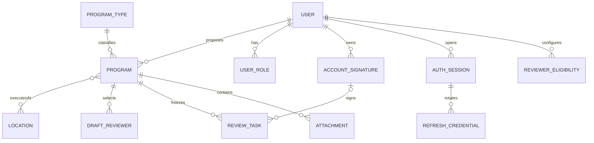
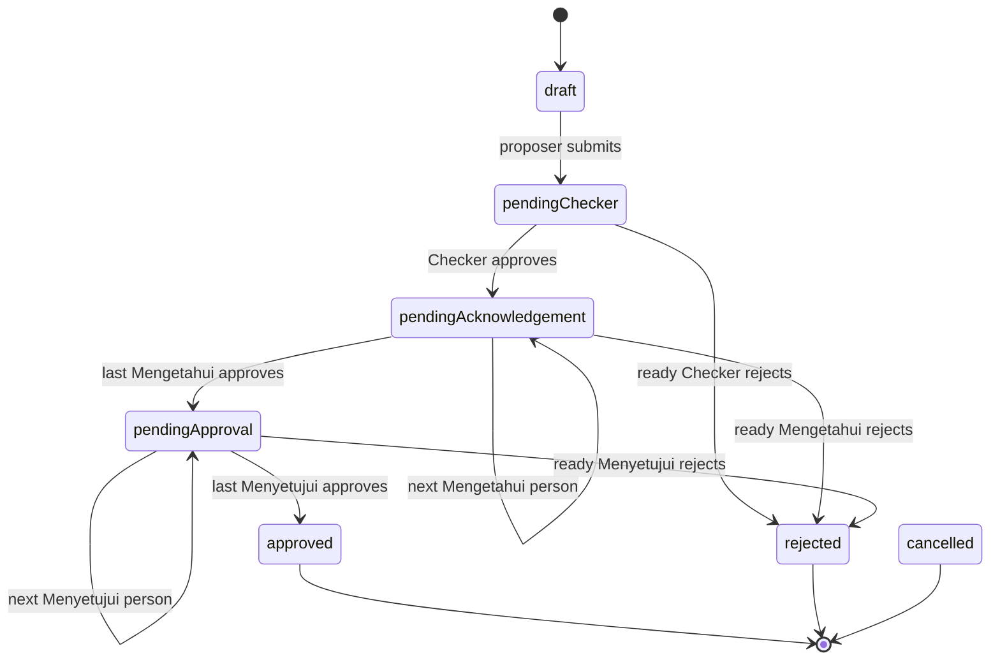

# Sales Program Submission API Design

Status: **implemented development backend**, contract revision 0.3.0, 2026-09-09. Stack: Flutter across supported mobile/web/desktop targets, Django REST Framework, MySQL 8.4. This backend phase leaves Flutter unchanged. The complete executable contract is [openapi.yaml](openapi.yaml); local startup, account provisioning and verification are in [BACKEND.md](BACKEND.md). Cancellation is implemented behind an unconfigured policy gate, not silently enabled.

## Evidence and confirmed scope

The original workspace supplied `ui-mockup/Authentication.dc.html`, `Pengajuan Program.dc.html`, `Backoffice.dc.html`, all six annotated `uploads/draw-*.png` images, `support.js`, `image-slot.js`, and thumbnail metadata. The HTML/script flows and annotations established login, draft editing, fixed Checker, selectable Mengetahui/Menyetujui, a current-turn inbox, filters, optional review notes and printable detail. The mockups’ hardcoded identities, dates, role labels and contradictory inbox data are examples rather than business rules. The original files remain in the parent workspace at `../../ui-mockup/`.

User decisions supersede the mockup: login only with pre-created employee accounts; future superadmin account management; a persisted employee-to-Checker relation; proposer-entered type/cost with IDR shown as Rp; optional Excel/PDF attachments; proposer-only cancellation; separate completed assignment history; all review notes visible to authorized participants. The subsequent answers explicitly confirm **every person approves sequentially, any rejection ends the submission, and signatures are provisioned images snapshotted on submit/approve**. Dashboard metrics were not selected and remain deferred.

## Business domain and actors

PT Total Chemindo Loka employees propose Sales & Marketing programs for one or more execution locations and dates. Bundling/Diskon and BSD/Bekasi are observed master-data examples. The established domain is program approval; customer CRM, orders, invoicing and budget execution are not included.

| Actor / role | Access |
| --- | --- |
| Public | CSRF bootstrap, email/password login, credential-bearing refresh/logout, minimal health checks |
| Proposer / `submitter` | Own drafts/submissions, fields, attachments, submit, progress, PDF; cancellation only when authorized by configured source states |
| Checker / `checker` | First assigned reviewer, resolved from proposer.checkerId; approve/reject only their ready task |
| Mengetahui / `acknowledger` | Sequential approval after Checker and before Menyetujui |
| Menyetujui / `approver` | Sequential final approval stage |
| `backofficeAdmin` | Reserved role; no global read, override, cancel or reassignment privileges inferred |
| Future superadmin | Account-management UI/API deferred; trusted provisioning command supplied now |
| Backend worker | Scans private attachments and audits results; cannot be selected as a client role |

An active role and the required object relationship are both necessary. Roles are not job titles. Staff/superuser flags do not bypass API permissions. A completed approved/rejected task retains read access while that reviewer role is still granted; waiting/voided tasks alone confer no access. An owner uses user-facing routes; reviewers use `/backoffice` routes. All notes on an authorized program are readable by its proposer and authorized current/completed reviewers.

## User flows

### Authentication

1. The organization provisions an employee’s email, password, role grants, locations, Checker/eligible reviewers and signature. There is no public registration endpoint.
2. Native Flutter sends email/password with `clientType: native`; web first obtains `/auth/csrf`, then sends `clientType: web`, credentials-enabled cookies and `X-CSRFToken`.
3. Login returns an access token and profile. Native receives a refresh token; web receives a CSRF token and an HttpOnly refresh cookie. `/users/me` refreshes current account information.
4. Access lasts 15 minutes. Refresh rotates access and refresh credentials together within a 30-day absolute session lifetime. Reuse revokes that session family. Logout revokes that device/session family.

### Program Submission

1. Load the caller’s own list, search/filter, create an empty or populated draft, and retain its ID and ETag.
2. Load authorized locations/types, the resolved Checker, and explicitly eligible selectable reviewers. Save name, type, exact IDR cost, execution dates, locations, and ordered reviewer arrays.
3. Optionally upload one PDF/Excel file per request. Poll metadata for scanning status; retained pending/rejected files block submit. Removal is available only in drafts.
4. Detail supplies `submissionIssues`, `allowedActions`, and `myActiveTaskIds`. The backend validates all references, readiness and policy before submit.
5. Submit freezes the plan, display identity/master labels, policy and proposer signature, creates tasks and activates Checker. Submitted content is immutable.
6. View progress, every review note and a printable PDF. Cancellation remains gated until its allowed source states are answered.

### Backoffice

1. The inbox includes programs with the caller’s ready task in a currently granted reviewer role. Future queued tasks are not actionable or visible through that assignment alone.
2. Open detail, read files/notes/PDF, then approve or reject one concrete task with the current program ETag and an idempotency key. Notes are optional under the current mockup contract.
3. Approval snapshots the signer’s provisioned image and activates the next person. Only after all Mengetahui approvals does Menyetujui begin; the last approval closes the program.
4. Any assigned ready reviewer may reject, except the proposer. Rejection immediately closes the program and voids the rest of the chain.
5. `/backoffice/review-history` supports a separate history page with the usual list/detail layout. Completed reviewers retain read access, including while later reviewers still work. This phase supplies its API, not a Flutter page.

## Data model and MySQL relationships

Application IDs are opaque prefixed strings up to 64 characters. Internally generated UUIDs do not encode authority. Required storage fields are populated server-side; nullable draft fields stay nullable until submit validation.

| Entity | Principal stored fields and relationships |
| --- | --- |
| User | id, unique normalized email, Argon2 password hash, fullName (150), nullable unique employeeNumber (50), jobTitle (150), timeZone, active/staff flags, created/updated dates, nullable Checker self-FK, assigned locations M:N, nullable current AccountSignature FK |
| UserRole | User FK + role enum, unique pair; multiple explicit capabilities per employee |
| AccountSignature | id, owner User FK, unique private storage key, SHA-256, createdAt; immutable image versions, event references protected from deletion |
| AuthSession | id, User FK, native/web transport, unique hashed access token, access/absolute refresh expiry, revokedAt, createdAt |
| RefreshCredential | Session FK, unique token hash, usedAt, createdAt; rotated credentials retained to detect reuse |
| Location | id, unique code (50), name (150), isActive; user and program M:N relationships |
| ProgramType | id, unique code (50), name (150), isActive; Program FK |
| ReviewerEligibility | employee User FK, reviewer User FK, acknowledgement/approval stage; unique triple; organization assigns exact eligibility |
| WorkflowPolicy | singleton configuration: sequential order, terminal rejection, required signature, nullable self-approval/type-cost requirements, cancellation source-state array, reviewer count limits, updatedAt |
| ProgramCounter | year primary key + integer sequence, allocated under row lock; PRG-YYYY-NNNN, Asia/Jakarta rollover; uniqueness promised, not gaplessness |
| Program | id, unique programNumber, owner User FK, nullable name/type/dates/Decimal(16,2) cost, locations M:N, status, currentStage, integer version, created/updated/submitted/closed times, cancellation reason, immutable submission/policy JSON snapshots, proposer signature FK |
| DraftReviewer | Program FK, reviewer User FK, acknowledgement/approval stage, 1-based position; unique stage-position and stage-reviewer per program |
| ReviewTask | id, Program/User FKs, reviewer display snapshot, stage, position, task status, decision time/note, nullable snapshotted signature FK; unique program-stage-position |
| Attachment | id, Program/uploader FKs, safe filename (255), private unique key, detected MIME, byte size, SHA-256, scan status/reason, uploaded/scanned/removed times; soft removal |
| AuditLog | actor nullable User FK, event, resourceId, requestId, bounded event metadata, timestamp; no request bodies/passwords/tokens/signature bytes |
| IdempotencyRecord | unique hashed actor/method/path/key scope, request fingerprint, original response/status/selected headers, expiry; 24-hour replay contract |
| RateLimitBucket | hashed key, count, window reset; transactional database-backed counters |

MySQL uses InnoDB, utf8mb4, strict SQL mode and READ COMMITTED transactions. FK/uniqueness/check constraints protect relationships, review positions, nonnegative cost and ordered dates. Indexes cover owner/status list access, reviewer task queues and resource audit lookup. Submission actions lock the parent row; idempotent actions also serialize writes for the actor. Signature references and completed tasks use protective deletion rules. Migration files are the authoritative SQL schema history; no SQLite fallback is used.



### Status lifecycle

Program enum: `draft`, `pendingChecker`, `pendingAcknowledgement`, `pendingApproval`, `approved`, `rejected`, `cancelled`. Stage enum: `checker`, `acknowledgement`, `approval`; currentStage is null in draft/terminal states. Review tasks: `waiting`, `ready`, `approved`, `rejected`, `voided`. Attachments: `pending`, `clean`, `rejected`. Role and transport enums are listed above.



Cancellation edges are intentionally not drawn: their source states are unresolved. Once authorized, only the owner can transition an allowlisted state to cancelled; outstanding tasks become voided. No revision, reopening, delegation or override endpoint exists. A same-stage approval can leave program status unchanged while incrementing version and moving readiness to the next person. The proposer cannot reject even if granted a reviewer role. Unconfirmed self-approval and cross-stage duplicate reviewers block submit.

## API conventions and Flutter consumption

- Base path `/api/v1`, no trailing slash, JSON `camelCase`; Python/database code uses snake_case. Explicit DTO serializers control the mapping.
- Success: `{"data": ..., "meta": {"requestId": "req_..."}}`. Lists put pagination alongside requestId in meta. Binary file/PDF success responses stream bytes; failures still use JSON.
- Error: `{"error":{"code":"VALIDATION_FAILED","message":"One or more fields are invalid.","details":[{"field":"periodEnd","code":"INVALID","message":"End date must be on or after start date."}]},"meta":{"requestId":"req_example"}}`.
- Unknown JSON/query fields or duplicate scalar query keys: 400. Field validation: 422. Authentication: 401 with Bearer challenge; role denial: 403; inaccessible/mismatched resource: 404. Policy/state conflict: 409. Stale version: 412; missing If-Match: 428. Oversize: 413; wrong media/content: 415; throttle: 429 + Retry-After; sanitized unexpected failure: 500; unavailable database/storage: 503. Unsupported verbs/Accept use 405/406. Successful creates return 201, uploads 202, other operations 200.
- Pagination: page defaults to 1, pageSize 20 (max 100), with totalItems, totalPages and hasNextPage; an out-of-range page returns []. No cursor abstraction is added now.
- Search is trimmed literal case-insensitive substring; q max 100. Repeated status/location/reviewer filters use repeated keys and OR inside that filter. Different filters combine with AND. Filtering never widens authorization. `periodStartFrom`/`periodStartTo` are inclusive bounds on execution start dates. This is explicitly a start-date filter, not overlap/submission-date filtering.
- Sort allowlist: `-createdAt` (default), `createdAt`, `-updatedAt`, `updatedAt`, `programNumber`; append id ascending for stable ties. Master/people results use stable code/name then id ordering.
- Instants are UTC RFC 3339 strings with Z; execution dates are `YYYY-MM-DD` without conversion. Profile timezone defaults to Asia/Jakarta. Flutter formats dates for display and costs as Rp. IDR amounts are exact strings such as `"42000000.00"`, never formatted currency strings or floating point JSON numbers.
- Detail and submission mutation responses include `ETag: "version"`. PATCH and action/upload/removal calls send If-Match with that quoted parent version. Every successful mutation and scan verdict increments the parent version. On 412, fetch fresh detail before reconciling; do not overwrite blindly.
- Create, submit, cancel, approve, reject, upload and attachment removal require a random 16–128-character Idempotency-Key. Scope includes actor/method/path; fingerprint includes original If-Match and JSON body (or filename/MIME/bytes checksum). An identical retry replays its original successful business response for 24 hours with a fresh requestId; changed payload/precondition under the same key returns 409. Authorization is checked before replay. PATCH is protected by versioning, not a separate replay cache. Failed operations are not saved as successes.
- All API responses use `Cache-Control: no-store` and server-generated X-Request-Id. Optional HEAD/OPTIONS follow DRF behavior. No client-supplied owner, checker, actor, next status, signature image or task list can change server authority.

Flutter feature repositories should wrap auth, submissions, backoffice and master-data services. Keep one in-flight refresh, retain draft IDs and pending action keys, map errors to field/session/conflict states, and use the latest allowedActions/myActiveTaskIds/submissionIssues for presentation. Access checks and workflow transitions remain server-side. Use OS secure storage for native refresh credentials; web uses credentials-enabled requests, in-memory access tokens and HttpOnly refresh cookies, never localStorage for refresh tokens. Browser API and frontend must be deployed on the same site for SameSite=Lax cookies; configure trusted origins/credentials explicitly. No frontend implementation is included here.

## Endpoint catalogue

All operations below are mounted under `/api/v1`. Each entry includes purpose, allowed roles, parameters, body, successful example, errors and rules. Shared request DTO constraints follow the catalogue. Cancellation’s success example is conditional on explicit future source-state configuration. The single-reviewer sample sequence is create version 1 → edit 2 → upload 3 → scan 4 → submit 5 → Checker 6 → Mengetahui 7 → final approve/reject 8. Removal/cancellation are alternative examples. Always use live server versions and IDs.

| Method | Path | Purpose |
| --- | --- | --- |
| POST | `/auth/login` | Authenticate an existing active account. |
| POST | `/auth/refresh` | Rotate the refresh token and issue a new access token. |
| POST | `/auth/logout` | Revoke the current refresh-token family and its access sessions. |
| GET | `/users/me` | Load the signed-in profile for the header and auto-filled applicant section. |
| GET | `/master-data/locations` | List locations the caller may select. |
| GET | `/master-data/program-types` | List active program types for draft selection and filters. |
| GET | `/program-submissions` | List and search only submissions owned by the caller. |
| POST | `/program-submissions` | Create a persisted draft, including an empty draft. |
| GET | `/program-submissions/{submissionId}` | Read an owned draft or submission, progress and attachment metadata. |
| PATCH | `/program-submissions/{submissionId}` | Partially update an owned draft. |
| GET | `/program-submissions/{submissionId}/policy` | Load server-resolved checker, reviewer limits and upload constraints for this draft. |
| GET | `/program-submissions/{submissionId}/reviewer-options` | List eligible reviewers for the selected draft and stage. |
| POST | `/program-submissions/{submissionId}/attachments` | Upload one PDF/Excel attachment to an owned draft. |
| GET | `/program-submissions/{submissionId}/attachments/{attachmentId}` | Read attachment metadata and scan status. |
| DELETE | `/program-submissions/{submissionId}/attachments/{attachmentId}` | Remove an attachment from an owned draft. |
| GET | `/program-submissions/{submissionId}/attachments/{attachmentId}/content` | Download an authorized, clean attachment. |
| GET | `/program-submissions/{submissionId}/pdf` | Render a printable submission form from a consistent saved snapshot. |
| GET | `/backoffice/program-submissions/{submissionId}/attachments/{attachmentId}/content` | Download an authorized, clean attachment. |
| GET | `/backoffice/program-submissions/{submissionId}/pdf` | Render a printable submission form from a consistent saved snapshot. |
| POST | `/program-submissions/{submissionId}/submit` | Freeze draft content and start the review chain. |
| POST | `/program-submissions/{submissionId}/cancel` | Cancel an owned program when its source state is explicitly authorized. |
| GET | `/backoffice/program-submissions` | List submissions with a current ready review task assigned to the caller. |
| GET | `/backoffice/review-history` | List the caller’s completed review assignments on a separate history page. |
| GET | `/backoffice/program-submissions/{submissionId}` | Read submission details for a current task, including progress and decision targets. |
| GET | `/backoffice/filter-options/people` | Populate submitter and reviewer person filters without an unrestricted directory. |
| POST | `/backoffice/program-submissions/{submissionId}/review-tasks/{taskId}/approve` | Record approval for exactly one assigned review task. |
| POST | `/backoffice/program-submissions/{submissionId}/review-tasks/{taskId}/reject` | Record rejection for exactly one assigned review task. |
| GET | `/auth/csrf` | Bootstrap a browser CSRF token. |
| GET | `/health/live` | Check application liveness. |
| GET | `/health/ready` | Check MySQL connectivity. |

### Authentication

#### `POST /api/v1/auth/login`

Authenticate an existing active account.

**Allowed roles:** Public

**Validation and business rules:** Login only for active, pre-provisioned employees. Normalize email, preserve password bytes, use uniform 401 failures. clientType defaults to native. Native returns refreshToken; web returns csrfToken and sets an HttpOnly SameSite=Lax refresh cookie, Secure outside development. Web first calls GET /auth/csrf and sends its X-CSRFToken with credentials. Origin-bearing login also requires CSRF. Access lasts 15 minutes; refresh families have a 30-day absolute expiry. No public registration.

| Parameter | In | Required | Constraints / meaning |
| --- | --- | --- | --- |
| `X-CSRFToken` | header | no | string. Required for web/cookie/Origin-bearing requests. Obtain from /auth/csrf, then use the rotated token from login. |
| `sales_refresh` | cookie | no | string. HttpOnly browser refresh transport. Sent automatically with credentials; do not set it from Flutter JavaScript. |

**Request body:** application/json — `LoginRequest`; see DTO fields below.

```json
{
  "email": "rizky@example.com",
  "password": "example-password-for-documentation"
}
```

**Success: 200.** Headers: `X-Request-Id`, `Cache-Control`, `Set-Cookie`.

Native transport:

```json
{
  "data": {
    "accessToken": "example-access-token-not-a-real-credential",
    "tokenType": "Bearer",
    "expiresIn": 900,
    "refreshToken": "example-refresh-token-not-a-real-credential",
    "refreshExpiresAt": "2026-09-20T03:00:00Z",
    "sessionId": "ses_rizky",
    "user": {
      "id": "usr_rizky",
      "fullName": "Rizky Pratama",
      "jobTitle": "Sales Executive",
      "employeeNumber": "B001",
      "email": "rizky@example.com",
      "status": "active",
      "roles": [
        "submitter"
      ],
      "timeZone": "Asia/Jakarta",
      "locationIds": [
        "loc_bsd"
      ],
      "checkerId": "usr_andi"
    }
  },
  "meta": {
    "requestId": "req_01salesdesign"
  }
}
```

Web transport:

```json
{
  "data": {
    "accessToken": "example-access-token-not-a-real-credential",
    "tokenType": "Bearer",
    "expiresIn": 900,
    "refreshExpiresAt": "2026-09-20T03:00:00Z",
    "sessionId": "ses_rizky",
    "user": {
      "id": "usr_rizky",
      "fullName": "Rizky Pratama",
      "jobTitle": "Sales Executive",
      "employeeNumber": "B001",
      "email": "rizky@example.com",
      "status": "active",
      "roles": [
        "submitter"
      ],
      "timeZone": "Asia/Jakarta",
      "locationIds": [
        "loc_bsd"
      ],
      "checkerId": "usr_andi"
    },
    "csrfToken": "example-csrf-token-not-a-real-token"
  },
  "meta": {
    "requestId": "req_01salesdesign"
  }
}
```

**Possible errors:** `400`, `401`, `415`, `422`, `429`, `500`, `503`, `403`, `405`, `406`. All use the shared Error envelope; domain conflict codes and conditions are described above.

#### `POST /api/v1/auth/refresh`

Rotate the refresh token and issue a new access token.

**Allowed roles:** Refresh-token holder

**Validation and business rules:** Rotate both access and refresh tokens atomically; the previous access token becomes invalid immediately. Native sends refreshToken; web sends {} with sales_refresh cookie and X-CSRFToken. A used refresh token revokes the whole family, including the newest access token. Expired, disabled, revoked or wrong-transport sessions return 401. Serialize refresh calls in the client.

| Parameter | In | Required | Constraints / meaning |
| --- | --- | --- | --- |
| `X-CSRFToken` | header | no | string. Required for web/cookie/Origin-bearing requests. Obtain from /auth/csrf, then use the rotated token from login. |
| `sales_refresh` | cookie | no | string. HttpOnly browser refresh transport. Sent automatically with credentials; do not set it from Flutter JavaScript. |

**Request body:** application/json — `RefreshRequest`; see DTO fields below.

```json
{
  "refreshToken": "example-refresh-token-not-a-real-credential"
}
```

**Success: 200.** Headers: `X-Request-Id`, `Cache-Control`, `Set-Cookie`.

Native transport:

```json
{
  "data": {
    "accessToken": "example-new-access-token-not-a-real-credential",
    "tokenType": "Bearer",
    "expiresIn": 900,
    "refreshToken": "example-new-refresh-token-not-a-real-credential",
    "refreshExpiresAt": "2026-09-20T03:00:00Z",
    "sessionId": "ses_rizky",
    "user": {
      "id": "usr_rizky",
      "fullName": "Rizky Pratama",
      "jobTitle": "Sales Executive",
      "employeeNumber": "B001",
      "email": "rizky@example.com",
      "status": "active",
      "roles": [
        "submitter"
      ],
      "timeZone": "Asia/Jakarta",
      "locationIds": [
        "loc_bsd"
      ],
      "checkerId": "usr_andi"
    }
  },
  "meta": {
    "requestId": "req_01salesdesign"
  }
}
```

Web transport:

```json
{
  "data": {
    "accessToken": "example-new-access-token-not-a-real-credential",
    "tokenType": "Bearer",
    "expiresIn": 900,
    "refreshExpiresAt": "2026-09-20T03:00:00Z",
    "sessionId": "ses_rizky",
    "user": {
      "id": "usr_rizky",
      "fullName": "Rizky Pratama",
      "jobTitle": "Sales Executive",
      "employeeNumber": "B001",
      "email": "rizky@example.com",
      "status": "active",
      "roles": [
        "submitter"
      ],
      "timeZone": "Asia/Jakarta",
      "locationIds": [
        "loc_bsd"
      ],
      "checkerId": "usr_andi"
    },
    "csrfToken": "example-csrf-token-not-a-real-token"
  },
  "meta": {
    "requestId": "req_01salesdesign"
  }
}
```

**Possible errors:** `400`, `401`, `415`, `422`, `429`, `500`, `503`, `403`, `405`, `406`. All use the shared Error envelope; domain conflict codes and conditions are described above.

#### `POST /api/v1/auth/logout`

Revoke the current refresh-token family and its access sessions.

**Allowed roles:** Refresh-token holder

**Validation and business rules:** Revoke the identified session family; repeated logout with a validly shaped but already revoked/unknown credential succeeds. Native supplies refreshToken; web uses its HttpOnly cookie and X-CSRFToken, then the cookie is cleared. Other sessions are unaffected. Missing credential is 401. Does not require a valid access token.

| Parameter | In | Required | Constraints / meaning |
| --- | --- | --- | --- |
| `X-CSRFToken` | header | no | string. Required for web/cookie/Origin-bearing requests. Obtain from /auth/csrf, then use the rotated token from login. |
| `sales_refresh` | cookie | no | string. HttpOnly browser refresh transport. Sent automatically with credentials; do not set it from Flutter JavaScript. |

**Request body:** application/json — `RefreshRequest`; see DTO fields below.

```json
{
  "refreshToken": "example-refresh-token-not-a-real-credential"
}
```

**Success: 200.** Headers: `X-Request-Id`, `Cache-Control`, `Set-Cookie`.

```json
{
  "data": {
    "revoked": true
  },
  "meta": {
    "requestId": "req_01salesdesign"
  }
}
```

**Possible errors:** `400`, `415`, `422`, `429`, `500`, `503`, `403`, `405`, `406`. All use the shared Error envelope; domain conflict codes and conditions are described above.

#### `GET /api/v1/auth/csrf`

Bootstrap a browser CSRF token.

**Allowed roles:** Public

**Validation and business rules:** Public read. Sets the CSRF cookie and returns the masked token; use credentials-enabled requests and X-CSRFToken for browser login/refresh/logout. No query parameters.

**Path/query parameters:** none.

**Request body:** none.

**Success: 200.** Headers: `X-Request-Id`, `Cache-Control`.

```json
{
  "data": {
    "csrfToken": "example-csrf-token-not-a-real-token"
  },
  "meta": {
    "requestId": "req_example"
  }
}
```

**Possible errors:** `400`, `429`, `500`, `503`, `405`, `406`. All use the shared Error envelope; domain conflict codes and conditions are described above.

### User/Profile

#### `GET /api/v1/users/me`

Load the signed-in profile for the header and auto-filled applicant section.

**Allowed roles:** Any active authenticated role

**Validation and business rules:** Return current authenticated identity, current role grants, assigned locationIds and nullable checkerId. Roles and relationships are provisioned by the organization. No public profile editing or account creation. No role grants are inferred from job title or staff flags.

**Path/query parameters:** none.

**Request body:** none.

**Success: 200.** Headers: `X-Request-Id`, `Cache-Control`.

```json
{
  "data": {
    "id": "usr_rizky",
    "fullName": "Rizky Pratama",
    "jobTitle": "Sales Executive",
    "employeeNumber": "B001",
    "email": "rizky@example.com",
    "status": "active",
    "roles": [
      "submitter"
    ],
    "timeZone": "Asia/Jakarta",
    "locationIds": [
      "loc_bsd"
    ],
    "checkerId": "usr_andi"
  },
  "meta": {
    "requestId": "req_01salesdesign"
  }
}
```

**Possible errors:** `400`, `401`, `403`, `429`, `500`, `503`, `405`, `406`. All use the shared Error envelope; domain conflict codes and conditions are described above.

### Program Submission

#### `GET /api/v1/program-submissions`

List and search only submissions owned by the caller.

**Allowed roles:** submitter (owner)

**Validation and business rules:** Submitter role plus owner scope. Apply filters before pagination. Search program name/number; execution date filters bound periodStart inclusively. OR within repeated filters, AND between filters. Stable sorting appends id ascending. Out-of-range pages are empty.

| Parameter | In | Required | Constraints / meaning |
| --- | --- | --- | --- |
| `page` | query | no | integer; minimum=1; maximum=2147483647; default=1. 1-based page. |
| `pageSize` | query | no | integer; minimum=1; maximum=100; default=20. Items per page. |
| `q` | query | no | string; minLength=1; maxLength=100. Trimmed, case-insensitive literal substring of program number or program name; no wildcard syntax. |
| `programNumber` | query | no | string; maxLength=200. Exact program number; combines with q using AND. |
| `status` | query | no | array of SubmissionStatus; maxItems=100. Repeat key for multiple statuses; OR within this filter. |
| `locationId` | query | no | array of Id; maxItems=100. Repeat key; submission must match at least one selected location. |
| `programTypeId` | query | no | Id. Exact type ID; submissions with unknown type do not match. |
| `periodStartFrom` | query | no | string. Inclusive lower bound on execution periodStart; not submittedAt. |
| `periodStartTo` | query | no | string. Inclusive upper bound on execution periodStart; lower bound must not exceed upper bound. |
| `sort` | query | no | string; enum=['-createdAt', 'createdAt', '-updatedAt', 'updatedAt', 'programNumber']; default=-createdAt. Default -createdAt; append id ascending internally as a stable tie-breaker. |

**Request body:** none.

**Success: 200.** Headers: `X-Request-Id`, `Cache-Control`.

```json
{
  "data": [
    {
      "id": "sub_0144",
      "programNumber": "PRG-2026-0144",
      "programName": "Bundling Idul Adha Outlet BSD",
      "programType": {
        "id": "typ_bundling",
        "code": "bundling",
        "name": "Bundling",
        "isActive": true
      },
      "locations": [
        {
          "id": "loc_bsd",
          "code": "BSD",
          "name": "BSD",
          "isActive": true
        }
      ],
      "periodStart": "2026-09-06",
      "periodEnd": "2026-09-20",
      "estimatedCost": {
        "currency": "IDR",
        "amount": "42000000.00"
      },
      "owner": {
        "id": "usr_rizky",
        "fullName": "Rizky Pratama",
        "jobTitle": "Sales Executive"
      },
      "status": "draft",
      "currentStage": null,
      "createdAt": "2026-08-21T03:00:00Z",
      "updatedAt": "2026-08-21T03:00:00Z",
      "submittedAt": null,
      "version": 1,
      "myActiveTaskIds": []
    }
  ],
  "meta": {
    "requestId": "req_01salesdesign",
    "page": 1,
    "pageSize": 20,
    "totalItems": 1,
    "totalPages": 1,
    "hasNextPage": false
  }
}
```

**Possible errors:** `400`, `401`, `403`, `422`, `429`, `500`, `503`, `405`, `406`. All use the shared Error envelope; domain conflict codes and conditions are described above.

#### `POST /api/v1/program-submissions`

Create a persisted draft, including an empty draft.

**Allowed roles:** submitter

**Validation and business rules:** Submitter role required. {} creates an empty draft. All supplied references must be active and authorized; selected reviewers require explicit per-employee eligibility plus the matching role. Allocate PRG-YYYY-NNNN under a MySQL row lock, yearly in Asia/Jakarta. Owner, checker, number, status, timestamps and tasks are server-owned. Never derive type/cost from uploaded spreadsheets. Drafts may be incomplete. Inspect submissionIssues before submit.

| Parameter | In | Required | Constraints / meaning |
| --- | --- | --- | --- |
| `Idempotency-Key` | header | yes | string; minLength=16; maxLength=128. Random key for one logical operation; reuse only for an identical retry. Retained for 24 hours. |

**Request body:** application/json — `DraftCreate`; see DTO fields below.

```json
{
  "programName": "Bundling Idul Adha Outlet BSD",
  "locationIds": [
    "loc_bsd"
  ],
  "periodStart": "2026-09-06",
  "periodEnd": "2026-09-20",
  "acknowledgerIds": [
    "usr_dewi"
  ],
  "approverIds": [
    "usr_ratna"
  ],
  "programTypeId": "typ_bundling",
  "estimatedCost": {
    "currency": "IDR",
    "amount": "42000000.00"
  }
}
```

**Success: 201.** Headers: `X-Request-Id`, `Cache-Control`, `ETag`, `Location`.

```json
{
  "data": {
    "id": "sub_0144",
    "programNumber": "PRG-2026-0144",
    "programName": "Bundling Idul Adha Outlet BSD",
    "programType": {
      "id": "typ_bundling",
      "code": "bundling",
      "name": "Bundling",
      "isActive": true
    },
    "locations": [
      {
        "id": "loc_bsd",
        "code": "BSD",
        "name": "BSD",
        "isActive": true
      }
    ],
    "periodStart": "2026-09-06",
    "periodEnd": "2026-09-20",
    "estimatedCost": {
      "currency": "IDR",
      "amount": "42000000.00"
    },
    "owner": {
      "id": "usr_rizky",
      "fullName": "Rizky Pratama",
      "jobTitle": "Sales Executive"
    },
    "status": "draft",
    "currentStage": null,
    "createdAt": "2026-08-21T03:00:00Z",
    "updatedAt": "2026-08-21T03:00:00Z",
    "submittedAt": null,
    "version": 1,
    "myActiveTaskIds": [],
    "reviewPlan": {
      "checker": {
        "id": "usr_andi",
        "fullName": "Andi Setiawan",
        "jobTitle": "Supervisor Sales"
      },
      "acknowledgers": [
        {
          "id": "usr_dewi",
          "fullName": "Dewi Larasati",
          "jobTitle": "Branch Manager BSD"
        }
      ],
      "approvers": [
        {
          "id": "usr_ratna",
          "fullName": "Ratna Kusuma",
          "jobTitle": "GM Sales & Marketing"
        }
      ]
    },
    "reviewTasks": [],
    "attachments": [],
    "allowedActions": [
      "update",
      "uploadAttachment",
      "downloadPdf"
    ],
    "submissionIssues": [
      {
        "field": null,
        "code": "WORKFLOW_POLICY_UNRESOLVED",
        "message": "Review policy must be confirmed before submission."
      }
    ]
  },
  "meta": {
    "requestId": "req_01salesdesign"
  }
}
```

**Possible errors:** `400`, `401`, `403`, `409`, `415`, `422`, `429`, `500`, `503`, `405`, `406`. All use the shared Error envelope; domain conflict codes and conditions are described above.

#### `GET /api/v1/program-submissions/{submissionId}`

Read an owned draft or submission, progress and attachment metadata.

**Allowed roles:** submitter (owner)

**Validation and business rules:** Require submitter role and ownership; return 404 outside owner scope. Return current version and ETag, complete review notes, attachments, allowedActions and submissionIssues. Submitted identity, master labels and review plan use frozen snapshots.

| Parameter | In | Required | Constraints / meaning |
| --- | --- | --- | --- |
| `submissionId` | path | yes | Id. Immutable submissionId. |

**Request body:** none.

**Success: 200.** Headers: `X-Request-Id`, `Cache-Control`, `ETag`.

```json
{
  "data": {
    "id": "sub_0144",
    "programNumber": "PRG-2026-0144",
    "programName": "Bundling September Outlet BSD",
    "programType": {
      "id": "typ_bundling",
      "code": "bundling",
      "name": "Bundling",
      "isActive": true
    },
    "locations": [
      {
        "id": "loc_bsd",
        "code": "BSD",
        "name": "BSD",
        "isActive": true
      }
    ],
    "periodStart": "2026-09-06",
    "periodEnd": "2026-09-20",
    "estimatedCost": {
      "currency": "IDR",
      "amount": "42000000.00"
    },
    "owner": {
      "id": "usr_rizky",
      "fullName": "Rizky Pratama",
      "jobTitle": "Sales Executive"
    },
    "status": "pendingChecker",
    "currentStage": "checker",
    "createdAt": "2026-08-21T03:00:00Z",
    "updatedAt": "2026-08-21T03:10:00Z",
    "submittedAt": "2026-08-21T03:10:00Z",
    "version": 5,
    "myActiveTaskIds": [],
    "reviewPlan": {
      "checker": {
        "id": "usr_andi",
        "fullName": "Andi Setiawan",
        "jobTitle": "Supervisor Sales"
      },
      "acknowledgers": [
        {
          "id": "usr_dewi",
          "fullName": "Dewi Larasati",
          "jobTitle": "Branch Manager BSD"
        }
      ],
      "approvers": [
        {
          "id": "usr_ratna",
          "fullName": "Ratna Kusuma",
          "jobTitle": "GM Sales & Marketing"
        }
      ]
    },
    "reviewTasks": [
      {
        "id": "tsk_checker",
        "stage": "checker",
        "reviewer": {
          "id": "usr_andi",
          "fullName": "Andi Setiawan",
          "jobTitle": "Supervisor Sales"
        },
        "position": 1,
        "status": "ready",
        "decidedAt": null,
        "note": null
      },
      {
        "id": "tsk_know",
        "stage": "acknowledgement",
        "reviewer": {
          "id": "usr_dewi",
          "fullName": "Dewi Larasati",
          "jobTitle": "Branch Manager BSD"
        },
        "position": 1,
        "status": "waiting",
        "decidedAt": null,
        "note": null
      },
      {
        "id": "tsk_approve",
        "stage": "approval",
        "reviewer": {
          "id": "usr_ratna",
          "fullName": "Ratna Kusuma",
          "jobTitle": "GM Sales & Marketing"
        },
        "position": 1,
        "status": "waiting",
        "decidedAt": null,
        "note": null
      }
    ],
    "attachments": [
      {
        "id": "att_proposal",
        "submissionId": "sub_0144",
        "fileName": "Proposal Program.pdf",
        "contentType": "application/pdf",
        "sizeBytes": 1800000,
        "scanStatus": "clean",
        "uploadedAt": "2026-08-21T03:06:00Z"
      }
    ],
    "allowedActions": [
      "downloadPdf"
    ],
    "submissionIssues": []
  },
  "meta": {
    "requestId": "req_01salesdesign"
  }
}
```

**Possible errors:** `400`, `401`, `403`, `404`, `429`, `500`, `503`, `405`, `406`. All use the shared Error envelope; domain conflict codes and conditions are described above.

#### `PATCH /api/v1/program-submissions/{submissionId}`

Partially update an owned draft.

**Allowed roles:** submitter (owner)

**Validation and business rules:** Require owner and draft status. PATCH omission preserves fields; null clears scalar/reference/cost fields; arrays replace selections. Empty PATCH is 422. Require nonblank names when supplied; start <= end; active assigned locations; eligible active reviewers. Costs are nonnegative exact IDR decimal strings with two digits after the decimal point. Reject unknown/server-owned fields. If-Match and version increment are atomic.

| Parameter | In | Required | Constraints / meaning |
| --- | --- | --- | --- |
| `submissionId` | path | yes | Id. Immutable submissionId. |
| `If-Match` | header | yes | string; pattern=^"[1-9][0-9]*"$. Quoted submission version from a prior detail/mutation ETag; attachment writes use the parent submission version. |

**Request body:** application/json — `DraftUpdate`; see DTO fields below.

```json
{
  "programName": "Bundling September Outlet BSD",
  "programTypeId": "typ_bundling",
  "estimatedCost": {
    "currency": "IDR",
    "amount": "42000000.00"
  }
}
```

**Success: 200.** Headers: `X-Request-Id`, `Cache-Control`, `ETag`.

```json
{
  "data": {
    "id": "sub_0144",
    "programNumber": "PRG-2026-0144",
    "programName": "Bundling September Outlet BSD",
    "programType": {
      "id": "typ_bundling",
      "code": "bundling",
      "name": "Bundling",
      "isActive": true
    },
    "locations": [
      {
        "id": "loc_bsd",
        "code": "BSD",
        "name": "BSD",
        "isActive": true
      }
    ],
    "periodStart": "2026-09-06",
    "periodEnd": "2026-09-20",
    "estimatedCost": {
      "currency": "IDR",
      "amount": "42000000.00"
    },
    "owner": {
      "id": "usr_rizky",
      "fullName": "Rizky Pratama",
      "jobTitle": "Sales Executive"
    },
    "status": "draft",
    "currentStage": null,
    "createdAt": "2026-08-21T03:00:00Z",
    "updatedAt": "2026-08-21T03:05:00Z",
    "submittedAt": null,
    "version": 2,
    "myActiveTaskIds": [],
    "reviewPlan": {
      "checker": {
        "id": "usr_andi",
        "fullName": "Andi Setiawan",
        "jobTitle": "Supervisor Sales"
      },
      "acknowledgers": [
        {
          "id": "usr_dewi",
          "fullName": "Dewi Larasati",
          "jobTitle": "Branch Manager BSD"
        }
      ],
      "approvers": [
        {
          "id": "usr_ratna",
          "fullName": "Ratna Kusuma",
          "jobTitle": "GM Sales & Marketing"
        }
      ]
    },
    "reviewTasks": [],
    "attachments": [],
    "allowedActions": [
      "update",
      "uploadAttachment",
      "downloadPdf"
    ],
    "submissionIssues": [
      {
        "field": null,
        "code": "WORKFLOW_POLICY_UNRESOLVED",
        "message": "Review policy must be confirmed before submission."
      }
    ]
  },
  "meta": {
    "requestId": "req_01salesdesign"
  }
}
```

**Possible errors:** `400`, `401`, `403`, `404`, `409`, `412`, `415`, `422`, `428`, `429`, `500`, `503`, `405`, `406`. All use the shared Error envelope; domain conflict codes and conditions are described above.

#### `GET /api/v1/program-submissions/{submissionId}/policy`

Load server-resolved checker, reviewer limits and upload constraints for this draft.

**Allowed roles:** submitter (owner)

**Validation and business rules:** Owner scope. Resolve Checker from employee.checkerId, requiring an active checker role. routingConfigured reports only this mapping. Initial selected-reviewer limits follow the mockup: one to two Mengetahui and one to three Menyetujui. Return current supported extensions and 10,000,000-byte limit. Full submit blockers are on submission detail.

| Parameter | In | Required | Constraints / meaning |
| --- | --- | --- | --- |
| `submissionId` | path | yes | Id. Immutable submissionId. |

**Request body:** none.

**Success: 200.** Headers: `X-Request-Id`, `Cache-Control`.

```json
{
  "data": {
    "policyVersion": "policy_example_1",
    "checker": {
      "id": "usr_andi",
      "fullName": "Andi Setiawan",
      "jobTitle": "Supervisor Sales"
    },
    "minAcknowledgers": 1,
    "maxAcknowledgers": 2,
    "minApprovers": 1,
    "maxApprovers": 3,
    "allowedAttachmentExtensions": [
      ".pdf",
      ".xls",
      ".xlsx",
      ".xlsm",
      ".xlsb",
      ".xlt",
      ".xltx",
      ".xltm",
      ".xla",
      ".xlam",
      ".xlw",
      ".xlm"
    ],
    "maxAttachmentBytes": 10000000,
    "routingConfigured": true
  },
  "meta": {
    "requestId": "req_01salesdesign"
  }
}
```

**Possible errors:** `400`, `401`, `403`, `404`, `409`, `429`, `500`, `503`, `405`, `406`. All use the shared Error envelope; domain conflict codes and conditions are described above.

#### `GET /api/v1/program-submissions/{submissionId}/reviewer-options`

List eligible reviewers for the selected draft and stage.

**Allowed roles:** submitter (owner)

**Validation and business rules:** Owner scope. stage is required and must be acknowledgement or approval. Return active people with the matching role and an explicit ReviewerEligibility grant for this employee. Search fullName/jobTitle; this is not an employee directory. Selection array order becomes the sequential approval order.

| Parameter | In | Required | Constraints / meaning |
| --- | --- | --- | --- |
| `submissionId` | path | yes | Id. Immutable submissionId. |
| `page` | query | no | integer; minimum=1; maximum=2147483647; default=1. 1-based page. |
| `pageSize` | query | no | integer; minimum=1; maximum=100; default=20. Items per page. |
| `stage` | query | yes | string; enum=['acknowledgement', 'approval']. Requested selectable stage. |
| `q` | query | no | string; minLength=1; maxLength=100. Case-insensitive substring of fullName/jobTitle. |

**Request body:** none.

**Success: 200.** Headers: `X-Request-Id`, `Cache-Control`.

```json
{
  "data": [
    {
      "person": {
        "id": "usr_dewi",
        "fullName": "Dewi Larasati",
        "jobTitle": "Branch Manager BSD"
      },
      "eligibleStages": [
        "acknowledgement"
      ]
    }
  ],
  "meta": {
    "requestId": "req_01salesdesign",
    "page": 1,
    "pageSize": 20,
    "totalItems": 1,
    "totalPages": 1,
    "hasNextPage": false
  }
}
```

**Possible errors:** `400`, `401`, `403`, `404`, `409`, `422`, `429`, `500`, `503`, `405`, `406`. All use the shared Error envelope; domain conflict codes and conditions are described above.

#### `POST /api/v1/program-submissions/{submissionId}/attachments`

Upload one PDF/Excel attachment to an owned draft.

**Allowed roles:** submitter (owner)

**Validation and business rules:** Owner and draft only. Exactly one multipart file, 1–10,000,000 bytes; require If-Match and Idempotency-Key. Validate supported PDF/Excel extension and container, bound expanded ZIP size to 100 MB and 10,000 entries, ignore claimed MIME. Store private random-key bytes with checksum; respond 202 pending. Worker scans with ClamAV before release. Encrypted/uninspectable files remain quarantined; malformed or infected documents are rejected. No macros or formulas execute. Fingerprint filename, detected MIME and SHA-256 for identical multipart retries. Pending/rejected attachments block submit until clean or removed.

| Parameter | In | Required | Constraints / meaning |
| --- | --- | --- | --- |
| `submissionId` | path | yes | Id. Immutable submissionId. |
| `If-Match` | header | yes | string; pattern=^"[1-9][0-9]*"$. Quoted submission version from a prior detail/mutation ETag; attachment writes use the parent submission version. |
| `Idempotency-Key` | header | yes | string; minLength=16; maxLength=128. Random key for one logical operation; reuse only for an identical retry. Retained for 24 hours. |

**Request body:** multipart/form-data — `MultipartUpload`; see DTO fields below.

One `file` part containing raw document bytes; the filename identifies the extension.

**Success: 202.** Headers: `X-Request-Id`, `Cache-Control`, `ETag`, `Location`.

```json
{
  "data": {
    "attachment": {
      "id": "att_proposal",
      "submissionId": "sub_0144",
      "fileName": "Proposal Program.pdf",
      "contentType": "application/pdf",
      "sizeBytes": 1800000,
      "scanStatus": "pending",
      "uploadedAt": "2026-08-21T03:06:00Z"
    },
    "submissionVersion": 3
  },
  "meta": {
    "requestId": "req_01salesdesign"
  }
}
```

**Possible errors:** `400`, `401`, `403`, `404`, `409`, `412`, `413`, `415`, `422`, `428`, `429`, `500`, `503`, `405`, `406`. All use the shared Error envelope; domain conflict codes and conditions are described above.

#### `GET /api/v1/program-submissions/{submissionId}/attachments/{attachmentId}`

Read attachment metadata and scan status.

**Allowed roles:** submitter (owner)

**Validation and business rules:** Owner scope and matching, nonremoved attachment. Metadata can be read while pending or rejected; internal storage paths, hashes and scanner diagnostics are never returned.

| Parameter | In | Required | Constraints / meaning |
| --- | --- | --- | --- |
| `submissionId` | path | yes | Id. Immutable submissionId. |
| `attachmentId` | path | yes | Id. Immutable attachmentId. |

**Request body:** none.

**Success: 200.** Headers: `X-Request-Id`, `Cache-Control`.

```json
{
  "data": {
    "id": "att_proposal",
    "submissionId": "sub_0144",
    "fileName": "Proposal Program.pdf",
    "contentType": "application/pdf",
    "sizeBytes": 1800000,
    "scanStatus": "clean",
    "uploadedAt": "2026-08-21T03:06:00Z"
  },
  "meta": {
    "requestId": "req_01salesdesign"
  }
}
```

**Possible errors:** `400`, `401`, `403`, `404`, `429`, `500`, `503`, `405`, `406`. All use the shared Error envelope; domain conflict codes and conditions are described above.

#### `DELETE /api/v1/program-submissions/{submissionId}/attachments/{attachmentId}`

Remove an attachment from an owned draft.

**Allowed roles:** submitter (owner)

**Validation and business rules:** Owner and draft only; no body. Require parent If-Match and Idempotency-Key. Soft-remove attachment and increment parent version atomically. Replaying the same request returns its original success. Removed bytes remain private pending a retention policy; no download remains available.

| Parameter | In | Required | Constraints / meaning |
| --- | --- | --- | --- |
| `submissionId` | path | yes | Id. Immutable submissionId. |
| `attachmentId` | path | yes | Id. Immutable attachmentId. |
| `If-Match` | header | yes | string; pattern=^"[1-9][0-9]*"$. Quoted submission version from a prior detail/mutation ETag; attachment writes use the parent submission version. |
| `Idempotency-Key` | header | yes | string; minLength=16; maxLength=128. Random key for one logical operation; reuse only for an identical retry. Retained for 24 hours. |

**Request body:** none.

**Success: 200.** Headers: `X-Request-Id`, `Cache-Control`, `ETag`.

```json
{
  "data": {
    "attachmentId": "att_proposal",
    "removed": true,
    "submissionVersion": 4
  },
  "meta": {
    "requestId": "req_01salesdesign"
  }
}
```

**Possible errors:** `400`, `401`, `403`, `404`, `409`, `412`, `428`, `429`, `500`, `503`, `405`, `406`. All use the shared Error envelope; domain conflict codes and conditions are described above.

#### `GET /api/v1/program-submissions/{submissionId}/attachments/{attachmentId}/content`

Download an authorized, clean attachment.

**Allowed roles:** submitter (owner)

**Validation and business rules:** Owner scope and matching, nonremoved, clean attachment. Otherwise 404 outside scope or 409 ATTACHMENT_NOT_READY. Stream bytes with Content-Disposition: attachment and detected MIME; audit the download. Missing storage returns 503.

| Parameter | In | Required | Constraints / meaning |
| --- | --- | --- | --- |
| `submissionId` | path | yes | Id. Immutable submissionId. |
| `attachmentId` | path | yes | Id. Immutable attachmentId. |

**Request body:** none.

**Success: 200.** Headers: `X-Request-Id`, `Cache-Control`, `Content-Disposition`.

Binary `application/octet-stream` response; no JSON envelope.

**Possible errors:** `400`, `401`, `403`, `404`, `409`, `429`, `500`, `503`, `405`, `406`. All use the shared Error envelope; domain conflict codes and conditions are described above.

#### `GET /api/v1/program-submissions/{submissionId}/pdf`

Render a printable submission form from a consistent saved snapshot.

**Allowed roles:** submitter (owner)

**Validation and business rules:** Owner scope. Generate application/pdf from a consistent saved form, escaped text, all review notes, statuses and event-bound account signature images. Draft PDF is unsigned and marked draft. Submit freezes proposer signature; each approve freezes that reviewer signature. Missing/corrupt historical signature bytes fail closed with 503. Does not expose raw signature assets or claim certificate-based digital signing.

| Parameter | In | Required | Constraints / meaning |
| --- | --- | --- | --- |
| `submissionId` | path | yes | Id. Immutable submissionId. |

**Request body:** none.

**Success: 200.** Headers: `X-Request-Id`, `Cache-Control`, `Content-Disposition`.

Binary `application/pdf` response; no JSON envelope.

**Possible errors:** `400`, `401`, `403`, `404`, `429`, `500`, `503`, `405`, `406`. All use the shared Error envelope; domain conflict codes and conditions are described above.

#### `POST /api/v1/program-submissions/{submissionId}/submit`

Freeze draft content and start the review chain.

**Allowed roles:** submitter (owner)

**Validation and business rules:** Owner and draft only; require If-Match and Idempotency-Key. Require name, at least one active assigned location, both ordered dates, active Checker mapping, one to two eligible Mengetahui and one to three eligible Menyetujui. Attachments are optional; every retained attachment must be clean. Require provisioned proposer signature. Snapshot identity, master labels, routing, policy and signature; create ordered tasks and activate Checker only. Multiple people approve sequentially. Missing type/cost is blocked with 409 WORKFLOW_POLICY_UNRESOLVED until requiredness is configured; complete values work now. Unconfirmed self-approval/cross-stage duplicates block submit. No automatic reassignment or revision.

| Parameter | In | Required | Constraints / meaning |
| --- | --- | --- | --- |
| `submissionId` | path | yes | Id. Immutable submissionId. |
| `If-Match` | header | yes | string; pattern=^"[1-9][0-9]*"$. Quoted submission version from a prior detail/mutation ETag; attachment writes use the parent submission version. |
| `Idempotency-Key` | header | yes | string; minLength=16; maxLength=128. Random key for one logical operation; reuse only for an identical retry. Retained for 24 hours. |

**Request body:** application/json — `EmptyRequest`; see DTO fields below.

```json
{}
```

**Success: 200.** Headers: `X-Request-Id`, `Cache-Control`, `ETag`.

```json
{
  "data": {
    "id": "sub_0144",
    "programNumber": "PRG-2026-0144",
    "programName": "Bundling September Outlet BSD",
    "programType": {
      "id": "typ_bundling",
      "code": "bundling",
      "name": "Bundling",
      "isActive": true
    },
    "locations": [
      {
        "id": "loc_bsd",
        "code": "BSD",
        "name": "BSD",
        "isActive": true
      }
    ],
    "periodStart": "2026-09-06",
    "periodEnd": "2026-09-20",
    "estimatedCost": {
      "currency": "IDR",
      "amount": "42000000.00"
    },
    "owner": {
      "id": "usr_rizky",
      "fullName": "Rizky Pratama",
      "jobTitle": "Sales Executive"
    },
    "status": "pendingChecker",
    "currentStage": "checker",
    "createdAt": "2026-08-21T03:00:00Z",
    "updatedAt": "2026-08-21T03:10:00Z",
    "submittedAt": "2026-08-21T03:10:00Z",
    "version": 5,
    "myActiveTaskIds": [],
    "reviewPlan": {
      "checker": {
        "id": "usr_andi",
        "fullName": "Andi Setiawan",
        "jobTitle": "Supervisor Sales"
      },
      "acknowledgers": [
        {
          "id": "usr_dewi",
          "fullName": "Dewi Larasati",
          "jobTitle": "Branch Manager BSD"
        }
      ],
      "approvers": [
        {
          "id": "usr_ratna",
          "fullName": "Ratna Kusuma",
          "jobTitle": "GM Sales & Marketing"
        }
      ]
    },
    "reviewTasks": [
      {
        "id": "tsk_checker",
        "stage": "checker",
        "reviewer": {
          "id": "usr_andi",
          "fullName": "Andi Setiawan",
          "jobTitle": "Supervisor Sales"
        },
        "position": 1,
        "status": "ready",
        "decidedAt": null,
        "note": null
      },
      {
        "id": "tsk_know",
        "stage": "acknowledgement",
        "reviewer": {
          "id": "usr_dewi",
          "fullName": "Dewi Larasati",
          "jobTitle": "Branch Manager BSD"
        },
        "position": 1,
        "status": "waiting",
        "decidedAt": null,
        "note": null
      },
      {
        "id": "tsk_approve",
        "stage": "approval",
        "reviewer": {
          "id": "usr_ratna",
          "fullName": "Ratna Kusuma",
          "jobTitle": "GM Sales & Marketing"
        },
        "position": 1,
        "status": "waiting",
        "decidedAt": null,
        "note": null
      }
    ],
    "attachments": [
      {
        "id": "att_proposal",
        "submissionId": "sub_0144",
        "fileName": "Proposal Program.pdf",
        "contentType": "application/pdf",
        "sizeBytes": 1800000,
        "scanStatus": "clean",
        "uploadedAt": "2026-08-21T03:06:00Z"
      }
    ],
    "allowedActions": [
      "downloadPdf"
    ],
    "submissionIssues": []
  },
  "meta": {
    "requestId": "req_01salesdesign"
  }
}
```

**Possible errors:** `400`, `401`, `403`, `404`, `409`, `412`, `415`, `422`, `428`, `429`, `500`, `503`, `405`, `406`. All use the shared Error envelope; domain conflict codes and conditions are described above.

#### `POST /api/v1/program-submissions/{submissionId}/cancel`

Cancel an owned program when its source state is explicitly authorized.

**Allowed roles:** submitter (owner) only

**Validation and business rules:** Proposer only. Implemented but disabled by an empty cancellation-state allowlist until R7 is answered. Returns 409 WORKFLOW_POLICY_UNRESOLVED in the initial configuration. When authorized states are configured, require If-Match, Idempotency-Key and a nonblank reason (provisional requirement), set cancelled, close the submission and void remaining tasks atomically. Keep files/history private and immutable. The success example assumes draft cancellation has explicitly been enabled; it is not the initial behavior.

| Parameter | In | Required | Constraints / meaning |
| --- | --- | --- | --- |
| `submissionId` | path | yes | Id. Immutable submissionId. |
| `If-Match` | header | yes | string; pattern=^"[1-9][0-9]*"$. Quoted submission version from a prior detail/mutation ETag; attachment writes use the parent submission version. |
| `Idempotency-Key` | header | yes | string; minLength=16; maxLength=128. Random key for one logical operation; reuse only for an identical retry. Retained for 24 hours. |

**Request body:** application/json — `CancelRequest`; see DTO fields below.

```json
{
  "reason": "Program tidak jadi dilaksanakan."
}
```

**Success: 200.** Headers: `X-Request-Id`, `Cache-Control`, `ETag`.

```json
{
  "data": {
    "id": "sub_0144",
    "programNumber": "PRG-2026-0144",
    "programName": "Bundling Idul Adha Outlet BSD",
    "programType": {
      "id": "typ_bundling",
      "code": "bundling",
      "name": "Bundling",
      "isActive": true
    },
    "locations": [
      {
        "id": "loc_bsd",
        "code": "BSD",
        "name": "BSD",
        "isActive": true
      }
    ],
    "periodStart": "2026-09-06",
    "periodEnd": "2026-09-20",
    "estimatedCost": {
      "currency": "IDR",
      "amount": "42000000.00"
    },
    "owner": {
      "id": "usr_rizky",
      "fullName": "Rizky Pratama",
      "jobTitle": "Sales Executive"
    },
    "status": "cancelled",
    "currentStage": null,
    "createdAt": "2026-08-21T03:00:00Z",
    "updatedAt": "2026-08-21T03:05:00Z",
    "submittedAt": null,
    "version": 2,
    "myActiveTaskIds": [],
    "reviewPlan": {
      "checker": {
        "id": "usr_andi",
        "fullName": "Andi Setiawan",
        "jobTitle": "Supervisor Sales"
      },
      "acknowledgers": [
        {
          "id": "usr_dewi",
          "fullName": "Dewi Larasati",
          "jobTitle": "Branch Manager BSD"
        }
      ],
      "approvers": [
        {
          "id": "usr_ratna",
          "fullName": "Ratna Kusuma",
          "jobTitle": "GM Sales & Marketing"
        }
      ]
    },
    "reviewTasks": [],
    "attachments": [],
    "allowedActions": [
      "downloadPdf"
    ],
    "submissionIssues": []
  },
  "meta": {
    "requestId": "req_01salesdesign"
  }
}
```

**Possible errors:** `400`, `401`, `403`, `404`, `409`, `412`, `415`, `422`, `428`, `429`, `500`, `503`, `405`, `406`. All use the shared Error envelope; domain conflict codes and conditions are described above.

### Backoffice

#### `GET /api/v1/backoffice/program-submissions/{submissionId}/attachments/{attachmentId}/content`

Download an authorized, clean attachment.

**Allowed roles:** checker / acknowledger / approver with a current ready OR completed approved/rejected task assigned to them

**Validation and business rules:** Require matching reviewer role and a ready or completed approved/rejected task on the parent. Waiting/voided-only assignments confer no access. File must belong to parent, be nonremoved and clean. Stream as attachment and audit; 409 while unready, 404 outside scope, 503 when storage is unavailable.

| Parameter | In | Required | Constraints / meaning |
| --- | --- | --- | --- |
| `submissionId` | path | yes | Id. Immutable submissionId. |
| `attachmentId` | path | yes | Id. Immutable attachmentId. |

**Request body:** none.

**Success: 200.** Headers: `X-Request-Id`, `Cache-Control`, `Content-Disposition`.

Binary `application/octet-stream` response; no JSON envelope.

**Possible errors:** `400`, `401`, `403`, `404`, `409`, `429`, `500`, `503`, `405`, `406`. All use the shared Error envelope; domain conflict codes and conditions are described above.

#### `GET /api/v1/backoffice/program-submissions/{submissionId}/pdf`

Render a printable submission form from a consistent saved snapshot.

**Allowed roles:** checker / acknowledger / approver with a current ready OR completed approved/rejected task assigned to them

**Validation and business rules:** Current ready or completed approved/rejected task assignee with matching role. Generate the same saved form and every review note with event-bound signature images; task state distinguishes approved/rejected/waiting. Missing signature storage returns 503; no global administrator bypass.

| Parameter | In | Required | Constraints / meaning |
| --- | --- | --- | --- |
| `submissionId` | path | yes | Id. Immutable submissionId. |

**Request body:** none.

**Success: 200.** Headers: `X-Request-Id`, `Cache-Control`, `Content-Disposition`.

Binary `application/pdf` response; no JSON envelope.

**Possible errors:** `400`, `401`, `403`, `404`, `429`, `500`, `503`, `405`, `406`. All use the shared Error envelope; domain conflict codes and conditions are described above.

#### `GET /api/v1/backoffice/program-submissions`

List submissions with a current ready review task assigned to the caller.

**Allowed roles:** checker / acknowledger / approver

**Validation and business rules:** Require checker, acknowledger or approver role. Inbox contains only submissions where the caller has a ready task in that matching role. Waiting tasks and another reviewer’s tasks confer no access. Search/filter/sort operate only within this scope; one submission per result.

| Parameter | In | Required | Constraints / meaning |
| --- | --- | --- | --- |
| `page` | query | no | integer; minimum=1; maximum=2147483647; default=1. 1-based page. |
| `pageSize` | query | no | integer; minimum=1; maximum=100; default=20. Items per page. |
| `q` | query | no | string; minLength=1; maxLength=100. Trimmed, case-insensitive literal substring of program number or program name; no wildcard syntax. |
| `programNumber` | query | no | string; maxLength=200. Exact program number; combines with q using AND. |
| `status` | query | no | array of SubmissionStatus; maxItems=100. Repeat key for multiple statuses; OR within this filter. |
| `locationId` | query | no | array of Id; maxItems=100. Repeat key; submission must match at least one selected location. |
| `programTypeId` | query | no | Id. Exact type ID; submissions with unknown type do not match. |
| `periodStartFrom` | query | no | string. Inclusive lower bound on execution periodStart; not submittedAt. |
| `periodStartTo` | query | no | string. Inclusive upper bound on execution periodStart; lower bound must not exceed upper bound. |
| `ownerId` | query | no | Id. Exact submitter ID. |
| `checkerId` | query | no | array of Id; maxItems=100. Repeat key; match any selected reviewer in this stage of the saved plan. Never widens the caller scope. |
| `acknowledgerId` | query | no | array of Id; maxItems=100. Repeat key; match any selected reviewer in this stage of the saved plan. Never widens the caller scope. |
| `approverId` | query | no | array of Id; maxItems=100. Repeat key; match any selected reviewer in this stage of the saved plan. Never widens the caller scope. |
| `sort` | query | no | string; enum=['-createdAt', 'createdAt', '-updatedAt', 'updatedAt', 'programNumber']; default=-createdAt. Default -createdAt; append id ascending internally as a stable tie-breaker. |

**Request body:** none.

**Success: 200.** Headers: `X-Request-Id`, `Cache-Control`.

```json
{
  "data": [
    {
      "id": "sub_0144",
      "programNumber": "PRG-2026-0144",
      "programName": "Bundling September Outlet BSD",
      "programType": {
        "id": "typ_bundling",
        "code": "bundling",
        "name": "Bundling",
        "isActive": true
      },
      "locations": [
        {
          "id": "loc_bsd",
          "code": "BSD",
          "name": "BSD",
          "isActive": true
        }
      ],
      "periodStart": "2026-09-06",
      "periodEnd": "2026-09-20",
      "estimatedCost": {
        "currency": "IDR",
        "amount": "42000000.00"
      },
      "owner": {
        "id": "usr_rizky",
        "fullName": "Rizky Pratama",
        "jobTitle": "Sales Executive"
      },
      "status": "pendingChecker",
      "currentStage": "checker",
      "createdAt": "2026-08-21T03:00:00Z",
      "updatedAt": "2026-08-21T03:10:00Z",
      "submittedAt": "2026-08-21T03:10:00Z",
      "version": 5,
      "myActiveTaskIds": [
        "tsk_checker"
      ]
    }
  ],
  "meta": {
    "requestId": "req_01salesdesign",
    "page": 1,
    "pageSize": 20,
    "totalItems": 1,
    "totalPages": 1,
    "hasNextPage": false
  }
}
```

**Possible errors:** `400`, `401`, `403`, `422`, `429`, `500`, `503`, `405`, `406`. All use the shared Error envelope; domain conflict codes and conditions are described above.

#### `GET /api/v1/backoffice/review-history`

List the caller’s completed review assignments on a separate history page.

**Allowed roles:** checker / acknowledger / approver

**Validation and business rules:** Require reviewer role. Include submissions with a completed approved/rejected task assigned to caller in that matching role, even if the program is still awaiting others. Waiting/voided tasks alone are excluded. Shared detail remains readable, with all review notes; only genuinely ready tasks may be acted on.

| Parameter | In | Required | Constraints / meaning |
| --- | --- | --- | --- |
| `page` | query | no | integer; minimum=1; maximum=2147483647; default=1. 1-based page. |
| `pageSize` | query | no | integer; minimum=1; maximum=100; default=20. Items per page. |
| `q` | query | no | string; minLength=1; maxLength=100. Trimmed, case-insensitive literal substring of program number or program name; no wildcard syntax. |
| `programNumber` | query | no | string; maxLength=200. Exact program number; combines with q using AND. |
| `status` | query | no | array of SubmissionStatus; maxItems=100. Repeat key for multiple statuses; OR within this filter. |
| `locationId` | query | no | array of Id; maxItems=100. Repeat key; submission must match at least one selected location. |
| `programTypeId` | query | no | Id. Exact type ID; submissions with unknown type do not match. |
| `periodStartFrom` | query | no | string. Inclusive lower bound on execution periodStart; not submittedAt. |
| `periodStartTo` | query | no | string. Inclusive upper bound on execution periodStart; lower bound must not exceed upper bound. |
| `ownerId` | query | no | Id. Exact submitter ID. |
| `checkerId` | query | no | array of Id; maxItems=100. Repeat key; match any selected reviewer in this stage of the saved plan. Never widens the caller scope. |
| `acknowledgerId` | query | no | array of Id; maxItems=100. Repeat key; match any selected reviewer in this stage of the saved plan. Never widens the caller scope. |
| `approverId` | query | no | array of Id; maxItems=100. Repeat key; match any selected reviewer in this stage of the saved plan. Never widens the caller scope. |
| `sort` | query | no | string; enum=['-createdAt', 'createdAt', '-updatedAt', 'updatedAt', 'programNumber']; default=-createdAt. Default -createdAt; append id ascending internally as a stable tie-breaker. |

**Request body:** none.

**Success: 200.** Headers: `X-Request-Id`, `Cache-Control`.

```json
{
  "data": [
    {
      "id": "sub_0144",
      "programNumber": "PRG-2026-0144",
      "programName": "Bundling September Outlet BSD",
      "programType": {
        "id": "typ_bundling",
        "code": "bundling",
        "name": "Bundling",
        "isActive": true
      },
      "locations": [
        {
          "id": "loc_bsd",
          "code": "BSD",
          "name": "BSD",
          "isActive": true
        }
      ],
      "periodStart": "2026-09-06",
      "periodEnd": "2026-09-20",
      "estimatedCost": {
        "currency": "IDR",
        "amount": "42000000.00"
      },
      "owner": {
        "id": "usr_rizky",
        "fullName": "Rizky Pratama",
        "jobTitle": "Sales Executive"
      },
      "status": "approved",
      "currentStage": null,
      "createdAt": "2026-08-21T03:00:00Z",
      "updatedAt": "2026-08-24T03:00:00Z",
      "submittedAt": "2026-08-21T03:10:00Z",
      "version": 8,
      "myActiveTaskIds": []
    }
  ],
  "meta": {
    "requestId": "req_01salesdesign",
    "page": 1,
    "pageSize": 20,
    "totalItems": 1,
    "totalPages": 1,
    "hasNextPage": false
  }
}
```

**Possible errors:** `400`, `401`, `403`, `422`, `429`, `500`, `503`, `405`, `406`. All use the shared Error envelope; domain conflict codes and conditions are described above.

#### `GET /api/v1/backoffice/program-submissions/{submissionId}`

Read submission details for a current task, including progress and decision targets.

**Allowed roles:** checker / acknowledger / approver with a current ready task OR a completed approved/rejected task assigned to them

**Validation and business rules:** Require matching reviewer role and a ready or completed approved/rejected task assigned to caller. Return 404 otherwise. Completed participants retain read access to all notes through later stages; completed tasks do not grant decision authority. No staff/superuser/global-admin bypass.

| Parameter | In | Required | Constraints / meaning |
| --- | --- | --- | --- |
| `submissionId` | path | yes | Id. Immutable submissionId. |

**Request body:** none.

**Success: 200.** Headers: `X-Request-Id`, `Cache-Control`, `ETag`.

```json
{
  "data": {
    "id": "sub_0144",
    "programNumber": "PRG-2026-0144",
    "programName": "Bundling September Outlet BSD",
    "programType": {
      "id": "typ_bundling",
      "code": "bundling",
      "name": "Bundling",
      "isActive": true
    },
    "locations": [
      {
        "id": "loc_bsd",
        "code": "BSD",
        "name": "BSD",
        "isActive": true
      }
    ],
    "periodStart": "2026-09-06",
    "periodEnd": "2026-09-20",
    "estimatedCost": {
      "currency": "IDR",
      "amount": "42000000.00"
    },
    "owner": {
      "id": "usr_rizky",
      "fullName": "Rizky Pratama",
      "jobTitle": "Sales Executive"
    },
    "status": "pendingChecker",
    "currentStage": "checker",
    "createdAt": "2026-08-21T03:00:00Z",
    "updatedAt": "2026-08-21T03:10:00Z",
    "submittedAt": "2026-08-21T03:10:00Z",
    "version": 5,
    "myActiveTaskIds": [
      "tsk_checker"
    ],
    "reviewPlan": {
      "checker": {
        "id": "usr_andi",
        "fullName": "Andi Setiawan",
        "jobTitle": "Supervisor Sales"
      },
      "acknowledgers": [
        {
          "id": "usr_dewi",
          "fullName": "Dewi Larasati",
          "jobTitle": "Branch Manager BSD"
        }
      ],
      "approvers": [
        {
          "id": "usr_ratna",
          "fullName": "Ratna Kusuma",
          "jobTitle": "GM Sales & Marketing"
        }
      ]
    },
    "reviewTasks": [
      {
        "id": "tsk_checker",
        "stage": "checker",
        "reviewer": {
          "id": "usr_andi",
          "fullName": "Andi Setiawan",
          "jobTitle": "Supervisor Sales"
        },
        "position": 1,
        "status": "ready",
        "decidedAt": null,
        "note": null
      },
      {
        "id": "tsk_know",
        "stage": "acknowledgement",
        "reviewer": {
          "id": "usr_dewi",
          "fullName": "Dewi Larasati",
          "jobTitle": "Branch Manager BSD"
        },
        "position": 1,
        "status": "waiting",
        "decidedAt": null,
        "note": null
      },
      {
        "id": "tsk_approve",
        "stage": "approval",
        "reviewer": {
          "id": "usr_ratna",
          "fullName": "Ratna Kusuma",
          "jobTitle": "GM Sales & Marketing"
        },
        "position": 1,
        "status": "waiting",
        "decidedAt": null,
        "note": null
      }
    ],
    "attachments": [
      {
        "id": "att_proposal",
        "submissionId": "sub_0144",
        "fileName": "Proposal Program.pdf",
        "contentType": "application/pdf",
        "sizeBytes": 1800000,
        "scanStatus": "clean",
        "uploadedAt": "2026-08-21T03:06:00Z"
      }
    ],
    "allowedActions": [
      "approve",
      "reject",
      "downloadPdf"
    ],
    "submissionIssues": []
  },
  "meta": {
    "requestId": "req_01salesdesign"
  }
}
```

**Possible errors:** `400`, `401`, `403`, `404`, `429`, `500`, `503`, `405`, `406`. All use the shared Error envelope; domain conflict codes and conditions are described above.

#### `GET /api/v1/backoffice/filter-options/people`

Populate submitter and reviewer person filters without an unrestricted directory.

**Allowed roles:** checker / acknowledger / approver

**Validation and business rules:** Require reviewer role. field selects owner/checker/acknowledger/approver, scope selects inbox/history. Only people attached to the caller’s scoped submissions appear. Search fullName/jobTitle. Never exposes the global employee directory.

| Parameter | In | Required | Constraints / meaning |
| --- | --- | --- | --- |
| `page` | query | no | integer; minimum=1; maximum=2147483647; default=1. 1-based page. |
| `pageSize` | query | no | integer; minimum=1; maximum=100; default=20. Items per page. |
| `field` | query | yes | string; enum=['owner', 'checker', 'acknowledger', 'approver']. Which relationship supplies people. |
| `q` | query | no | string; minLength=1; maxLength=100. Case-insensitive substring of fullName/jobTitle. |
| `scope` | query | no | string; enum=['inbox', 'history']; default=inbox. Choose the authorized current-work or completed-assignment dataset for filter options. |

**Request body:** none.

**Success: 200.** Headers: `X-Request-Id`, `Cache-Control`.

```json
{
  "data": [
    {
      "id": "usr_rizky",
      "fullName": "Rizky Pratama",
      "jobTitle": "Sales Executive"
    }
  ],
  "meta": {
    "requestId": "req_01salesdesign",
    "page": 1,
    "pageSize": 20,
    "totalItems": 1,
    "totalPages": 1,
    "hasNextPage": false
  }
}
```

**Possible errors:** `400`, `401`, `403`, `422`, `429`, `500`, `503`, `405`, `406`. All use the shared Error envelope; domain conflict codes and conditions are described above.

#### `POST /api/v1/backoffice/program-submissions/{submissionId}/review-tasks/{taskId}/approve`

Record approval for exactly one assigned review task.

**Allowed roles:** Current ready task assignee with matching checker / acknowledger / approver role

**Validation and business rules:** Require task-parent match, current ready assignee and matching reviewer role. If-Match and Idempotency-Key protect the atomic transition. Provisioned account signature is required and snapshotted with decision time and optional note. Advance one person at a time, first Checker, then all Mengetahui, then all Menyetujui. Final approval closes program as approved. Tasks and submitted content cannot be edited. Backend owns next status; actor/status/signature bytes are not accepted in body.

| Parameter | In | Required | Constraints / meaning |
| --- | --- | --- | --- |
| `submissionId` | path | yes | Id. Immutable submissionId. |
| `taskId` | path | yes | Id. Immutable taskId. |
| `If-Match` | header | yes | string; pattern=^"[1-9][0-9]*"$. Quoted submission version from a prior detail/mutation ETag; attachment writes use the parent submission version. |
| `Idempotency-Key` | header | yes | string; minLength=16; maxLength=128. Random key for one logical operation; reuse only for an identical retry. Retained for 24 hours. |

**Request body:** application/json — `DecisionRequest`; see DTO fields below.

```json
{
  "note": "Disetujui sesuai proposal."
}
```

**Success: 200.** Headers: `X-Request-Id`, `Cache-Control`, `ETag`.

```json
{
  "data": {
    "id": "sub_0144",
    "programNumber": "PRG-2026-0144",
    "programName": "Bundling September Outlet BSD",
    "programType": {
      "id": "typ_bundling",
      "code": "bundling",
      "name": "Bundling",
      "isActive": true
    },
    "locations": [
      {
        "id": "loc_bsd",
        "code": "BSD",
        "name": "BSD",
        "isActive": true
      }
    ],
    "periodStart": "2026-09-06",
    "periodEnd": "2026-09-20",
    "estimatedCost": {
      "currency": "IDR",
      "amount": "42000000.00"
    },
    "owner": {
      "id": "usr_rizky",
      "fullName": "Rizky Pratama",
      "jobTitle": "Sales Executive"
    },
    "status": "approved",
    "currentStage": null,
    "createdAt": "2026-08-21T03:00:00Z",
    "updatedAt": "2026-08-24T03:00:00Z",
    "submittedAt": "2026-08-21T03:10:00Z",
    "version": 8,
    "myActiveTaskIds": [],
    "reviewPlan": {
      "checker": {
        "id": "usr_andi",
        "fullName": "Andi Setiawan",
        "jobTitle": "Supervisor Sales"
      },
      "acknowledgers": [
        {
          "id": "usr_dewi",
          "fullName": "Dewi Larasati",
          "jobTitle": "Branch Manager BSD"
        }
      ],
      "approvers": [
        {
          "id": "usr_ratna",
          "fullName": "Ratna Kusuma",
          "jobTitle": "GM Sales & Marketing"
        }
      ]
    },
    "reviewTasks": [
      {
        "id": "tsk_checker",
        "stage": "checker",
        "reviewer": {
          "id": "usr_andi",
          "fullName": "Andi Setiawan",
          "jobTitle": "Supervisor Sales"
        },
        "position": 1,
        "status": "approved",
        "decidedAt": "2026-08-22T03:00:00Z",
        "note": null
      },
      {
        "id": "tsk_know",
        "stage": "acknowledgement",
        "reviewer": {
          "id": "usr_dewi",
          "fullName": "Dewi Larasati",
          "jobTitle": "Branch Manager BSD"
        },
        "position": 1,
        "status": "approved",
        "decidedAt": "2026-08-23T03:00:00Z",
        "note": null
      },
      {
        "id": "tsk_approve",
        "stage": "approval",
        "reviewer": {
          "id": "usr_ratna",
          "fullName": "Ratna Kusuma",
          "jobTitle": "GM Sales & Marketing"
        },
        "position": 1,
        "status": "approved",
        "decidedAt": "2026-08-24T03:00:00Z",
        "note": "Disetujui sesuai proposal."
      }
    ],
    "attachments": [
      {
        "id": "att_proposal",
        "submissionId": "sub_0144",
        "fileName": "Proposal Program.pdf",
        "contentType": "application/pdf",
        "sizeBytes": 1800000,
        "scanStatus": "clean",
        "uploadedAt": "2026-08-21T03:06:00Z"
      }
    ],
    "allowedActions": [
      "downloadPdf"
    ],
    "submissionIssues": []
  },
  "meta": {
    "requestId": "req_01salesdesign"
  }
}
```

**Possible errors:** `400`, `401`, `403`, `404`, `409`, `412`, `415`, `422`, `428`, `429`, `500`, `503`, `405`, `406`. All use the shared Error envelope; domain conflict codes and conditions are described above.

#### `POST /api/v1/backoffice/program-submissions/{submissionId}/review-tasks/{taskId}/reject`

Record rejection for exactly one assigned review task.

**Allowed roles:** Current ready task assignee with matching checker / acknowledger / approver role; proposer excluded

**Validation and business rules:** Require task-parent match, current ready assignee and matching reviewer role. Proposer rejection is forbidden even with a reviewer role. Require If-Match and Idempotency-Key. Any rejection immediately closes the submission as rejected and voids every remaining task. Optional note is visible to every authorized participant; no signature is applied as an approval. Rejected programs cannot be edited/resubmitted through this API; any future revision flow is deferred.

| Parameter | In | Required | Constraints / meaning |
| --- | --- | --- | --- |
| `submissionId` | path | yes | Id. Immutable submissionId. |
| `taskId` | path | yes | Id. Immutable taskId. |
| `If-Match` | header | yes | string; pattern=^"[1-9][0-9]*"$. Quoted submission version from a prior detail/mutation ETag; attachment writes use the parent submission version. |
| `Idempotency-Key` | header | yes | string; minLength=16; maxLength=128. Random key for one logical operation; reuse only for an identical retry. Retained for 24 hours. |

**Request body:** application/json — `DecisionRequest`; see DTO fields below.

```json
{
  "note": "Anggaran perlu ditinjau kembali."
}
```

**Success: 200.** Headers: `X-Request-Id`, `Cache-Control`, `ETag`.

```json
{
  "data": {
    "id": "sub_0144",
    "programNumber": "PRG-2026-0144",
    "programName": "Bundling September Outlet BSD",
    "programType": {
      "id": "typ_bundling",
      "code": "bundling",
      "name": "Bundling",
      "isActive": true
    },
    "locations": [
      {
        "id": "loc_bsd",
        "code": "BSD",
        "name": "BSD",
        "isActive": true
      }
    ],
    "periodStart": "2026-09-06",
    "periodEnd": "2026-09-20",
    "estimatedCost": {
      "currency": "IDR",
      "amount": "42000000.00"
    },
    "owner": {
      "id": "usr_rizky",
      "fullName": "Rizky Pratama",
      "jobTitle": "Sales Executive"
    },
    "status": "rejected",
    "currentStage": null,
    "createdAt": "2026-08-21T03:00:00Z",
    "updatedAt": "2026-08-24T03:00:00Z",
    "submittedAt": "2026-08-21T03:10:00Z",
    "version": 8,
    "myActiveTaskIds": [],
    "reviewPlan": {
      "checker": {
        "id": "usr_andi",
        "fullName": "Andi Setiawan",
        "jobTitle": "Supervisor Sales"
      },
      "acknowledgers": [
        {
          "id": "usr_dewi",
          "fullName": "Dewi Larasati",
          "jobTitle": "Branch Manager BSD"
        }
      ],
      "approvers": [
        {
          "id": "usr_ratna",
          "fullName": "Ratna Kusuma",
          "jobTitle": "GM Sales & Marketing"
        }
      ]
    },
    "reviewTasks": [
      {
        "id": "tsk_checker",
        "stage": "checker",
        "reviewer": {
          "id": "usr_andi",
          "fullName": "Andi Setiawan",
          "jobTitle": "Supervisor Sales"
        },
        "position": 1,
        "status": "approved",
        "decidedAt": "2026-08-22T03:00:00Z",
        "note": null
      },
      {
        "id": "tsk_know",
        "stage": "acknowledgement",
        "reviewer": {
          "id": "usr_dewi",
          "fullName": "Dewi Larasati",
          "jobTitle": "Branch Manager BSD"
        },
        "position": 1,
        "status": "approved",
        "decidedAt": "2026-08-23T03:00:00Z",
        "note": null
      },
      {
        "id": "tsk_approve",
        "stage": "approval",
        "reviewer": {
          "id": "usr_ratna",
          "fullName": "Ratna Kusuma",
          "jobTitle": "GM Sales & Marketing"
        },
        "position": 1,
        "status": "rejected",
        "decidedAt": "2026-08-24T03:00:00Z",
        "note": "Anggaran perlu ditinjau kembali."
      }
    ],
    "attachments": [
      {
        "id": "att_proposal",
        "submissionId": "sub_0144",
        "fileName": "Proposal Program.pdf",
        "contentType": "application/pdf",
        "sizeBytes": 1800000,
        "scanStatus": "clean",
        "uploadedAt": "2026-08-21T03:06:00Z"
      }
    ],
    "allowedActions": [
      "downloadPdf"
    ],
    "submissionIssues": []
  },
  "meta": {
    "requestId": "req_01salesdesign"
  }
}
```

**Possible errors:** `400`, `401`, `403`, `404`, `409`, `412`, `415`, `422`, `428`, `429`, `500`, `503`, `405`, `406`. All use the shared Error envelope; domain conflict codes and conditions are described above.

### Master data

#### `GET /api/v1/master-data/locations`

List locations the caller may select.

**Allowed roles:** Any active authenticated role

**Validation and business rules:** Return only active locations explicitly assigned to this account. Search code/name. Location values are master records, not permanent enums.

| Parameter | In | Required | Constraints / meaning |
| --- | --- | --- | --- |
| `page` | query | no | integer; minimum=1; maximum=2147483647; default=1. 1-based page. |
| `pageSize` | query | no | integer; minimum=1; maximum=100; default=20. Items per page. |
| `q` | query | no | string; minLength=1; maxLength=100. Case-insensitive literal substring of location code/name. |

**Request body:** none.

**Success: 200.** Headers: `X-Request-Id`, `Cache-Control`.

```json
{
  "data": [
    {
      "id": "loc_bsd",
      "code": "BSD",
      "name": "BSD",
      "isActive": true
    }
  ],
  "meta": {
    "requestId": "req_01salesdesign",
    "page": 1,
    "pageSize": 20,
    "totalItems": 1,
    "totalPages": 1,
    "hasNextPage": false
  }
}
```

**Possible errors:** `400`, `401`, `403`, `429`, `500`, `503`, `405`, `406`. All use the shared Error envelope; domain conflict codes and conditions are described above.

#### `GET /api/v1/master-data/program-types`

List active program types for draft selection and filters.

**Allowed roles:** Any active authenticated role

**Validation and business rules:** Return active program types, searchable by code/name. Proposer selects a type when editing a draft. No master-data write API is exposed.

| Parameter | In | Required | Constraints / meaning |
| --- | --- | --- | --- |
| `page` | query | no | integer; minimum=1; maximum=2147483647; default=1. 1-based page. |
| `pageSize` | query | no | integer; minimum=1; maximum=100; default=20. Items per page. |
| `q` | query | no | string; minLength=1; maxLength=100. Case-insensitive literal substring of type code/name. |

**Request body:** none.

**Success: 200.** Headers: `X-Request-Id`, `Cache-Control`.

```json
{
  "data": [
    {
      "id": "typ_bundling",
      "code": "bundling",
      "name": "Bundling",
      "isActive": true
    },
    {
      "id": "typ_diskon",
      "code": "diskon",
      "name": "Diskon",
      "isActive": true
    }
  ],
  "meta": {
    "requestId": "req_01salesdesign",
    "page": 1,
    "pageSize": 20,
    "totalItems": 2,
    "totalPages": 1,
    "hasNextPage": false
  }
}
```

**Possible errors:** `400`, `401`, `403`, `429`, `500`, `503`, `405`, `406`. All use the shared Error envelope; domain conflict codes and conditions are described above.

### Health

#### `GET /api/v1/health/live`

Check application liveness.

**Allowed roles:** Public

**Validation and business rules:** Public, no credentials or request body. Standard HEAD/OPTIONS are provided by DRF. Does not validate migration state.

**Path/query parameters:** none.

**Request body:** none.

**Success: 200.** Headers: `X-Request-Id`, `Cache-Control`.

```json
{
  "data": {
    "status": "ok"
  },
  "meta": {
    "requestId": "req_example"
  }
}
```

**Possible errors:** `405`, `406`. All use the shared Error envelope; domain conflict codes and conditions are described above.

#### `GET /api/v1/health/ready`

Check MySQL connectivity.

**Allowed roles:** Public

**Validation and business rules:** Public, no credentials or request body. Standard HEAD/OPTIONS are provided by DRF. Does not validate migration state.

**Path/query parameters:** none.

**Request body:** none.

**Success: 200.** Headers: `X-Request-Id`, `Cache-Control`.

```json
{
  "data": {
    "status": "ready",
    "database": "ok"
  },
  "meta": {
    "requestId": "req_example"
  }
}
```

**Possible errors:** `405`, `406`, `503`. All use the shared Error envelope; domain conflict codes and conditions are described above.

## DTO field catalogue

These schemas are implemented in `openapi.yaml`. Required means required in the JSON object, not necessarily non-null; `null` is explicit. POST drafts allow omission of every field. PATCH needs at least one field. Unknown properties are rejected. Response schemas list all fields, including nullable values, to simplify generated Flutter DTOs.

### LoginRequest

| Field | Required | Type / constraints |
| --- | --- | --- |
| `email` | yes | string; maxLength=254 |
| `password` | yes | string; minLength=1; maxLength=128 |
| `clientType` | no | string; enum=['native', 'web']; default=native |

### RefreshRequest

| Field | Required | Type / constraints |
| --- | --- | --- |
| `refreshToken` | no | string; minLength=32; maxLength=2048 |

### DraftCreate

| Field | Required | Type / constraints |
| --- | --- | --- |
| `programName` | no | string; minLength=1; maxLength=200 / null |
| `locationIds` | no | array of Id; maxItems=100; uniqueItems=True |
| `periodStart` | no | string / null |
| `periodEnd` | no | string / null |
| `acknowledgerIds` | no | array of Id; maxItems=4; uniqueItems=True |
| `approverIds` | no | array of Id; maxItems=5; uniqueItems=True |
| `programTypeId` | no | Id / null |
| `estimatedCost` | no | Money / null |

### DraftUpdate

| Field | Required | Type / constraints |
| --- | --- | --- |
| `programName` | no | string; minLength=1; maxLength=200 / null |
| `locationIds` | no | array of Id; maxItems=100; uniqueItems=True |
| `periodStart` | no | string / null |
| `periodEnd` | no | string / null |
| `acknowledgerIds` | no | array of Id; maxItems=4; uniqueItems=True |
| `approverIds` | no | array of Id; maxItems=5; uniqueItems=True |
| `programTypeId` | no | Id / null |
| `estimatedCost` | no | Money / null |

### DecisionRequest

| Field | Required | Type / constraints |
| --- | --- | --- |
| `note` | no | string; maxLength=2000 / null |

### CancelRequest

| Field | Required | Type / constraints |
| --- | --- | --- |
| `reason` | yes | string; minLength=1; maxLength=2000 |

### Money

| Field | Required | Type / constraints |
| --- | --- | --- |
| `currency` | yes | string; enum=['IDR'] |
| `amount` | yes | string; pattern=^(0\|[1-9][0-9]{0,13})(\.[0-9]{2})$ |

### User

| Field | Required | Type / constraints |
| --- | --- | --- |
| `id` | yes | Id |
| `fullName` | yes | string; minLength=0; maxLength=150 |
| `employeeNumber` | yes | string; minLength=0; maxLength=50 |
| `email` | yes | string; maxLength=254 |
| `jobTitle` | yes | string; maxLength=150 / null |
| `status` | yes | string; enum=['active', 'disabled'] |
| `roles` | yes | array of Role; uniqueItems=True |
| `timeZone` | yes | string |
| `locationIds` | yes | array of Id; uniqueItems=True |
| `checkerId` | yes | Id / null |

### Person

| Field | Required | Type / constraints |
| --- | --- | --- |
| `id` | yes | Id |
| `fullName` | yes | string; minLength=1; maxLength=150 |
| `jobTitle` | yes | string; maxLength=150 / null |

### Location

| Field | Required | Type / constraints |
| --- | --- | --- |
| `id` | yes | Id |
| `code` | yes | string |
| `name` | yes | string |
| `isActive` | yes | boolean |

### ProgramType

| Field | Required | Type / constraints |
| --- | --- | --- |
| `id` | yes | Id |
| `code` | yes | string |
| `name` | yes | string |
| `isActive` | yes | boolean |

### ReviewPlan

| Field | Required | Type / constraints |
| --- | --- | --- |
| `checker` | yes | Person / null |
| `acknowledgers` | yes | array of Person |
| `approvers` | yes | array of Person |

### ReviewTask

| Field | Required | Type / constraints |
| --- | --- | --- |
| `id` | yes | Id |
| `stage` | yes | Stage |
| `reviewer` | yes | Person |
| `position` | yes | integer; minimum=1 |
| `status` | yes | string; enum=['waiting', 'ready', 'approved', 'rejected', 'voided'] |
| `decidedAt` | yes | string / null |
| `note` | yes | string; maxLength=2000 / null |

### Attachment

| Field | Required | Type / constraints |
| --- | --- | --- |
| `id` | yes | Id |
| `submissionId` | yes | Id |
| `fileName` | yes | string; minLength=1; maxLength=255 |
| `contentType` | yes | string; minLength=1 |
| `sizeBytes` | yes | integer; minimum=1; maximum=10000000 |
| `scanStatus` | yes | string; enum=['pending', 'clean', 'rejected'] |
| `uploadedAt` | yes | string |

### SubmissionSummary

| Field | Required | Type / constraints |
| --- | --- | --- |
| `id` | yes | Id |
| `programNumber` | yes | string |
| `programName` | yes | string; maxLength=200 / null |
| `programType` | yes | ProgramType / null |
| `locations` | yes | array of Location |
| `periodStart` | yes | string / null |
| `periodEnd` | yes | string / null |
| `estimatedCost` | yes | Money / null |
| `owner` | yes | Person |
| `status` | yes | SubmissionStatus |
| `currentStage` | yes | Stage / null |
| `createdAt` | yes | string |
| `updatedAt` | yes | string |
| `submittedAt` | yes | string / null |
| `version` | yes | integer; minimum=1 |
| `myActiveTaskIds` | yes | array of Id |

### Submission

| Field | Required | Type / constraints |
| --- | --- | --- |
| `id` | yes | Id |
| `programNumber` | yes | string |
| `programName` | yes | string; maxLength=200 / null |
| `programType` | yes | ProgramType / null |
| `locations` | yes | array of Location |
| `periodStart` | yes | string / null |
| `periodEnd` | yes | string / null |
| `estimatedCost` | yes | Money / null |
| `owner` | yes | Person |
| `status` | yes | SubmissionStatus |
| `currentStage` | yes | Stage / null |
| `createdAt` | yes | string |
| `updatedAt` | yes | string |
| `submittedAt` | yes | string / null |
| `version` | yes | integer; minimum=1 |
| `myActiveTaskIds` | yes | array of Id |
| `reviewPlan` | yes | ReviewPlan |
| `reviewTasks` | yes | array of ReviewTask |
| `attachments` | yes | array of Attachment |
| `allowedActions` | yes | array of string; enum=['update', 'uploadAttachment', 'removeAttachment', 'submit', 'approve', 'reject', 'cancel', 'downloadPdf']; uniqueItems=True |
| `submissionIssues` | yes | array of object |

### SubmissionPolicy

| Field | Required | Type / constraints |
| --- | --- | --- |
| `policyVersion` | yes | string |
| `checker` | yes | Person / null |
| `minAcknowledgers` | yes | integer; const=1 |
| `maxAcknowledgers` | yes | integer; minimum=1; maximum=4 |
| `minApprovers` | yes | integer; const=1 |
| `maxApprovers` | yes | integer; minimum=1; maximum=5 |
| `allowedAttachmentExtensions` | yes | array of string; pattern=^\.[a-z0-9]+$; uniqueItems=True |
| `maxAttachmentBytes` | yes | integer; const=10000000 |
| `routingConfigured` | yes | boolean |

### NativeSession

| Field | Required | Type / constraints |
| --- | --- | --- |
| `accessToken` | yes | string |
| `tokenType` | yes | string; enum=['Bearer'] |
| `expiresIn` | yes | integer; minimum=1 |
| `refreshToken` | yes | string |
| `refreshExpiresAt` | yes | string |
| `sessionId` | yes | Id |
| `user` | yes | User |

### WebSession

| Field | Required | Type / constraints |
| --- | --- | --- |
| `accessToken` | yes | string |
| `tokenType` | yes | string; enum=['Bearer'] |
| `expiresIn` | yes | integer; minimum=1 |
| `refreshExpiresAt` | yes | string |
| `sessionId` | yes | Id |
| `user` | yes | User |
| `csrfToken` | yes | string |

### PageMeta

| Field | Required | Type / constraints |
| --- | --- | --- |
| `requestId` | yes | string; minLength=1 |
| `page` | yes | integer; minimum=1 |
| `pageSize` | yes | integer; minimum=1; maximum=100 |
| `totalItems` | yes | integer; minimum=0 |
| `totalPages` | yes | integer; minimum=0 |
| `hasNextPage` | yes | boolean |

## Security, uploads, signatures and audit

Passwords use Django Argon2 hashing and provisioning validators (minimum 15 characters plus common/numeric/similarity checks). Token values are random, stored hashed, and never logged. Every authenticated request checks active account, unrevoked session and access expiry; role and object checks happen at each business request. Disabling an account immediately blocks access and refresh; deliberate all-session revocation is needed if an account will later be re-enabled. Native and web use the same Bearer API access authorization. Browser refresh cookies are HttpOnly, Secure outside DEBUG and SameSite=Lax; CSRF is checked on cookie/Origin-bearing writes, including login. Trusted origins and CORS are allowlisted. These protections follow [Django’s CSRF model](https://docs.djangoproject.com/en/5.2/ref/csrf/).

Login is limited by source address (60 auth requests/minute) and normalized email (10 login attempts/minute), with authenticated program APIs at 180 requests/minute per user. Rate counters are transactional across workers. Configure trusted proxy address handling and edge request limits when deploying; do not blindly trust X-Forwarded-For. Use TLS, a production application server, private media access, backups and secret management before deployment; Compose uses the development server. Browser origins must share a site with the API for the chosen cookie policy. Token lifetimes/rates are explicit engineering defaults, not selected company session policy.

Allowed upload extensions: `.pdf`, `.xls`, `.xlsx`, `.xlsm`, `.xlsb`, `.xlt`, `.xltx`, `.xltm`, `.xla`, `.xlam`, `.xlw`, `.xlm`. The server validates PDF or Office container content, not just extension/MIME. Modern ZIP workbooks require workbook/content-type entries and bounded expansion. Legacy containers require a readable Excel workbook stream before release. Very old non-OLE workbooks/import formats are not silently accepted. Password-encrypted PDF/Office documents stay pending; malformed/infected files are rejected. No macros, formulas or external workbook links execute. Files accepted with 202 remain unusable until inspection completes; scanner/storage outage does not turn pending into clean. ClamAV INSTREAM transport and image setup follow the [official scanner documentation](https://docs.clamav.net/manual/Usage/Scanning.html) and [Docker instructions](https://docs.clamav.net/manual/Installing/Docker.html). Legacy encryption detection uses the [Excel FILEPASS record](https://learn.microsoft.com/en-us/openspecs/office_file_formats/ms-xls/cf9ae8d5-4e8c-40a2-95f1-3b31f16b5529) and [olefile stream inspection](https://olefile.readthedocs.io/en/latest/Howto.html).

Upload flow: create draft → multipart POST with key/ETag → 202 pending → poll attachment metadata with backoff → refetch detail after a verdict changes its version → submit or remove. Private random storage keys never appear in API responses. Downloads require parent ownership/assignment and a nonremoved clean file, use attachment disposition/nosniff, and are audited. Files are soft removed; aggregate/count quotas and deletion retention await company policy. Long-running scanning uses a simple management worker, not a message broker or microservice architecture.

The team provisions a PNG/JPEG signature (up to 2 MB/4 megapixels), normalized to a private PNG. Submit/approve bind immutable signature versions to the event. Missing required signatures block signing actions; missing/corrupt historical image bytes stop PDF generation. Future replacement must add a new version, preserving old references. PDFs include the saved status, signers, timestamps and notes; rejected/waiting tasks never gain approval signatures. The image is a provisioned signature artifact, not an inferred certificate-signing service.

Audit rows record actor, operation, resource, request ID, time and bounded metadata for login/refresh/logout, draft changes, submission/decisions/cancel, uploads/removal/scanning, file/PDF reads and trusted provisioning. State changes and their audits commit together using [Django atomic transactions](https://docs.djangoproject.com/en/5.2/topics/db/transactions/). Request bodies, passwords, bearer/refresh tokens, raw signatures and file contents are not stored in logs. No public audit-edit/delete endpoint exists. Deployment roles, audit-reader access, tamper-evident storage and retention remain operational policy work.

## Open Questions / Assumptions

Confirmed sequential approval, terminal rejection and provisioned signature snapshots are implemented; they are no longer questions. Remaining decisions are listed here, with their current behavior made explicit.

| ID | Question / assumption | Current behavior |
| --- | --- | --- |
| R2 | Who maintains employee roles, locations and selectable reviewers, and who repairs missing/inactive Checker mappings? | Team provisions exact database relationships; drafts can be saved, submit blocks invalid mapping. No automatic substitute. |
| R3 | Confirm maximum two Mengetahui/three Menyetujui; allow self-approval, the same reviewer in multiple stages, delegation or reassignment? | Mockup limits are configuration defaults; sequential approval is confirmed. Unconfirmed self/cross-stage assignments block submit; no delegation/reassignment API. |
| R4 | Must rejection have a note, and is a separate revision/new linked submission workflow needed? | Any rejection is terminal as confirmed. Notes follow the optional mockup input; rejected content is immutable and there is no resubmit endpoint. |
| R5 | Are type and cost mandatory at submit? Are structured budgets needed? Are past dates allowed; do users also need an overlap-period filter? | Type/cost are editable; with both filled the workflow works. Missing values block until requiredness is configured. Only valid ordered execution dates are validated today (no invented future-date cutoff). Filtering explicitly uses inclusive start-date bounds. No structured budget inference. |
| R6 | Are password-protected/very old Excel/import formats needed? What are per-program count/aggregate limits and retention? | PDF and listed Excel families accepted for quarantine. Encrypted/uninspectable files are not released; very old unsupported containers fail validation. Per-file 10,000,000-byte limit; no approved aggregate quota/deletion schedule. |
| R7 | May the proposer cancel drafts, pending reviews or approved programs? Must a reason be required? | Cancellation states stay empty, so endpoint returns 409 policy unresolved. Conditional implementation requires a reason, voids outstanding tasks and retains files/history; this is reviewable but disabled. |
| R8 | Does Backoffice admin need broader visibility/overrides? What powers belong to the future superadmin? | No broad grants or public account-management endpoints. Trusted provisioning command only. |
| R9 | What dashboard/report cards, date basis and audience are needed later? | Deferred by the user’s unresolved dashboard requirement; no fabricated summary endpoint/metrics. |
| R10 | Recovery/password change, profile editing, device limits and inactivity policy? | Not exposed. Native secure-storage and browser HttpOnly/CSRF contracts are designed; 15-minute access and 30-day absolute sessions are engineering defaults. |
| R11 | Who may replace signatures, review audit logs and set retention? | Initial signatures are provisioned by the team and snapshotted automatically on submit/approve as confirmed. No replacement UI or raw-signature read API; audit/retention permissions remain undefined. |

Other engineering defaults: PRG-YYYY-NNNN numbering rolls over in Asia/Jakarta without a gap-free guarantee; UTC instants and date-only execution values; 20/100 pagination; 24-hour successful idempotency replay; no automatic record purge; one modular DRF service and one MySQL database. These are documented implementation choices, not invented sales policies.
