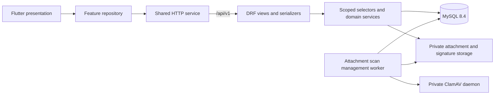

# Architecture and implementation status

The stack is Flutter + Django REST Framework + MySQL. One shared Flutter codebase targets Android, iOS, web, Windows, macOS and Linux. One modular DRF service owns authentication, authorization, workflow and file handling; there is no broker or microservice split.

Flutter remains at its previously generated six-platform shell and service-status repository. Business backend operations are now implemented, with their full contract in [openapi.yaml](openapi.yaml). [API_DESIGN.md](API_DESIGN.md) explains the business rules and unresolved decisions; [BACKEND.md](BACKEND.md) explains running and provisioning the implementation.

| Layer | Responsibility |
| --- | --- |
| `apps/accounts` | Custom employee user, explicit role grants, fixed Checker, assigned locations, versioned signatures; opaque Bearer session authentication, native/web refresh transport, trusted account provisioning |
| `apps/core` | Request IDs, success/error envelopes, strict request fields, audit records, MySQL rate counters, idempotency replay, optimistic version checks and health |
| `apps/programs/models.py` | Master records, explicit reviewer eligibility, policy, drafts, tasks, attachments and numbering counter |
| `apps/programs/selectors.py` | Owner/current-task/completed-task access scopes, role checks, filters and pagination |
| `apps/programs/services.py` | Draft validation, policy blockers, submission snapshots, sequential approvals, terminal rejection and gated cancellation |
| `apps/programs/views.py` | Explicit REST resource/action endpoints, request validation and transactional service calls |
| `apps/programs/uploads.py` | Private bounded uploads, quarantining, ClamAV transport, content access and soft removal |
| `apps/programs/pdf.py` | Escaped printable forms with saved statuses, notes and frozen signature versions |
| Management commands | Employee/master/policy provisioning and simple scan-worker execution |

Views validate syntax and permissions; services decide state transitions. Submit/action transactions lock the parent Program row. Idempotent actions also lock the actor, save their response atomically, and reject mismatched reuse. Unique review positions and counter locks prevent duplicate assignments/numbers. MySQL tests exercise concurrent duplicate creates and competing approval/rejection requests. Incomplete drafts remain editable, while unresolved business behavior is surfaced through submissionIssues or policy-conflict responses.

Program snapshots preserve identity/master labels/review plans; policy snapshots protect submitted routing from later configuration changes. Each submit/approve references the signer’s exact immutable AccountSignature version. Replacing a current signature must never edit old image bytes/records. Private files have no static/media URL mapping. Background scan verdicts increment program versions, so clients refetch the parent before further writes.

Use typed camelCase DTOs, exact IDR strings, date-only execution values and UTC instants. Flutter repositories should own session refresh serialization, ETag reconciliation and action retry keys. The backend enforces object scope and workflow even if a modified client sends forged status/actor fields.

Current authenticated scope includes pre-provisioned login/profile; authorized master data and reviewer options; own drafts/list/detail/PATCH/submit; reviewer inbox/history/detail/approve/reject; optional quarantined uploads, private downloads and signed PDFs. Cancellation is implemented but its initial source-state allowlist is empty pending the user’s answer. Type/cost can be supplied now; submitting without them awaits requiredness configuration. No broad Backoffice-admin bypass exists.

Deferred: Flutter business screens/integration, public signup, future superadmin account-management UI/API, recovery/profile editing, signature replacement UI, approval delegation/revision/reassignment, dashboard/report metrics, approved file/audit retention and deployment infrastructure. No existing Flutter file is changed by this backend phase.

MySQL is required in development and tests (InnoDB, utf8mb4, strict mode, READ COMMITTED); no SQLite fallback. Migrations are committed and applied explicitly. Default initialization grants the application access to `sales` and the isolated `test_sales` database. Production should use distinct migration/runtime permissions and an approved deployment process.

Docker Compose exposes only loopback development API/MySQL ports by default, stores MySQL persistently, and uses non-root Python containers. The optional uploads profile adds ClamAV 1.4 and one worker; its official amd64 image uses emulation on Apple Silicon. Private files use the shared ignored `backend/media/` mount. Compose’s Django runserver, mutable image-series tags and local credentials are development choices, not a production release.

Toolchains: existing Flutter 3.38.3/Dart 3.10.1; Python 3.12; Django 5.2.17, DRF 3.18.1, mysqlclient 2.2.8; MySQL 8.4. Backend direct dependencies and contract-validation tools are pinned. CI validates OpenAPI/examples/route coverage, MySQL migrations/tests and the existing Flutter analyzer/tests/web compilation.
