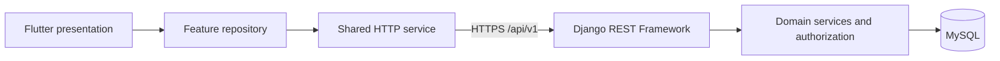

# Architecture and implementation status

The selected stack is **Flutter + Django REST Framework + MySQL**. One modular backend serves one shared Flutter codebase across Android, iOS, web, Windows, macOS and Linux. This repository currently implements the development foundation.

The diagram shows the intended dependency direction. The only wired feature is service availability: the launch shell calls `ServiceStatusRepository`, which uses `ApiClient` to call the backend readiness endpoint; readiness runs a real MySQL query. Domain services/approval workflows remain to be implemented.

## Implemented

| Area | Foundation |
| --- | --- |
| Flutter | Six generated platform projects, Material app shell, loading/failure/retry state, environment API URL, portable HTTP adapter, service repository, unit/widget tests |
| Backend | Django 5.2 LTS, DRF, Python 3.12 container, MySQL-only settings, UTC, strict SQL mode, utf8mb4, request IDs, response/error helpers, CORS allowlist, secure-by-default future view permissions |
| Identity | Custom user installed before initial migrations: opaque ID, normalized email, nullable unique employee number, full name, job title, timezone, Argon2 password hashing |
| Runtime API | `GET /api/v1/health/live` and `GET /api/v1/health/ready`; standard HEAD/OPTIONS behavior supplied by DRF |
| Local infrastructure | Docker Compose, private project network, loopback host ports, persistent MySQL volume, non-root backend container, separate MySQL test database |
| Documentation | Business design preserved, implementation scope explicit, independent runtime OpenAPI, platform/host setup instructions |
| CI | MySQL-backed backend tests, migration checks, Flutter formatting/analyzer/tests, web compilation |

See [foundation.openapi.yaml](foundation.openapi.yaml) for implemented GET contracts. Liveness has no database dependency. Readiness checks connectivity only, not migration state or future external services. The service endpoints are public and return minimal operational information. Normal API views default to authenticated access, with no implicit Basic or browser session authentication enabled.

## Not implemented yet

- Public registration/login, bearer token issuance/rotation/revocation, recovery and MFA/SSO.
- Native secure token storage and browser HttpOnly session/CSRF adaptation. Web support is confirmed; the authentication transport still needs design work before login implementation.
- Submission/master-data models, ownership/query filtering, file storage/scanning, PDFs, tasks, decisions and audit persistence.
- The Authentication, Program Submission and Backoffice business screens.
- Production hosting, TLS termination, production application server, backups and release signing.

The 22 operations in [openapi.yaml](openapi.yaml) are **design contracts**, not executable backend routes. The six provisional business operations remain excluded from that specification. Selecting a framework does not resolve registration trust, routing/quorum, rejection, cost/type provenance, cancellation or Backoffice access.

## Boundaries for subsequent work

Flutter widgets call a feature repository, never construct HTTP requests or calculate workflow transitions. Repositories map API DTOs to client models and own refresh/reconciliation rules once those are defined. Shared HTTP code must remain portable: avoid unconditional `dart:io`, filesystem assumptions or native-only token plugins in common code. API addresses use compile-time public configuration; release targets require an explicit HTTPS URL. Date-only values, exact money strings and server action capabilities follow the business contract.

Backend views validate request syntax and permissions, then call a feature service for a business operation. The service owns transactional authorization/state changes; selectors own scoped reads. Add domain apps such as `programs`, `reviews` and `master_data` when implementing their first confirmed use case, rather than introducing empty layers now. Explicit camelCase serializer fields map to Python snake_case model attributes; there is no blanket case-conversion middleware that could alter arbitrary keys.

The custom user model is infrastructure preparation, not a completed profile/registration API. Its staff/superuser flags do not grant Backoffice rights. Future role and assignment checks must follow the design. Employee number can remain null for unprovisioned internal identities; the eventual registration flow must enforce the agreed employment verification rules.

Use MySQL in development and tests to catch database-specific collation, uniqueness and transaction behavior. Migrations are committed and applied explicitly, not silently during every server startup. The development initialization grants access to `sales` and `test_sales` only. Changing the database/user names requires updating initialization too. Tests use `--keepdb` to retain only the isolated test database.

The Compose file runs Django's development server. It is deliberately not a production deployment recipe. Keep debug disabled and strong secrets in deployment environments; introduce a production server, TLS, deployment checks and secret management when deployment is in scope.

## Toolchain choices

- Flutter **3.38.3**, Dart **3.10.1**, matching the installed SDK; dependencies resolved in `frontend/pubspec.lock`. No machine-wide SDK upgrade was performed.
- Python **3.12**, Django **5.2.17** within the 5.2 LTS series, DRF **3.18.1**, mysqlclient **2.2.8**. Direct backend dependencies are pinned.
- MySQL **8.4** image series; patch/image digests may change on pull. Pin deployment image digests as part of release engineering, not by assuming the local image is a production release.

The initial technical decisions are informed by the [Django MySQL documentation](https://docs.djangoproject.com/en/5.2/ref/databases/#mysql-notes), [DRF release notes](https://www.django-rest-framework.org/community/release-notes/), and [Flutter platform setup](https://docs.flutter.dev/platform-integration). See README for local verification and remaining host-toolchain prerequisites.
