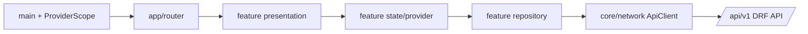

# Flutter architecture decision

Status: accepted for the first Flutter implementation milestone, 2026-09-10.

## Goal

The Flutter client will be one responsive application for Android, iOS, web, Windows, macOS, and Linux. It consumes the DRF API under `/api/v1`; it does not recreate authorization, workflow transitions, or financial calculations that belong to the backend.

## Decisions

| Concern | Decision | Why |
| --- | --- | --- |
| Dependency injection and application state | `flutter_riverpod` | Providers keep repositories/services testable and remove HTTP/session construction from widgets. Feature state can remain local until it must be shared or restored. |
| Navigation | `go_router` | URL-based routes, deep links, browser history, redirects, nested authenticated shells, and an explicit unknown-route state are needed across all supported targets. |
| API boundary | Typed feature repositories over one `ApiClient` | Repositories own DTO mapping, session reconciliation, ETags, idempotency keys, paging, and feature cache rules. Widgets receive state/actions, never raw HTTP responses. |
| DTO approach | Hand-written immutable Dart value objects in the first feature PR | The OpenAPI document is the contract. Start without generated code so the first auth slice stays small; revisit generation only after DTO count/repetition makes it worthwhile. |
| Native/desktop refresh credential | A future `SecureSessionStore` adapter backed by `flutter_secure_storage` | Refresh credentials must use OS-backed storage. The adapter keeps plugin/platform details outside auth state/repositories. |
| Web refresh credential | Backend-managed `HttpOnly` `sales_refresh` cookie only | Flutter web must not store refresh credentials in LocalStorage, including via a secure-storage plugin. It bootstraps CSRF, keeps access token in memory, and calls refresh/logout with credentials. |
| User-facing language | Indonesian | API codes remain stable English identifiers; UI maps them to concise Indonesian messages. |

`go_router` supplies declarative routes, redirects, deep links, and nested navigators across Flutter targets. Version 17.5.0 is pinned because it is the newest line compatible with this repository's Dart 3.10 SDK; version 18 requires Dart 3.12. `flutter_riverpod` supplies reactive dependency/state providers; version 3.3.2 is pinned because 3.4.1 and later require Dart 3.12. `flutter_secure_storage` supports the native/desktop targets but its web implementation uses browser storage, so it is intentionally not used for the web refresh transport. [GoRouter versions](https://pub.dev/packages/go_router/versions), [Riverpod](https://pub.dev/packages/flutter_riverpod), and [flutter_secure_storage](https://pub.dev/packages/flutter_secure_storage) document these capabilities and constraints.

## Layering



Allowed dependency direction is from left to right. `core` contains platform-neutral configuration, network, error, storage interfaces, and reusable primitives. `app` owns router/theme/application composition. Each `features/<name>` module contains its own `data`, `domain`, `application`, and `presentation` folders only when it needs them. Do not create empty layers merely for symmetry.

Feature code must not import another feature's presentation widgets. Shared visual primitives move to `core/design_system` only after a second feature actually needs them. Backend model names stay at API/repository boundaries; UI labels and formatting belong in presentation/value helpers.

## Initial folder layout

```text
lib/
  app/
    router/                    App-wide route definitions and guards
  core/
    config/                    Public runtime configuration
    di/                        Root providers and dependency wiring
    network/                   HTTP client, envelopes, API errors
    session/                   Session/store abstractions (next milestone)
    design_system/             Shared UI only after reuse is real
  features/
    auth/                      Login/session/profile (next milestone)
    submissions/               Proposer flow (later)
    backoffice/                Reviewer flow/history (later)
    master_data/               Locations/types/reviewer options (later)
    service_status/            Existing development availability shell
```

The current router contains only the existing service-status route. Authentication will replace it with a startup state, `/login`, and guarded authenticated destinations. This keeps today’s verified shell working while avoiding a fake login screen or premature route guards.

## HTTP and state rules

- `ApiClient` is the only low-level HTTP owner. It validates API envelopes and produces `ApiException` without logging secrets.
- Feature repositories use typed values and understand endpoint-specific behavior. They do not expose JSON maps to widgets.
- Auth/session owns a single refresh operation; an original request may retry once after refresh.
- Mutations carry persistent idempotency keys until success/final failure. Program mutations also carry the latest parent ETag; `412` triggers a fresh read rather than an overwrite.
- Server `allowedActions`, `myActiveTaskIds`, and `submissionIssues` drive presentation. The client may improve UX but cannot grant itself authority.
- A provider can be overridden in tests. Tests use mock HTTP clients or fakes at a repository boundary; they do not depend on global service locators.

## Secure storage and platform notes

The native session implementation will add `flutter_secure_storage` when it is first used. Before then, avoid adding platform configuration that has no executable consumer.

- Android: the package currently requires Android API 23 or newer and recommends disabling automatic backup for encrypted storage. Confirm the project’s Android support policy before changing minimum SDK or backup behavior.
- iOS/macOS: configure Keychain Sharing only when the adapter is added and validate with the selected signing team.
- Windows: release builders need ATL tooling; Linux packages need a Secret Service/libsecret runtime. These are release-work items, not requirements for the web auth slice.
- Web: use HTTPS in deployed environments and credentialed requests to the same site as the API. The browser stores the refresh token only in the backend-set HttpOnly cookie. Never use `flutter_secure_storage`, LocalStorage, preferences, logs, or URL parameters for it.

## Definition of done for this decision

- The project uses `ProviderScope` at startup and owns shared dependencies via providers.
- The router owns the existing route and has an intentional unknown-route view.
- Existing service-status behavior remains testable through an overridden API provider.
- Authentication can add its repository/session store/routes without changing widget construction across the app.
- `flutter analyze`, widget tests, and web compilation remain green after dependencies are resolved.
